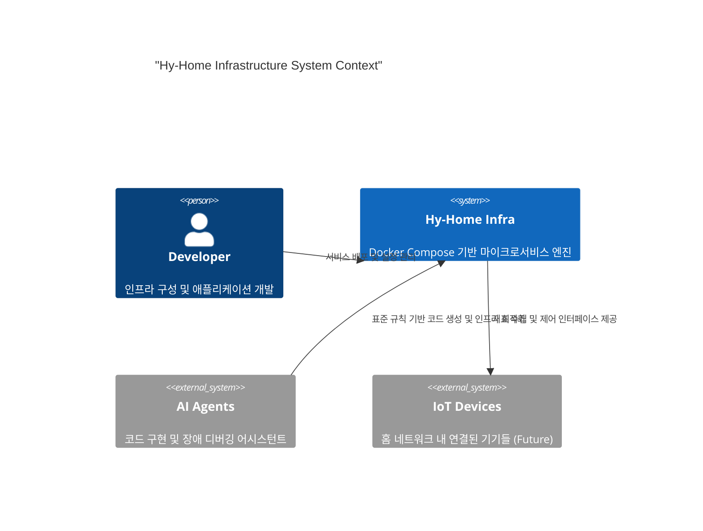

# 📐 System Architecture

이 문서는 **Hy-Home Docker Infrastructure**의 기술적 설계 원칙, 시스템 구성, 그리고 관리 표준을 정의합니다.

---

## 1. System Context

본 프로젝트는 C4 모델링 패턴을 기반으로 시스템의 경계를 정의하며, AI 에이전트와 개발자가 효율적으로 협업할 수 있는 구조를 지향합니다.

---

## 2. Infrastructure Layering (Layered Architecture)

시스템은 Presentation -> Governance -> Data -> Infrastructure의 명확한 단방향 의존성을 유지합니다.

1. **Ingress Layer (Traefik)**: 외부 요청의 진입점. SSL 종료, 도메인 기반 라우팅, 부하 분산을 담당합니다.
2. **Auth & Security Layer (Keycloak, Vault)**: 통합 인증(SSO)과 민감 정보 관리를 수행합니다.
3. **Application/Service Layer**: 실제 비즈니스 로직 및 프로젝트 앱이 위치하는 영역입니다.
4. **Data/Persistence Layer**: 고가용성 DB 클러스터(PG, Redis)와 메시지 브로커(Kafka)가 위치합니다.
5. **Observability Layer**: Prometheus, Grafana, Loki 등이 모든 레이어의 지표와 로그를 수집합니다.

---

## 3. Technology Stack

> 💡 각 서비스별 상세 포트 및 설정은 [**docs/02-infrastructure-stack.md**](docs/02-infrastructure-stack.md)를 참조하십시오.

| 영역 | 기술 스택 | 비고 |
| --- | --- | --- |
| **Orchestration** | Docker Compose (V2) | `include` 기능을 활용한 모듈화 |
| **Reverse Proxy** | Traefik | Let's Encrypt 자동 갱신 및 Dashboard 제공 |
| **Authentication** | Keycloak / OAuth2 Proxy | 프로젝트 전반의 SSO 통합 |
| **Database** | PostgreSQL (Patroni), InfluxDB, Redis, Valkey | 고가용성 및 성능 최적화 |
| **Observability** | Prometheus, Grafana, Loki, Tempo, Alloy | 통합 대시보드 및 분산 추적 |
| **AI Support** | Ollama, Qdrant | 로컬 LLM 및 벡터 검색 기반 RAG 지원 |
| **Message Broker** | Kafka (KRaft mode) | 실시간 데이터 스트리밍 및 메시징 |

---

## 4. Modular Orchestration Standards

모든 인프라 서비스는 `infra/` 디렉토리 내에서 다음과 같은 표준에 따라 관리됩니다:

- **Directory-per-Service**: 각 서비스는 고유한 폴더와 `docker-compose.yml`을 갖습니다.
- **Top-level Integration**: `infra/docker-compose.yml`에서 `include` 예약어를 사용하여 가동할 서비스를 선택적으로 포함합니다.
- **Network Isolation**:
  - `infra_net`: 시스템 핵심 서비스 간의 내부 통신용 (Bridge, 172.19.0.0/16).
  - `project_net`: 외부 애플리케이션 프로젝트와 인프라 서비스 간의 연결용.
- **Environment Governance**: 모든 서비스는 공통 `.env` 파일의 변수를 상속받아 경로와 설정을 동기화합니다.

---

## 5. Decision Records (ADR)

주요 아키텍처적 변경 사항 및 의사 결정은 `docs/adr/` 디렉토리에 [Architecture Decision Record] 형식으로 기록됩니다. 모든 변경은 기존의 레이어링 원칙과 의존성 규칙을 준수해야 합니다.
