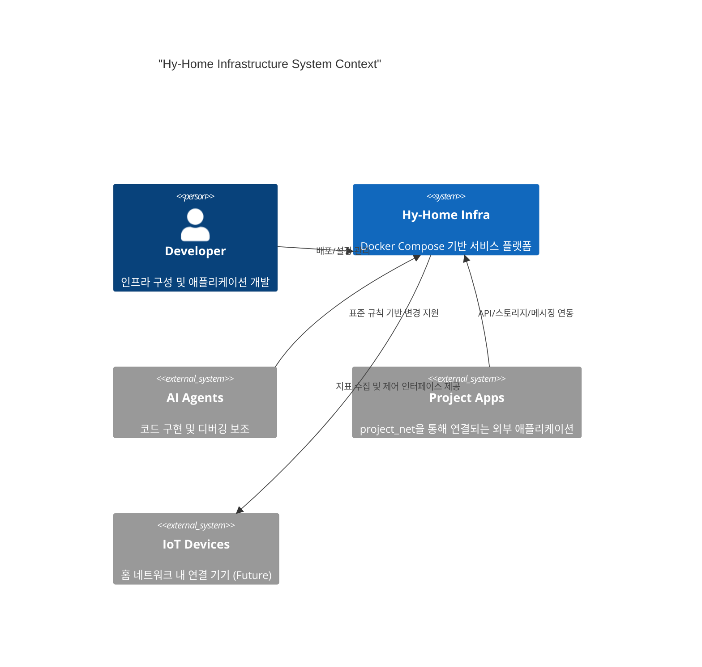

# 📐 System Architecture

이 문서는 **Hy-Home Docker Infrastructure**의 설계 원칙, 구성 계층, 그리고 운영 상의 불변 조건을 정의합니다. 상세 포트/환경 변수는 `docs/02-infrastructure-stack.md`와 `infra/README.md`를 기준으로 합니다.

---

## 1. Purpose & Scope

- **목적**: 인프라 전체의 의존성 방향, 운영 표준, 변경 원칙을 명확히 한다.
- **범위**: Docker Compose 기반의 `infra/` 디렉토리 및 루트 `docker-compose.yml`에서 조립되는 스택.
- **비범위**: 개별 서비스의 상세 튜닝/운영 절차(각 서비스 README로 위임).

---

## 2. System Context (C4)



---

## 3. Architecture Principles

1. **Layered Dependency**: 상위 레이어는 하위 레이어에만 의존한다.
2. **Composable Modules**: 서비스는 `infra/<category>/<service>` 단위로 분리한다.
3. **Profile-Driven Optionality**: 선택 스택은 `profiles`로 활성화한다.
4. **Security Baseline**: 기본 접근은 SSO를 통해 보호하고, 민감 정보는 `.env`/`secrets`로 분리한다.
5. **Observability-First**: 모든 핵심 서비스는 지표/로그/추적을 수집 가능해야 한다.
6. **Change Traceability**: 큰 변경은 ADR로 기록한다.

---

## 4. Layered Architecture

의존성 흐름은 **Ingress → Auth/Security → Service → Data/Messaging → Observability** 방향으로 유지한다.

1. **Ingress Layer**: Traefik(기본), Nginx(옵션)
2. **Auth & Security Layer**: Keycloak, OAuth2 Proxy, Vault(옵션)
3. **Service Layer**: 워크플로우, 툴링, AI 서비스 등 비즈니스/플랫폼 서비스
4. **Data & Messaging Layer**: PostgreSQL, Valkey/Redis, Kafka, OpenSearch, Qdrant, MinIO 등
5. **Observability Layer**: Prometheus, Grafana, Loki, Tempo, Alloy, Alertmanager

---

## 5. Orchestration Model

- **Top-level Compose**: 루트 `docker-compose.yml`이 `include`로 infra 스택을 조립한다.
- **Service Ownership**: 각 서비스는 `infra/<category>/<service>/docker-compose.yml`로 독립 관리한다.
- **Classification**
  - **Core**: 기본 포함되는 서비스.
  - **Optional (Profile)**: `profiles`로 켜는 서비스.
  - **Standalone**: 루트 `include`에 없는 별도 스택.

```bash
# 전체 기동 (루트)
docker compose up -d

# 선택 스택
docker compose --profile <profile> up -d
```

---

## 6. Networking Model

- **infra_net**: 내부 핵심 서비스 간 통신 (기본 172.19.0.0/16)
- **project_net**: 외부 프로젝트 앱 연결용 (외부 네트워크)
- **kind**: K8s 실험/연동용 외부 네트워크

정적 IP는 서비스 간 참조 안정성을 위해 사용하지만, **중복되지 않도록 카테고리별 대역을 유지**한다.

---

## 7. Configuration & Secrets

- **공통 설정**: 루트 `.env` 및 `.env.example`에서 관리
- **민감 정보**: `secrets/` 하위 텍스트 파일로 분리
- **서비스별 설정**: 각 서비스 폴더의 `config/` 또는 `*.example`로 템플릿 제공
- **영속 데이터**: `DEFAULT_*_DIR` 환경 변수로 호스트 경로를 지정해 데이터 유실 방지

---

## 8. Observability & Operations

- **Metrics**: Prometheus 중심 수집, Grafana 시각화
- **Logs**: Loki, **Traces**: Tempo, **Collector**: Alloy
- **Alerting**: Alertmanager로 라우팅 및 통지
- **SSO**: Grafana 등 UI는 Keycloak 연동을 기본 전제로 한다.

---

## 9. Decision Records (ADR)

주요 아키텍처 변경은 `docs/adr/`에 **ADR 형식**으로 기록한다. 레이어링 및 의존성 원칙을 훼손하는 변경은 ADR 검토를 선행한다.
