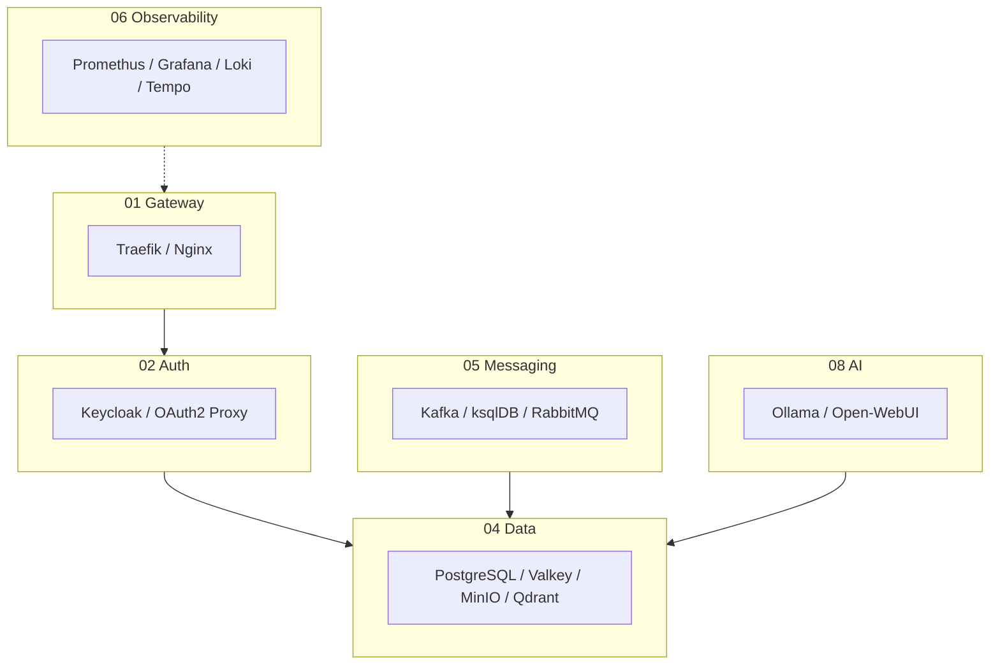

# System Architecture

This document defines the global architectural invariants and rules for the `hy-home.docker` repository. For service-specific details, see [`docs/guides/`](docs/guides/). For operational procedures, refer to [`docs/runbooks/`](docs/runbooks/) and [`OPERATIONS.md`](OPERATIONS.md).

## 1. Scope

- **Target:** The infrastructure stack composed of the root [`docker-compose.yml`](docker-compose.yml) and modular definitions in [`infra/`](infra/).
- **Goal:** To provide a reproducible, multi-tier infrastructure for local development and home-lab environments.
- **Exclusions:** Internal business logic and application-level code details (defined in [`docs/specs/`](docs/specs/)).

## 2. Architectural Invariants

Standard rules for the codebase. Exceptions must be documented in ADRs or feature specs.

- **Root orchestration:** The `docker-compose.yml` is the single entry point. The stack is assembled using the `include` feature.
- **Modular boundaries:** Compose definitions are isolated in `infra/<tier>/<service>/`. Common policies are managed globally at the root.
- **Secrets-first:** Passwords and tokens must never be in `.env`. They are injected via `secrets/**/*.txt` into `/run/secrets/`.
- **Port policy:** Host-exposed ports use `*_HOST_PORT`. Container-internal ports use `*_PORT`. Always use `${VAR:-default}` in Compose files.
- **Security baseline:** By default, all services must implement `security_opt: [no-new-privileges:true]` and `cap_drop: [ALL]`.
- **Documentation separation**: Background info goes to [`docs/`](docs/), plans to [`docs/plans/`](docs/plans/), and executable manuals to [`docs/runbooks/`](docs/runbooks/).

## 3. Runtime Topology

### 3.1 Network model

| Network | Type | Purpose |
| :--- | :--- | :--- |
| `infra_net` | bridge (internal) | Primary backbone for inter-service communication. |
| `project_net` | external | For connecting external application projects. |
| `kind` | external | For integration with Kubernetes (KinD) clusters. |

### 3.2 Layered service map

The infrastructure is organized into 10 logical tiers.

```mermaid
graph TD
    subgraph Tier_01_Gateway [01 Gateway]
        Traefik["Traefik / Nginx"]
    end

    subgraph Tier_02_Auth [02 Auth]
        Keycloak["Keycloak / OAuth2 Proxy"]
    end

    subgraph Tier_04_Data [04 Data]
        DB["PostgreSQL / Valkey / MinIO / Qdrant"]
    end

    subgraph Tier_05_Messaging [05 Messaging]
        Kafka["Kafka / ksqlDB / RabbitMQ"]
    end

    subgraph Tier_06_Obs [06 Observability]
        LGTM["Promethus / Grafana / Loki / Tempo"]
    end

    subgraph Tier_08_AI [08 AI]
        Ollama["Ollama / Open-WebUI"]
    end

    Tier_01_Gateway --> Tier_02_Auth
    Tier_02_Auth --> Tier_04_Data
    Tier_05_Messaging --> Tier_04_Data
    Tier_06_Obs -.-> Tier_01_Gateway
    Tier_08_AI --> Tier_04_Data
```

| Tier | Role | Primary Services |
| :--- | :--- | :--- |
| `01-gateway` | Ingress / Edge Routing | Traefik, Nginx |
| `02-auth` | Identity / Access Proxy | Keycloak, OAuth2 Proxy |
| `03-security` | Secret Vault | Vault |
| `04-data` | DB / Cache / Object / Search | PostgreSQL, Valkey, MinIO, Qdrant |
| `05-messaging` | Event / Queue | Kafka, ksqlDB, RabbitMQ |
| `06-observability` | Metrics / Logs / Traces | Prometheus, Grafana, Loki, Tempo |
| `07-workflow` | Orchestration | Airflow, n8n |
| `08-ai` | Inference / AI UI | Ollama, Open-WebUI |
| `09-tooling` | QA / DevOps Tools | SonarQube, Terrakube, Locust |
| `10-communication`| Mail / Relay | Stalwart, Mailhog |

## 4. Change Governance

All architectural modifications must satisfy the repository's governance checklist. For detailed requirements, see the [Architecture Governance Rule](docs/agentic/rules/governance-rule.md).

## 5. References

- **Infra baseline ARD:** [`docs/ard/infra-baseline-ard.md`](docs/ard/infra-baseline-ard.md)
- **Messaging ARD:** [`docs/ard/messaging-ard.md`](docs/ard/messaging-ard.md)
- **Agent Contract:** [`AGENTS.md`](AGENTS.md) (Standard for AI-driven changes)
- **Guides hub:** [`docs/guides/README.md`](docs/guides/README.md)
- **Ops policy:** [`OPERATIONS.md`](OPERATIONS.md)
