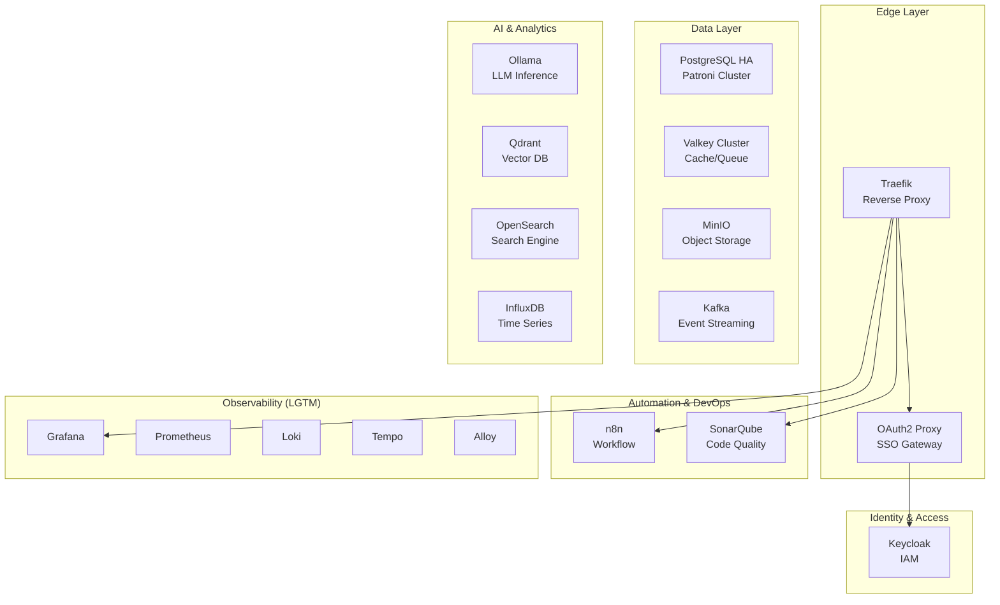

# Infrastructure Services

This directory contains the Docker Compose configurations for the project's infrastructure services. Each service is isolated in its own subdirectory with dedicated configuration.

## Architecture Overview



## Service Directory

### Active Services

These services are included in the main `docker-compose.yml` and start by default:

| Service | Description | Image | Static IP |
| :--- | :--- | :--- | :--- |
| [**Traefik**](./traefik/README.md) | Cloud-native application proxy and edge router | `traefik:v3.5.1` | `172.19.0.2` |
| [**OAuth2 Proxy**](./oauth2-proxy/README.md) | Authentication proxy for SSO integration | `quay.io/oauth2-proxy/oauth2-proxy:v7.9.0` | `172.19.0.3` |
| [**Keycloak**](./keycloak/README.md) | Identity and Access Management (IAM) | `quay.io/keycloak/keycloak:26.3.0` | `172.19.0.4` |
| [**Management DB**](./mng-db/README.md) | Shared Valkey + PostgreSQL for tools | `valkey:9.0.1-alpine` / `postgres:17-alpine` | `172.19.0.5-6` |
| [**Observability**](./observability/README.md) | LGTM Stack (Loki, Grafana, Tempo, Prometheus) + Alloy | See [observability](./observability) | `172.19.0.30-37` |
| [**MinIO**](./minio/README.md) | High-performance S3-compatible object storage | `minio/minio:RELEASE.2025-06-01` | `172.19.0.10` |
| [**InfluxDB**](./influxdb/README.md) | Time-series database for metrics | `influxdb:2.7-alpine` | `172.19.0.11` |
| [**n8n**](./n8n/README.md) | Workflow automation tool | `n8nio/n8n:latest` | `172.19.0.12` |
| [**Ollama**](./ollama/README.md) | Local LLM inference engine with GPU support | `ollama/ollama:latest` | `172.19.0.13` |
| [**Qdrant**](./qdrant/README.md) | Vector database for AI/ML applications | `qdrant/qdrant:latest` | `172.19.0.14` |
| [**PostgreSQL HA**](./postgresql-cluster/README.md) | High Availability PostgreSQL (Patroni + etcd) | `bitnami/postgresql-repmgr:17` | `172.19.0.20-23` |
| [**Kafka**](./kafka/README.md) | Event streaming platform (KRaft mode) | `confluentinc/cp-kafka:8.0.0` | `172.19.0.40-43` |
| [**Valkey Cluster**](./valkey-cluster/README.md) | Distributed cache/queue (Redis fork) | `valkey/valkey:9.0.1-alpine` | `172.19.0.50-55` |
| [**SonarQube**](./sonarqube/README.md) | Code quality and security scanning | `sonarqube:lts-community` | `172.19.0.60` |

### Optional Services

These services are commented out in `docker-compose.yml` and can be enabled as needed:

| Service | Description | Image | Status |
| :--- | :--- | :--- | :--- |
| [**Airflow**](./airflow/README.md) | Workflow orchestration for data pipelines | `apache/airflow:2.10.x` | Optional |
| [**OpenSearch**](./opensearch/README.md) | Search and analytics engine (3-node cluster) | `opensearch:2.19.x` | Optional |
| [**Nginx**](./nginx/README.md) | Web server and reverse proxy | `nginx:alpine` | Optional |
| [**MailHog**](./mail/README.md) | Email testing tool for development | `mailhog/mailhog` | Optional |
| [**CouchDB**](./couchdb/README.md) | NoSQL document database cluster | `couchdb:3.x` | Optional |
| [**Terrakube**](./Terrakube/README.md) | Infrastructure as Code platform (Terraform) | `azbuilder/terrakube` | Optional |
| [**Redis Cluster**](./redis-cluster/README.md) | Distributed Redis (Legacy, replaced by Valkey) | `redis:7.x` | Deprecated |
| [**Harbor**](./harbor/README.md) | Private container registry | `goharbor/harbor` | Optional |
| [**ksqlDB**](./ksql/README.md) | Stream processing database for Kafka | `confluentinc/ksqldb-server` | Optional |
| [**Storybook**](./storybook/README.md) | UI component documentation and testing | Custom | Development |

## Network Configuration

All services communicate via the external Docker network `infra_net`.

### Network Details

| Network | Subnet | Gateway | Purpose |
| :--- | :--- | :--- | :--- |
| `infra_net` | `172.19.0.0/16` | `172.19.0.1` | Infrastructure services |
| `project_net` | External | - | Application services |
| `kind` | External | - | Kubernetes (KinD) integration |

### IP Address Allocation

| Range | Service Group |
| :--- | :--- |
| `172.19.0.2-9` | Core (Traefik, OAuth2, Keycloak, MNG) |
| `172.19.0.10-19` | Storage & AI (MinIO, InfluxDB, Ollama, Qdrant) |
| `172.19.0.20-29` | PostgreSQL Cluster (Patroni + etcd) |
| `172.19.0.30-39` | Observability Stack (LGTM) |
| `172.19.0.40-49` | Kafka Cluster |
| `172.19.0.50-59` | Valkey/Redis Cluster |
| `172.19.0.60-69` | DevOps Tools (SonarQube) |

## Secrets Management

Sensitive credentials are stored in Docker secrets:

| Secret | File | Used By |
| :--- | :--- | :--- |
| `postgres_password` | `../secrets/postgres_password.txt` | PostgreSQL |
| `valkey_password` | `../secrets/valkey_password.txt` | Valkey |
| `minio_root_user` | `../secrets/minio_root_user.txt` | MinIO |
| `minio_root_password` | `../secrets/minio_root_password.txt` | MinIO |
| `minio_app_user` | `../secrets/minio_app_user.txt` | MinIO |
| `minio_app_user_password` | `../secrets/minio_app_user_password.txt` | MinIO |
| `redis_password` | `../secrets/redis_password.txt` | Redis (Legacy) |

## Environment Variables

A shared `.env` file (located in `infra/.env`) manages configuration:

### Core Settings

| Variable | Description | Example |
| :--- | :--- | :--- |
| `DEFAULT_URL` | Base domain for all services | `home.local` |
| `HTTP_PORT` | HTTP port | `80` |
| `HTTPS_PORT` | HTTPS port | `443` |

### Service Ports

| Service | Port Variable | Default |
| :--- | :--- | :--- |
| Traefik | `TRAEFIK_PORT` | `8080` |
| Keycloak | `KEYCLOAK_PORT` | `8080` |
| Grafana | `GRAFANA_PORT` | `3000` |
| Prometheus | `PROMETHEUS_PORT` | `9090` |
| PostgreSQL | `POSTGRES_PORT` | `5432` |
| Valkey | `VALKEY_PORT` | `6379` |
| MinIO API | `MINIO_API_PORT` | `9000` |
| MinIO Console | `MINIO_CONSOLE_PORT` | `9001` |
| Kafka | `KAFKA_PORT` | `9092` |
| n8n | `N8N_PORT` | `5678` |
| Ollama | `OLLAMA_PORT` | `11434` |
| Qdrant | `QDRANT_PORT` | `6333` |
| InfluxDB | `INFLUXDB_PORT` | `8086` |
| SonarQube | `SONARQUBE_PORT` | `9000` |

For complete environment variable reference, see [Environment Variables Documentation](../docs/reference/environment-variables.md).

## Data Persistence

All services use named volumes for data persistence:

### Volume Mapping

| Service | Volume(s) | Data Type |
| :--- | :--- | :--- |
| PostgreSQL HA | `pg0-data`, `pg1-data`, `pg2-data` | Database |
| Valkey Cluster | `valkey-data-{0-5}` | Cache/Queue |
| Kafka | `kafka-{1-3}-data` | Event Logs |
| MinIO | `minio-data` | Objects |
| Ollama | `ollama-data` | Models |
| Qdrant | `qdrant-data` | Vectors |
| InfluxDB | `influxdb-data` | Time Series |
| n8n | `n8n-data` | Workflows |
| Grafana | `grafana-data` | Dashboards |
| Prometheus | `prometheus-data` | Metrics |
| Loki | `loki-data` | Logs |
| Tempo | `tempo-data` | Traces |
| SonarQube | `sonarqube-data-volume` | Analysis |
| OpenSearch | `opensearch-data{1-3}` | Search Index |
| etcd | `etcd{1-3}-data` | Cluster State |

## Usage

### Starting All Services

```bash
cd infra
docker compose up -d
```

### Starting Specific Service Group

```bash
# Start only observability stack
docker compose up -d prometheus grafana loki tempo alloy

# Start only database layer
docker compose up -d postgres-0 postgres-1 postgres-2 valkey-0 valkey-1 valkey-2
```

### Enabling Optional Services

Edit `docker-compose.yml` and uncomment the desired service:

```yaml
include:
  # ... active services ...
  - opensearch/docker-compose.yml  # Uncomment to enable
```

### Checking Service Status

```bash
docker compose ps
docker compose logs -f <service-name>
```

## Quick Links

- **[System Architecture](../docs/architecture/system-architecture.md)**: Layered architecture overview
- **[Network Topology](../docs/architecture/network-topology.md)**: Network configuration details
- **[Service Catalog](../docs/reference/service-catalog.md)**: Complete service reference
- **[Deployment Guide](../docs/guides/deployment-guide.md)**: Installation and setup
- **[Troubleshooting](../docs/guides/troubleshooting.md)**: Common issues and solutions

## Directory Structure

```
infra/
├── .env                    # Environment variables
├── .env.example            # Environment template
├── docker-compose.yml      # Main compose file (includes)
├── README.md               # This file
│
├── traefik/               # Edge Router
├── oauth2-proxy/          # SSO Proxy
├── keycloak/              # Identity Provider
├── mng-db/                # Management Database
│
├── observability/         # LGTM + Alloy Stack
│   ├── prometheus/
│   ├── grafana/
│   ├── loki/
│   ├── tempo/
│   ├── alloy/
│   ├── alertmanager/
│   └── pushgateway/
│
├── postgresql-cluster/    # HA PostgreSQL (Patroni)
├── valkey-cluster/        # Distributed Cache
├── kafka/                 # Event Streaming
│
├── minio/                 # Object Storage
├── influxdb/              # Time Series DB
├── ollama/                # LLM Inference
├── qdrant/                # Vector DB
├── opensearch/            # Search Engine
│
├── n8n/                   # Workflow Automation
├── sonarqube/             # Code Quality
├── airflow/               # Data Pipelines
│
├── mail/                  # Email Testing
├── nginx/                 # Web Server
├── couchdb/               # Document DB
├── harbor/                # Container Registry
├── ksql/                  # Stream Processing
├── redis-cluster/         # Legacy Cache
├── storybook/             # UI Components
└── Terrakube/             # IaC Platform
```
