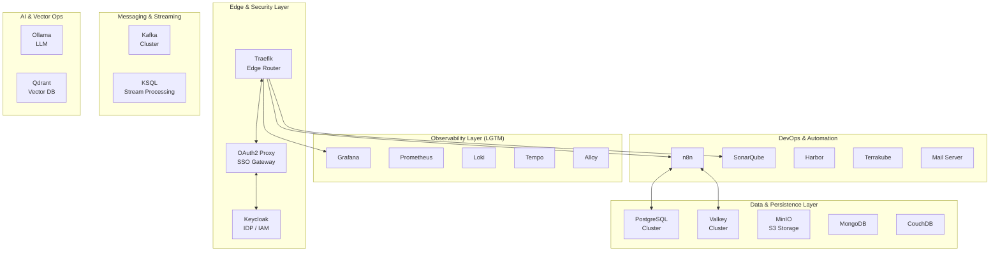

# Infrastructure Services

## Overview

This directory houses the core infrastructure stack for the project, orchestrated via Docker Compose. The environment is designed for **High Availability**, **Observability**, and **Developer Productivity**, following a modular, layered architecture.



## Service Catalog

### Core Services (Active)

These services are critical for the infrastructure's operation.

| Service | Category | Description |
| :--- | :--- | :--- |
| [**Traefik**](./traefik/README.md) | Ingress | Dynamic reverse proxy & SSL termination. |
| [**Keycloak**](./keycloak/README.md) | Identity | Unified SSO and IAM provider. |
| [**Observability**](./observability/README.md) | Monitoring | LGTM Stack (Grafana, Prometheus, Loki, Tempo, Alloy). |
| [**PostgreSQL Cluster**](./postgresql-cluster/README.md) | Database | HA PostgreSQL with Patroni (Bitnami). |
| [**Valkey Cluster**](./valkey-cluster/README.md) | Cache | High-performance Redis-compatible key-value store. |
| [**MinIO**](./minio/README.md) | Storage | S3-compatible object storage. |
| [**Kafka**](./kafka/README.md) | Streaming | KRaft-based Event Streaming Platform. |

### Application & DevOps Services

Services for development, automation, and specific application needs.

| Service | Category | Use Case |
| :--- | :--- | :--- |
| [**n8n**](./n8n/README.md) | Automation | Workflow automation tool. |
| [**Ollama**](./ollama/README.md) | AI | Local LLM inference. |
| [**Qdrant**](./qdrant/README.md) | Vector DB | Vector similarity search engine. |
| [**SonarQube**](./sonarqube/README.md) | Quality | Code quality and security scanning. |
| [**Harbor**](./harbor/README.md) | Registry | Cloud native registry project. |
| [**Terrakube**](./terrakube/README.md) | IaC | Open Source Terraform Cloud alternative. |
| [**Storybook**](./storybook/README.md) | Frontend | UI component explorer and documentation. |
| [**Mail**](./mail/README.md) | Utility | Mail server/relay for notifications. |
| [**Nginx**](./nginx/README.md) | Web Server | Static content serving / Additional proxy. |

### Data & Specialized Stores

Additional data storage and processing engines.

| Service | Category | Use Case |
| :--- | :--- | :--- |
| [**MongoDB**](./mng-db/README.md) | NoSQL | Document-oriented database. |
| [**CouchDB**](./couchdb/README.md) | NoSQL | JSON document database. |
| [**InfluxDB**](./influxdb/README.md) | Time Series | Time series database. |
| [**OpenSearch**](./opensearch/README.md) | Search | Distributed search and analytics suite. |
| [**Redis Cluster**](./redis-cluster/README.md) | Cache | (Legacy/Alternative) Redis Cluster. |
| [**KSQL**](./ksql/README.md) | Streaming | Streaming SQL engine for Kafka. |
| [**Airflow**](./airflow/README.md) | Orchestration | Data pipeline management. |

## Network Topology

The infrastructure operates on a dedicated `172.19.0.0/16` subnet (`infra_net`). For detailed IP assignments and routing rules, see the [Network Topology Documentation](../docs/architecture/network-topology.md).

| IP Range | Group | Description |
| :--- | :--- | :--- |
| `172.19.0.10-19` | **Core & Storage** | Traefik, MinIO, OAuth Proxy support |
| `172.19.0.20-29` | **Kafka & Security** | Kafka Cluster, Keycloak, OAuth Proxy |
| `172.19.0.30-39` | **Observability** | LGTM Stack (Grafana, Loki, etc.) |
| `172.19.0.50-59` | **Databases (HA)** | PostgreSQL HA Cluster (Patroni) |
| `172.19.0.60-79` | **Apps & Mng DBs** | Valkey, RedisInsight, Management DBs |

## Secrets Management

This project uses **Docker Secrets** for sensitive data. Do NOT hardcode passwords.
Secrets are read from files in the `../secrets/` directory.

- `postgres_password`
- `valkey_password`
- `minio_root_user` / `minio_root_password`
- `grafana_admin_password`

## Maintenance

```bash
# Start Infrastructure
docker compose up -d

# Check Status
docker compose ps

# View Logs
docker compose logs -f [service]
```
