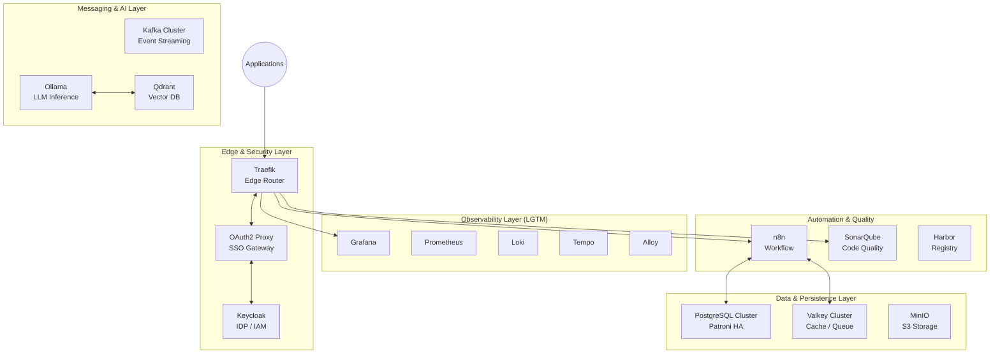

# Infrastructure Services

## Overview

This directory houses the core infrastructure stack for the project, orchestrated via Docker Compose. The environment is designed for **High Availability**, **Observability**, and **Developer Productivity**, following a modular, layered architecture.



## Service Catalog

### Core Infrastructure (Active)

These services are prioritized for development and operational core stability.

| Service | Category | Image | Role |
| :--- | :--- | :--- | :--- |
| [**Traefik**](./traefik/README.md) | Ingress | `traefik:v3.5` | Dynamic reverse proxy & SSL termination. |
| [**Keycloak**](./keycloak/README.md) | Identity | `keycloak:26` | Unified SSO and IAM provider. |
| [**Observability**](./observability/README.md) | Monitoring | LGTM Stack | Full-stack metrics, logs, and traces. |
| [**n8n**](./n8n/README.md) | Automation | `n8n:2.3` | Scalable workflow automation (Queue Mode). |
| [**Ollama**](./ollama/README.md) | AI | `ollama:latest` | Local LLM inference engine. |
| [**PostgreSQL HA**](./postgresql-cluster/README.md) | Database | `bitnami/pg:17` | High Availability relational data. |
| [**Valkey Cluster**](./valkey-cluster/README.md) | Cache | `valkey:9` | Distributed Redis-compatible storage. |
| [**MinIO**](./minio/README.md) | Storage | `minio:latest` | S3-compatible object storage. |
| [**Kafka**](./kafka/README.md) | Streaming | `cp-kafka:8` | Event-driven architecture (KRaft). |

### Specialized & Optional Services

Can be enabled by uncommenting in the main `docker-compose.yml`.

| Service | Category | Image | Use Case |
| :--- | :--- | :--- | :--- |
| [**SonarQube**](./sonarqube/README.md) | Quality | `sonarqube:lts` | Static code analysis & security scanning. |
| [**Harbor**](./harbor/README.md) | Registry | `harbor:2` | Enterprise-grade private image registry. |
| [**InfluxDB**](./influxdb/README.md) | Time Series | `influxdb:2` | Dedicated telemetry & IoT data storage. |
| [**OpenSearch**](./opensearch/README.md) | Search | `opensearch:2` | Distributed search and log analytics. |
| [**CouchDB**](./couchdb/README.md) | NoSQL | `couchdb:3` | HA document store with sync capabilities. |
| [**Airflow**](./airflow/README.md) | Data Ops | `airflow:2` | Complex data pipeline orchestration. |

## Network Topology

The infrastructure operates on a dedicated `172.19.0.0/16` subnet to ensure deterministic routing and isolation.

| IP Range | Layer / Group | Purpose |
| :--- | :--- | :--- |
| `172.19.0.2-9` | **Core & Identity** | Traefik, Keycloak, OAuth2 Proxy |
| `172.19.0.10-19`| **Storage & AI** | MinIO, InfluxDB, Ollama, Qdrant |
| `172.19.0.20-29`| **Databases** | PostgreSQL Cluster (Patroni), etcd |
| `172.19.0.30-39`| **Observability** | LGTM Stack (Prometheus, Grafana, etc.) |
| `172.19.0.40-49`| **Messaging** | Kafka Cluster |
| `172.19.0.50-59`| **Caching** | Valkey/Redis Cluster |

## Secrets Management

Security is maintained through **Docker Secrets**, ensuring no sensitive data is present in the environment variables or logs.

| Secret | Mapping File | Description |
| :--- | :--- | :--- |
| `postgres_password` | `./secrets/postgres_password.txt` | Core DB root/user password |
| `valkey_password` | `./secrets/valkey_password.txt` | Cluster authentication key |
| `minio_root_*` | `./secrets/minio_root_*.txt` | S3 root credentials |
| `harbor_*` | `./secrets/harbor_*.txt` | Registry secrets & database links |

## Maintenance & Operations

### Standard Start/Stop

```bash
# Start all active infrastructure nodes
docker compose up -d

# Stop services and preserve data
docker compose stop

# Fully dismantle cluster (data on volumes is preserved)
docker compose down
```

### Health & Status

```bash
# Check service health and static IP assignments
docker compose ps

# View unified logs for a specific service
docker compose logs -f <service_name>
```

### Configuration Updates

Most services (Prometheus, Traefik, Alloy) support dynamic reloads or have health-check-aware restart policies. Refer to the individual **README.md** in each subdirectory for specific maintenance procedures.
