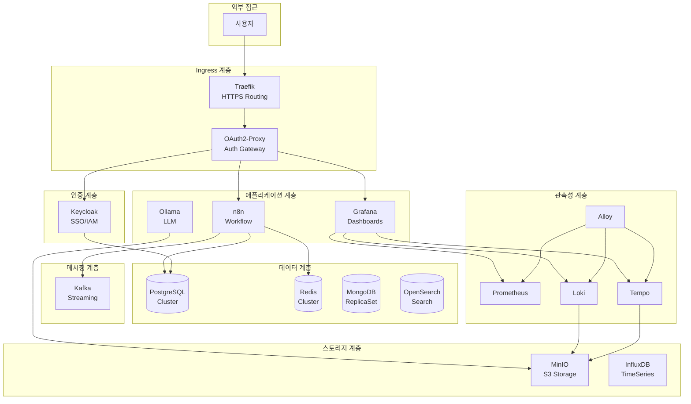

# Docker Infrastructure  

## 개요

이 저장소는 전체 인프라 서비스를 위한 Docker Compose 구성을 포함합니다. **13개 활성화된 핵심 서비스**와 17개 추가 서비스로 구성된 완전한 On-Premise 인프라 스택을 제공합니다.

## 전체 시스템 아키텍처



## 활성화된 서비스 (13개) ✅

### 1. 리버스 프록시 및 인증

| 서비스 | 설명 | 접속 URL |
| :--- | :--- | :--- |
| [traefik](./traefik) | 동적 리버스 프록시, HTTPS 라우팅 | `https://dashboard.hy-home.local` |
| [oauth2-proxy](./oauth2-proxy) | Forward Auth 인증 미들웨어 | `https://auth.hy-home.local` |
| [keycloak](./keycloak) | SSO/IAM, 통합 인증 시스템 | `https://keycloak.hy-home.local` |

### 2. 핵심 데이터베이스

| 서비스 | 설명 | 시스템 역할 |
| :--- | :--- | :--- |
| [postgresql-cluster](./postgresql-cluster) | 고가용성 PostgreSQL (3노드 + etcd + HAProxy) | 관계형 데이터 주 저장소 |
| [redis-cluster](./redis-cluster) | Redis 클러스터 (6노드: 3M + 3R) | 캐시, 세션, Pub/Sub |
| [mongodb](./mongodb) | MongoDB 레플리카 셋 (2노드 + Arbiter) | 문서 기반 NoSQL |
| [opensearch](./opensearch) | OpenSearch + 대시보드 | 전문 검색, 로그 집계 |
| [mng-db](./mng-db) | 관리용 PostgreSQL + Redis | 인프라 메타데이터 |

### 3. 메시징 및 스트리밍

| 서비스 | 설명 | 시스템 역할 |
| :--- | :--- | :--- |
| [kafka](./kafka) | Kafka 클러스터 (KRaft, 3노드) + Schema Registry + Connect + UI | 이벤트 스트리밍, 메시지 브로커 |

### 4. 스토리지

| 서비스 | 설명 | 시스템 역할 |
| :--- | :--- | :--- |
| [minio](./minio) | S3 호환 객체 스토리지 | 파일 저장, Loki/Tempo 백엔드 |
| [influxdb](./influxdb) | 시계열 데이터베이스 | IoT, 메트릭 저장 |

### 5. 관측성 (Full Stack)

| 서비스 | 설명 | 구성 요소 |
| :--- | :--- | :--- |
| [observability](./observability) | 통합 모니터링 스택 | Prometheus + Grafana + Loki + Tempo + Alloy + cAdvisor + Alertmanager |

### 6. 애플리케이션 서비스

| 서비스 | 설명 | 시스템 역할 |
| :--- | :--- | :--- |
| [n8n](./n8n) | 워크플로우 자동화 (Main + Worker + Redis) | 노코드 자동화, 시스템 통합 |
| [ollama](./ollama) | 로컬 LLM (Ollama + Qdrant + Open WebUI) | AI 챗봇, RAG 시스템 |

### 7. 기타

| 서비스 | 설명 | 용도 |
| :--- | :--- | :--- |
| [mail](./mail) | MailHog (테스트 SMTP) | 개발용 메일 테스트 |

---

## 비활성화된 서비스 (17개)

다음 서비스들은 `docker-compose.yml`에서 주석 처리되어 있습니다:

**데이터베이스:**

- [nginx](./nginx), [supabase](./supabase), [neo4j](./neo4j)
- [arangodb](./arangodb), [cassandra](./cassandra), [couchdb](./couchdb)
- [valkey](./valkey)

**개발 도구:**

- [airflow](./airflow), [harbor](./harbor), [sonarqube](./sonarqube)
- [locust](./locust), [storybook](./storybook)

**기타:**

- [ksql](./ksql), [syncthing](./syncthing), [Terrakube](./Terrakube)

---

## 필수 조건

- **Docker**: Docker Engine 24.0+
- **Docker Compose**: v2.20+
- **환경 변수**: `Infra/.env` 파일 (필수)
- **Secrets**: `../secrets/` 디렉토리 (비밀번호 파일)

## 빠른 시작

### 1. Secrets 준비

```bash
cd d:\hy-home.docker
mkdir -p secrets

# 비밀번호 파일 생성
echo "your_postgres_password" > secrets/postgres_password.txt
echo "your_redis_password" > secrets/redis_password.txt
echo "minio_user" > secrets/minio_root_user.txt
echo "minio_password" > secrets/minio_root_password.txt
```

### 2. 환경 변수 설정

```bash
cd Infra
cp .env.example .env
# .env 파일 수정
```

### 3. 전체 스택 시작

```bash
cd Infra
docker-compose up -d
```

### 4. 개별 서비스 시작

```bash
# PostgreSQL만 시작
cd postgresql-cluster
docker-compose up -d

# Observability만 시작
cd observability
docker-compose up -d
```

## 주요 접속 정보

### 관측성

- **Grafana**: `https://grafana.hy-home.local` (Keycloak SSO)
- **Prometheus**: `https://prometheus.hy-home.local`
- **Alertmanager**: `https://alertmanager.hy-home.local`

### 데이터베이스 UI

- **RedisInsight**: `https://redisinsight.hy-home.local`
- **Mongo Express**: `https://mongo-express.hy-home.local`
- **Kafka UI**: `https://kafka-ui.hy-home.local`
- **MinIO Console**: `https://minio-console.hy-home.local`

### 애플리케이션

- **n8n**: `https://n8n.hy-home.local`
- **Ollama WebUI**: `https://chat.hy-home.local`
- **Keycloak Admin**: `https://keycloak.hy-home.local/admin`

### 인프라 관리

- **Traefik Dashboard**: `https://dashboard.hy-home.local`
- **MailHog**: `https://mail.hy-home.local`

## 네트워크

모든 서비스는 `infra_net` (172.19.0.0/16) 네트워크를 공유합니다:

- **고정 IP**: 안정적인 서비스 간 통신
- **DNS**: Docker 내부 DNS를 통한 서비스 디스커버리
- **격리**: 외부 네트워크와 격리된 안전한 통신

## 시스템 요구사항

### 최소 사양

- **CPU**: 8 코어
- **RAM**: 16GB
- **Disk**: 100GB SSD

### 권장 사양

- **CPU**: 16 코어
- **RAM**: 32GB
- **Disk**: 500GB NVMe SSD
- **GPU**: NVIDIA GPU (Ollama 사용 시)

## 트러블슈팅

### 공통 문제

**1. 포트 충돌**

```bash
# 사용 중인 포트 확인
netstat -an | findstr "5432"
```

**2. 볼륨 권한 문제**

```bash
# WSL2/Linux
sudo chown -R 1000:1000 /path/to/volume
```

**3. DNS 해석 실패**

```bash
# hosts 파일에 추가 (C:\Windows\System32\drivers\etc\hosts)
127.0.0.1 grafana.hy-home.local
127.0.0.1 keycloak.hy-home.local
```

### 로그 확인

```bash
# 특정 서비스 로그
docker logs <container-name>

# 전체 스택 로그
docker-compose logs -f
```

## 보안 권장사항

1. **비밀번호 변경**: 모든 기본 비밀번호를 강력한 비밀번호로 변경
2. **SSL 인증서**: 프로덕션에서는 Let's Encrypt 사용
3. **방화벽**: 불필요한 포트 차단
4. **정기 업데이트**: 컨테이너 이미지 정기 업데이트
5. **백업**: 중요 데이터 정기 백업

## 참고 자료

- [Docker 공식 문서](https://docs.docker.com/)
- [Docker Compose](https://docs.docker.com/compose/)
- [Traefik](https://doc.traefik.io/traefik/)
- [Grafana Stack](https://grafana.com/docs/)
