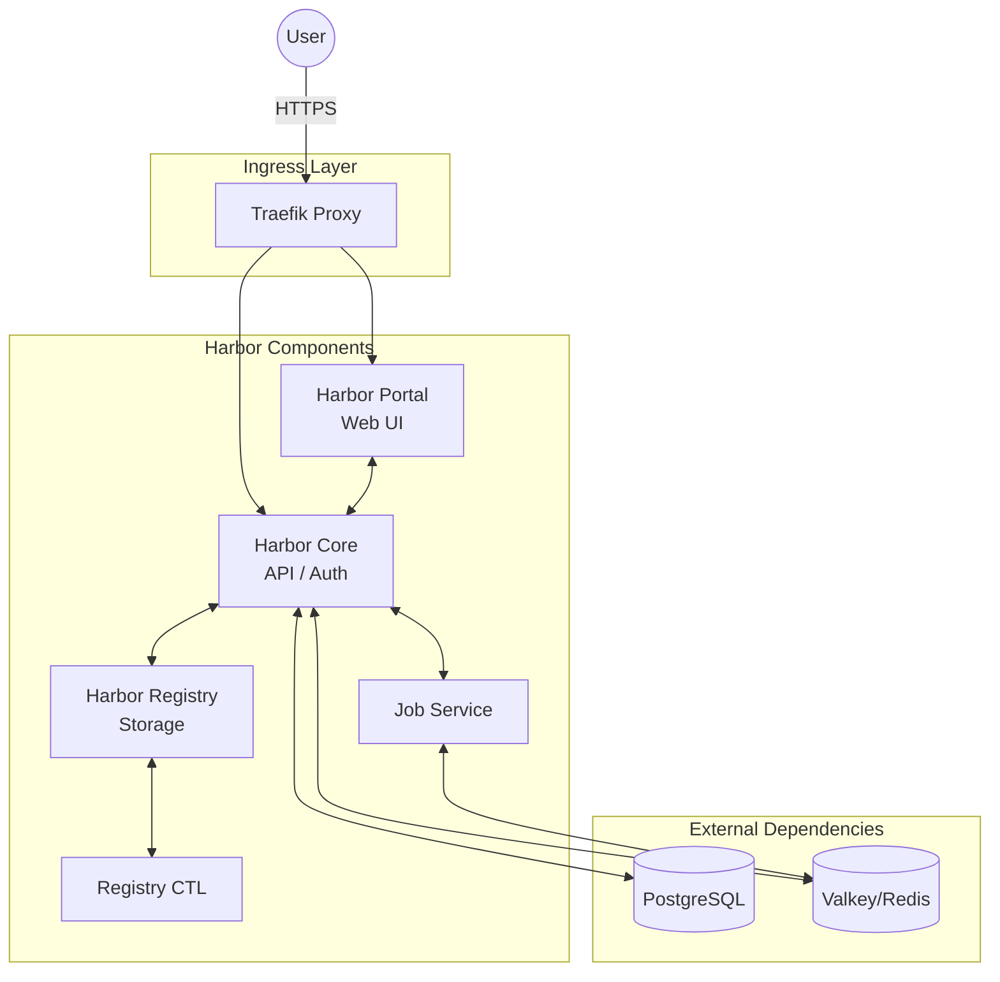

# Harbor Container Registry

## Overview

**Harbor** is an open-source trusted cloud native registry project that stores, signs, and scans content. This deployment features a multi-component architecture including a portal, core management, asynchronous job execution, and a Docker distribution registry, leveraging external high-performance databases for metadata and caching.



## Services

| Service | Image | Role | Resources |
| :--- | :--- | :--- | :--- |
| `harbor-core` | `bitnami/harbor-core:2` | Management API & Authentication | 1.0 CPU / 1GB |
| `harbor-portal` | `bitnami/harbor-portal:2` | Web UI Dashboard | *(Implicit)* |
| `harbor-registry` | `bitnami/harbor-registry:2` | Docker Distribution Engine | 1.0 CPU / 1G |
| `harbor-registryctl` | `bitnami/harbor-registryctl:2`| Registry Controller | 0.5 CPU / 512M |
| `harbor-jobservice` | `bitnami/harbor-jobservice:2`| Async Repositories / Scanning Jobs | 1.0 CPU / 1G |

## External Dependencies

Harbor relies on existing management services within the `infra_net` network:

- **PostgreSQL (`mng-pg`)**: Persistent storage for projects, users, and repository metadata.
- **Valkey (`mng-redis`)**: High-performance caching for sessions and job queues (Database indices 0 and 1).

## Networking

All components are connected via `infra_net` and exposed through Traefik.

| Setting | Value | Description |
| :--- | :--- | :--- |
| **External Endpoint** | `https://harbor.${DEFAULT_URL}` | Public access URL |
| **Internal Communication** | `harbor-core:8080`, `harbor-registry:5000` | Intra-service API calls |

## Persistence

Data is persisted using local bind mounts on the host system to ensure easy backups and maintenance.

| Mount Point | Host Path | Description |
| :--- | :--- | :--- |
| `/storage` | `${DEFAULT_CICD_DIR}/harbor/registry/data` | Actual Docker image layers and blobs |
| `/data` | `${DEFAULT_CICD_DIR}/harbor/core/data` | Core application state and certificates |
| `/var/log/jobs` | `${DEFAULT_CICD_DIR}/harbor/jobservice/logs` | Task logs for vulnerability scans |

## Usage

### 1. Web Access

Navigate to `https://harbor.${DEFAULT_URL}` and log in with the admin credentials:

- **User**: `admin`
- **Password**: `${HARBOR_PASSWORD}`

### 2. Docker CLI Login

To use Harbor as your primary registry:

```bash
docker login harbor.${DEFAULT_URL}
```

### 3. Pushing an Image

```bash
docker tag my-app:latest harbor.${DEFAULT_URL}/my-project/my-app:latest
docker push harbor.${DEFAULT_URL}/my-project/my-app:latest
```

## Troubleshooting

### "Service Unhealthy"

Harbor components have strict dependency chains. If the Core service is unhealthy, check the logs of **PostgreSQL** or **Valkey** first.

### "Token Mismatch"

Ensure the `HARBOR_CORE_SECRET` and `HARBOR_REGISTRY_HTTP_SECRET` are consistent across all cluster components defined in the `docker-compose.yml`.
