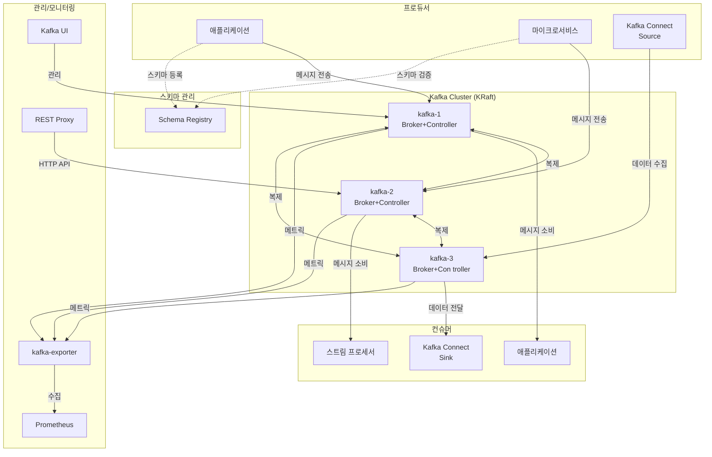

# Apache Kafka 클러스터 (KRaft 모드)

## 시스템 아키텍처에서의 역할

Kafka는 **이벤트 스트리밍 플랫폼**으로서 시스템의 핵심 메시징 및 이벤트 처리 계층입니다. 마이크로서비스 간 비동기 통신, 실시간 데이터 파이프라인, 이벤트 소싱 아키텍처의 백본을 담당합니다.

**핵심 역할:**

- 📨 **이벤트 브로커**: 마이크로서비스 간 비동기 메시지 전달
- 🔄 **데이터 파이프라인**: 실시간 데이터 스트리밍 및 변환
- 📊 **이벤트 소싱**: 모든 상태 변경을 이벤트로 기록
- 🔗 **시스템 통합**: Kafka Connect를 통한 외부 시스템 연동
- ⚡ **이벤트 드리븐 아키텍처**: 느슨한 결합의 확장 가능한 시스템 구축

## 아키텍처 구성



## 주요 구성 요소

### 1. Kafka 브로커 (KRaft 모드, 3개)

- **컨테이너**: `kafka-1`, `kafka-2`, `kafka-3`
- **이미지**: `confluentinc/cp-kafka:7.7.0`
- **모드**: KRaft (Zookeeper 불필요)
- **역할**: Broker + Controller (통합 모드)

**포트:**

- **내부 통신**: `19092` (PLAINTEXT)
- **컨트롤러**: `9093` (CONTROLLER)
- **외부 접속**:
  - kafka-1: `${KAFKA_CONTROLLER_1_HOST_PORT}` (기본 9092)
  - kafka-2: `${KAFKA_CONTROLLER_2_HOST_PORT}` (기본 9093)
  - kafka-3: `${KAFKA_CONTROLLER_3_HOST_PORT}` (기본 9094)

**주요 설정:**

- `CLUSTER_ID`: 클러스터 고유 ID
- `KAFKA_NODE_ID`: 노드 ID (1, 2, 3)
- `KAFKA_PROCESS_ROLES`: "broker,controller"
- `KAFKA_CONTROLLER_QUORUM_VOTERS`: "1@kafka-1:9093,2@kafka-2:9093,3@kafka-3:9093"
- `KAFKA_OFFSETS_TOPIC_REPLICATION_FACTOR`: 3
- `KAFKA_MIN_INSYNC_REPLICAS`: 2
- `KAFKA_NUM_PARTITIONS`: 3 (기본 파티션 수)

**볼륨**: `kafka-1-data`, `kafka-2-data`, `kafka-3-data` (`/var/lib/kafka/data`)  
**IP**: 172.19.0.20-22  
**JVM**: `-Xms512m -Xmx512m`

### 2. Schema Registry

- **컨테이너**: `schema-registry`
- **이미지**: `confluentinc/cp-schema-registry:7.7.0`
- **역할**: Avro/Protobuf/JSON 스키마 중앙 관리
- **포트**: `${SCHEMA_REGISTRY_PORT}` (기본 8081)
- **Traefik**: `https://schema-registry.${DEFAULT_URL}`
- **IP**: 172.19.0.23

**기능:**

- 스키마 버전 관리
- 스키마 호환성 검증
- 프로듀서/컨슈머 스키마 공유

### 3. Kafka Connect (Distributed)

- **컨테이너**: `kafka-connect`
- **이미지**: `confluentinc/cp-kafka-connect:7.7.0`
- **역할**: 외부 시스템과 Kafka 간 데이터 연동
- **포트**: `${KAFKA_CONNECT_PORT}` (기본 8083)
- **Traefik**: `https://kafka-connect.${DEFAULT_URL}`
- **IP**: 172.19.0.24

**내부 토픽:**

- `_connect-configs`: 커넥터 설정
- `_connect-offsets`: 오프셋 저장
- `_connect-status`: 커넥터 상태

**변환기:**

- Key/Value: JSON Converter (스키마 비활성화)
- Schema Registry 통합 지원

**볼륨**: `kafka-connect-data:/var/lib/kafka-connect`

**사용 사례:**

- PostgreSQL → Kafka (CDC, Debezium)
- Kafka → OpenSearch (실시간 검색)
- Kafka → S3/MinIO (데이터 레이크)

### 4. Kafka REST Proxy

- **컨테이너**: `kafka-rest-proxy`
- **이미지**: `confluentinc/cp-kafka-rest:7.7.0`
- **역할**: HTTP REST API를 통한 Kafka 접근
- **포트**: `${KAFKA_REST_PROXY_PORT}` (기본 8082)
- **Traefik**: `https://kafka-rest.${DEFAULT_URL}`
- **IP**: 172.19.0.25

**API 엔드포인트:**

- `/topics`: 토픽 목록
- `/topics/{topic}`: 메시지 Produce/Consume
- `/consumers/{group}`: 컨슈머 그룹관리

### 5. Kafka UI (Provectus)

- **컨테이너**: `kafka-ui`
- **이미지**: `provectuslabs/kafka-ui:v0.7.2`
- **역할**: Kafka 클러스터 관리 웹 UI
- **포트**: `${KAFKA_UI_PORT}` (기본 8080)
- **Traefik**: `https://kafka-ui.${DEFAULT_URL}`
- **인증**: Keycloak SSO (`sso-auth@file`)
- **IP**: 172.19.0.26

**기능:**

- 토픽/파티션 브라우저
- 메시지 검색 및 필터링
- Schema Registry 관리
- Kafka Connect 커넥터관리
- 컨슈머 그룹 모니터링
- ACL 관리

### 6. Kafka Exporter

- **컨테이너**: `kafka-exporter`
- **이미지**: `danielqsj/kafka-exporter:v1.7.0`
- **역할**: Prometheus 메트릭 수집
- **포트**: `${KAFKA_EXPORTER_PORT}` (기본 9308)
- **IP**: 172.19.0.27

**주요 메트릭:**

- `kafka_brokers`: 브로커 수
- `kafka_topic_partitions`: 토픽 파티션 수
- `kafka_consumergroup_lag`: 컨슈머 그룹 지연

## 환경 변수

### .env 파일

```bash
# Kafka 클러스터
KAFKA_CLSUTER_ID=MkU3OEVBNTcwNTJENDM2Qk
KAFKA_CLSUTER_NAME=hy-kafka-cluster

# Kafka 브로커 포트
KAFKA_CONTROLLER_PORT=9092
KAFKA_CONTROLLER_1_HOST_PORT=9092
KAFKA_CONTROLLER_2_HOST_PORT=9093
KAFKA_CONTROLLER_3_HOST_PORT=9094

# Schema Registry
SCHEMA_REGISTRY_PORT=8081
SCHEMA_REGISTRY_HOST_PORT=8081

# Kafka Connect
KAFKA_CONNECT_PORT=8083
KAFKA_CONNECT_HOST_PORT=8083

# REST Proxy
KAFKA_REST_PROXY_PORT=8082
KAFKA_REST_PROXY_HOST_PORT=8082

# Kafka UI
KAFKA_UI_PORT=8080
KAFKA_UI_HOST_PORT=8080

# Kafka Exporter
KAFKA_EXPORTER_PORT=9308
KAFKA_EXPORTER_HOST_PORT=9308

# 도메인
DEFAULT_URL=hy-home.local
```

## 네트워크

- **네트워크**: `infra_net`
- **서브넷**: 172.19.0.0/16
- **고정 IP**: 안정적인 브로커 간 통신

## 시작 방법

### 1. 클러스터 ID 생성 (최초 1회)

```bash
# 클러스터 ID 생성
CLUSTER_ID=$(docker run --rm confluentinc/cp-kafka:7.7.0 kafka-storage random-uuid)
echo "KAFKA_CLSUTER_ID=$CLUSTER_ID"

# .env 파일에 추가
```

### 2. 서비스 시작

```bash
cd d:\hy-home.docker\Infra\kafka
docker-compose up -d
```

### 3. 클러스터 상태 확인

```bash
# 브로커 목록
docker exec kafka-1 kafka-broker-api-versions --bootstrap-server kafka-1:19092

# 토픽 목록
docker exec kafka-1 kafka-topics --bootstrap-server kafka-1:19092 --list
```

## 접속 정보

### Kafka UI

- **URL**: `https://kafka-ui.hy-home.local`
- **인증**: Keycloak SSO

### Kafka REST API

- **URL**: `https://kafka-rest.hy-home.local`
- **문서**: [Confluent REST Proxy API](https://docs.confluent.io/platform/current/kafka-rest/api.html)

### Schema Registry

- **URL**: `https://schema-registry.hy-home.local`

### Kafka Connect

- **URL**: `https://kafka-connect.hy-home.local`

### CLI 연결

```bash
# 컨테이너 내부에서
docker exec -it kafka-1 bash

# 외부에서 (로컬 Kafka 클라이언트 필요)
kafka-console-producer --bootstrap-server localhost:9092 --topic test
```

## 유용한 명령어

### 토픽 관리

```bash
# 토픽 생성
docker exec kafka-1 kafka-topics \
  --bootstrap-server kafka-1:19092 \
  --create \
  --topic my-topic \
  --partitions 3 \
  --replication-factor 3

# 토픽 목록
docker exec kafka-1 kafka-topics --bootstrap-server kafka-1:19092 --list

# 토픽 상세 정보
docker exec kafka-1 kafka-topics \
  --bootstrap-server kafka-1:19092 \
  --describe \
  --topic my-topic

# 토픽 삭제
docker exec kafka-1 kafka-topics \
  --bootstrap-server kafka-1:19092 \
  --delete \
  --topic my-topic
```

### 메시지 Produce/Consume

```bash
# 콘솔 프로듀서
docker exec -it kafka-1 kafka-console-producer \
  --bootstrap-server kafka-1:19092 \
  --topic my-topic

# 콘솔 컨슈머 (처음부터)
docker exec -it kafka-1 kafka-console-consumer \
  --bootstrap-server kafka-1:19092 \
  --topic my-topic \
  --from-beginning

# 컨슈머 그룹 지정
docker exec -it kafka-1 kafka-console-consumer \
  --bootstrap-server kafka-1:19092 \
  --topic my-topic \
  --group my-group
```

### 컨슈머 그룹 관리

```bash
# 컨슈머 그룹 목록
docker exec kafka-1 kafka-consumer-groups \
  --bootstrap-server kafka-1:19092 \
  --list

# 컨슈머 그룹 상세 (lag 확인)
docker exec kafka-1 kafka-consumer-groups \
  --bootstrap-server kafka-1:19092 \
  --group my-group \
  --describe

# 오프셋 리셋
docker exec kafka-1 kafka-consumer-groups \
  --bootstrap-server kafka-1:19092 \
  --group my-group \
  --topic my-topic \
  --reset-offsets \
  --to-earliest \
  --execute
```

### Kafka Connect 관리

```bash
# 커넥터 목록
curl https://kafka-connect.hy-home.local/connectors

# 커넥터 상태
curl https://kafka-connect.hy-home.local/connectors/my-connector/status

# 커넥터 생성
curl -X POST https://kafka-connect.hy-home.local/connectors \
  -H "Content-Type: application/json" \
  -d @connector-config.json

# 커넥터 삭제
curl -X DELETE https://kafka-connect.hy-home.local/connectors/my-connector
```

### Schema Registry

```bash
# 스키마 목록
curl https://schema-registry.hy-home.local/subjects

# 스키마 조회
curl https://schema-registry.hy-home.local/subjects/my-topic-value/versions/latest

# 스키마 등록
curl -X POST https://schema-registry.hy-home.local/subjects/my-topic-value/versions \
  -H "Content-Type: application/vnd.schemaregistry.v1+json" \
  -d '{"schema":"{\"type\":\"string\"}"}'
```

## 데이터 영속성

### 볼륨

- `kafka-1-data`, `kafka-2-data`, `kafka-3-data`: Kafka 로그 세그먼트
- `kafka-connect-data`: Connect 커넥터 데이터

### 로그 보존 정책

```bash
# 토픽별 보존 시간 설정 (7일)
docker exec kafka-1 kafka-configs \
  --bootstrap-server kafka-1:19092 \
  --alter \
  --entity-type topics \
  --entity-name my-topic \
  --add-config retention.ms=604800000
```

## 모니터링 및 경고

### Prometheus 메트릭

- `kafka_brokers`: 활성 브로커 수
- `kafka_topic_partitions`: 토픽 파티션 수
- `kafka_consumergroup_lag`: 컨슈머 지연

### Grafana 대시보드

- [Kafka Exporter Dashboard (ID: 7589)](https://grafana.com/grafana/dashboards/7589)

## 문제 해결

### 브로커 연결 불가

```bash
# 브로커 상태 확인
docker logs kafka-1

# 네트워크 연결 확인
docker exec kafka-1 nc -zv kafka-2 19092
```

### 컨슈머 Lag 증가

```bash
# Lag 확인
docker exec kafka-1 kafka-consumer-groups \
  --bootstrap-server kafka-1:19092 \
  --group my-group \
  --describe

# 파티션 재조정
# 컨슈머 수 증가 또는 파티션 추가
```

### Under-Replicated 파티션

```bash
# 복제 상태 확인
docker exec kafka-1 kafka-topics \
  --bootstrap-server kafka-1:19092 \
  --describe \
  --under-replicated-partitions

# 재균형
docker exec kafka-1 kafka-reassign-partitions \
  --bootstrap-server kafka-1:19092 \
  --reassignment-json-file /tmp/reassignment.json \
  --execute
```

## 시스템 통합

### 의존하는 서비스

- **Traefik**: HTTPS 라우팅
- **Keycloak**: Kafka UI SSO
- **Prometheus**: 메트릭 수집

### 이 서비스를 사용하는 시스템

- **FastAPI**: 이벤트 발행/구독
- **Airflow**: 데이터 파이프라인 트리거
- **n8n**: 워크플로우 이벤트
- **OpenSearch**: 실시간 검색 인덱싱

## 고급 설정

### 성능 튜닝

```bash
# 브로커 설정 (server.properties)
num.network.threads=8
num.io.threads=16
socket.send.buffer.bytes=102400
socket.receive.buffer.bytes=102400

# 프로듀서 최적화
batch.size=32768
linger.ms=10
compression.type=lz4

# 컨슈머 최적화
fetch.min.bytes=1
fetch.max.wait.ms=500
```

### 보안 설정 (SSL/SASL)

KRaft에서 SASL_PLAINTEXT 또는 SSL 활성화 가능 (추가 설정 필요)

## 참고 자료

- [Apache Kafka 공식 문서](https://kafka.apache.org/documentation/)
- [Confluent Platform](https://docs.confluent.io/platform/current/overview.html)
- [KRaft (KIP-500)](https://cwiki.apache.org/confluence/display/KAFKA/KIP-500%3A+Replace+ZooKeeper+with+a+Self-Managed+Metadata+Quorum)
- [Kafka Connect](https://docs.confluent.io/platform/current/connect/index.html)
- [Schema Registry](https://docs.confluent.io/platform/current/schema-registry/index.html)
