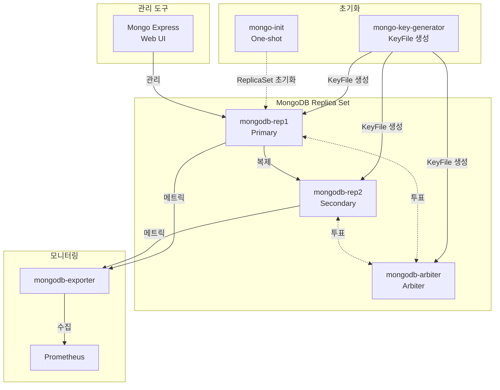

# MongoDB 레플리카 셋

## 시스템 아키텍처에서의 역할

MongoDB는 **문서 기반 NoSQL 데이터베이스**로서 비정형 데이터, JSON/BSON 문서, 유연한 스키마가 필요한 애플리케이션 데이터를 저장합니다. 레플리카 셋을 통해 고가용성과 데이터 내구성을 보장합니다.

**핵심 역할:**

- 📄 **문서 데이터베이스**: JSON 형태의 비정형 데이터 저장
- 🔄 **고가용성**: 레플리카 셋을 통한 자동 장애 조치
- 📊 **CMS 백엔드**: 콘텐츠 관리 시스템 데이터
- 🔍 **실시간 쿼리**: 인덱스 기반 빠른 조회
- 🌐 **지리 정보**: 위치 기반 서비스(Geospatial Queries)

## 아키텍처 구성



## 주요 구성 요소

### 1. KeyFile 생성기

- **컨테이너**: `mongo-key-generator`
- **이미지**: `alpine:3.23.0`
- **역할**: 레플리카 셋 인증용 KeyFile 자동 생성 (one-shot)
- **동작**:
  1. `/data/configdb/mongodb.key` 존재 확인
  2. 없으면 `openssl rand -base64 756`로 생성
  3. 권한 설정: `chown 999:999`, `chmod 400`

### 2. MongoDB 레플리카 셋 노드

**Primary + Secondary (2개):**

- **컨테이너**: `mongodb-rep1`, `mongodb-rep2`
- **이미지**: `mongo:8.2.2-noble`
- **역할**: 데이터 저장 노드 (Priority 2, 1)
- **볼륨**: `mongodb1-data`, `mongodb2-data` (`/data/db`)
- **환경 변수**:
  - `MONGO_INITDB_ROOT_USERNAME`
  - `MONGO_INITDB_ROOT_PASSWORD`

**Arbiter (투표 전용):**

- **컨테이너**: `mongodb-arbiter`
- **이미지**: `mongo:8.2.2-noble`
- **역할**: 투표권만 가진 가벼운 노드 (데이터 저장 없음)
- **목적**: 홀수 노드로 split-brain 방지

**공통 설정:**

- `--replSet MyReplicaSet`
- `--keyFile /data/configdb/mongodb.key`
- `--bind_ip_all`
- 헬스체크: `mongosh --eval "db.adminCommand('ping')"`

### 3. ReplicaSet 초기화

- **컨테이너**: `mongo-init`
- **이미지**: `mongo:8.2.2-noble`
- **역할**: 레플리카 셋 자동 구성 (one-shot)
- **재시작 정책**: `no`

**ReplicaSet 구성:**

```javascript
{
  _id: "MyReplicaSet",
  members: [
    { _id: 0, host: "mongodb-rep1:27017", priority: 2 },   // Primary 우선
    { _id: 1, host: "mongodb-rep2:27017", priority: 1 },   // Secondary
    { _id: 2, host: "mongodb-arbiter:27017", arbiterOnly: true }  // Arbiter
  ]
}
```

### 4. Mongo Express (Web UI)

- **컨테이너**: `mongo-express`
- **이미지**: `mongo-express:1.0.2-20-alpine3.19`
- **역할**: MongoDB 관리 웹 인터페이스
- **포트**: `${MONGO_EXPRESS_PORT}` (기본 8081)
- **Traefik**: `https://mongo-express.${DEFAULT_URL}`
- **인증**: Basic Auth (자체)
- **환경 변수**:
  - `ME_CONFIG_MONGODB_SERVER`: mongodb-rep1,mongodb-rep2,mongodb-arbiter
  - `ME_CONFIG_MONGODB_REPLICA_SET`: MyReplicaSet
  - `ME_CONFIG_BASICAUTH_USERNAME`
  - `ME_CONFIG_BASICAUTH_PASSWORD`

### 5. MongoDB Exporter

- **컨테이너**: `mongodb-exporter`
- **이미지**: `percona/mongodb_exporter:0.40`
- **역할**: Prometheus 메트릭 수집
- **포트**: `${MONGO_EXPORTER_PORT}` (기본 9216)
- **연결**: `mongodb://<user>:<pass>@mongodb-rep1:27017,mongodb-rep2:27017/?replicaSet=MyReplicaSet&authSource=admin`
- **수집 옵션**:
  - `--collect.collection`
  - `--collect.database`
  - `--collect.indexusage`

## 환경 변수

### .env 파일

```bash
# MongoDB 인증
MONGODB_ROOT_USERNAME=admin
MONGODB_ROOT_PASSWORD=<secure_password>

# Mongo Express
MONGO_EXPRESS_PORT=8081
MONGO_EXPRESS_CONFIG_BASICAUTH_USERNAME=admin
MONGO_EXPRESS_CONFIG_BASICAUTH_PASSWORD=<password>

# MongoDB Exporter
MONGO_EXPORTER_PORT=9216

# 도메인
DEFAULT_URL=127.0.0.1.nip.io
```

## 네트워크

- **네트워크**: `infra_net`
- **동적 IP**: 고정 IP 미할당 (DNS 기반 서비스 디스커버리)

## 시작 방법

### 1. 환경 설정

`.env` 파일에 비밀번호 설정

### 2. 서비스 시작

```bash
cd d:\hy-home.docker\Infra\mongodb
docker-compose up -d
```

### 3. 레플리카 셋 상태 확인

```bash
# Primary 확인
docker exec -it mongodb-rep1 mongosh -u admin -p <password> --eval "rs.status()"

# 노드 목록
docker exec -it mongodb-rep1 mongosh -u admin -p <password> --eval "rs.conf()"
```

### 4. 초기화 로그 확인

```bash
docker logs mongo-init
```

## 접속 정보

### Mongo Express (Web UI)

- **URL**: `https://mongo-express.127.0.0.1.nip.io`
- **인증**: Basic Auth (설정한 사용자명/비밀번호)

### CLI 연결

**레플리카 셋 연결:**

```bash
docker exec -it mongodb-rep1 mongosh \
  "mongodb://admin:<password>@mongodb-rep1:27017,mongodb-rep2:27017/admin?replicaSet=MyReplicaSet"
```

**Primary 직접 연결:**

```bash
docker exec -it mongodb-rep1 mongosh -u admin -p <password>
```

## 유용한 명령어

### 레플리카 셋 관리

```bash
# 레플리카 셋 상태
docker exec mongodb-rep1 mongosh -u admin -p <password> --eval "rs.status()"

# Primary 확인
docker exec mongodb-rep1 mongosh -u admin -p <password> --eval "rs.isMaster()"

# 노드 추가
docker exec mongodb-rep1 mongosh -u admin -p <password> --eval '
rs.add({host: "mongodb-rep3:27017", priority: 1})'

# 수동 페일오버
docker exec mongodb-rep2 mongosh -u admin -p <password> --eval "rs.stepDown()"
```

### 데이터베이스 작업

```bash
# 데이터베이스 목록
docker exec mongodb-rep1 mongosh -u admin -p <password> --eval "show dbs"

# 데이터베이스 생성 및 사용
docker exec mongodb-rep1 mongosh -u admin -p <password> --eval '
use mydb;
db.users.insertOne({name: "John", age: 30});
db.users.find().pretty();
'

# 컬렉션 목록
docker exec mongodb-rep1 mongosh -u admin -p <password> mydb --eval "show collections"

# 통계 정보
docker exec mongodb-rep1 mongosh -u admin -p <password> --eval "db.stats()"
```

### 사용자 관리

```bash
# 사용자 생성
docker exec mongodb-rep1 mongosh -u admin -p <password> --eval '
use mydb;
db.createUser({
  user: "appuser",
  pwd: "apppass",
  roles: [{role: "readWrite", db: "mydb"}]
});
'

# 사용자 목록
docker exec mongodb-rep1 mongosh -u admin -p <password> --eval "db.getUsers()"
```

### 백업 및 복구

```bash
# 데이터베이스 백업
docker exec mongodb-rep1 mongodump \
  -u admin -p <password> \
  --authenticationDatabase admin \
  --db mydb \
  --out /tmp/backup

# 백업 파일 추출
docker cp mongodb-rep1:/tmp/backup ./backup

# 복구
docker cp ./backup mongodb-rep1:/tmp/restore
docker exec mongodb-rep1 mongorestore \
  -u admin -p <password> \
  --authenticationDatabase admin \
  /tmp/restore
```

## 데이터 영속성

### 볼륨

- `mongo-key`: KeyFile 저장 (`/data/configdb`)
- `mongodb1-data`: mongodb-rep1 데이터 (`/data/db`)
- `mongodb2-data`: mongodb-rep2 데이터 (`/data/db`)

### 저널링

MongoDB는 기본적으로 저널링 활성화 (데이터 내구성 보장)

## 모니터링 및 경고

### Prometheus 메트릭

- `mongodb_up`: MongoDB 가용성
- `mongodb_replset_member_state`: 레플리카 셋 멤버 상태
- `mongodb_connections`: 현재 연결 수
- `mongodb_op_counters_total`: 작업 카운터

### Grafana 대시보드

- [MongoDB Dashboard (ID: 2583)](https://grafana.com/grafana/dashboards/2583)

## 문제 해결

### 레플리카 셋 초기화 실패

```bash
# 초기화 로그 확인
docker logs mongo-init

# 수동 초기화
docker exec -it mongodb-rep1 mongosh -u admin -p <password> --eval '
rs.initiate({
  _id: "MyReplicaSet",
  members: [
    { _id: 0, host: "mongodb-rep1:27017" }
  ]
});
rs.add("mongodb-rep2:27017");
rs.addArb("mongodb-arbiter:27017");
'
```

### Primary 선출 문제

```bash
# 투표 가능한 노드 확인
docker exec mongodb-rep1 mongosh -u admin -p <password> --eval "rs.status().members"

# Priority 확인
docker exec mongodb-rep1 mongosh -u admin -p <password> --eval "rs.conf().members"
```

### 복제 지연

```bash
# 복제 상태 확인
docker exec mongodb-rep1 mongosh -u admin -p <password> --eval "rs.printReplicationInfo()"
docker exec mongodb-rep1 mongosh -u admin -p <password> --eval "rs.printSecondaryReplicationInfo()"
```

## 시스템 통합

### 의존하는 서비스

- **Traefik**: Mongo Express HTTPS 라우팅
- **Prometheus**: 메트릭 수집

### 이 서비스를 사용하는 애플리케이션

- **NestJS**: 비정형 데이터 저장
- **CMS 애플리케이션**: 콘텐츠 관리
- **실시간 대시보드**: 로그 집계

## 참고 자료

- [MongoDB 공식 문서](https://www.mongodb.com/docs/)
- [Replication](https://www.mongodb.com/docs/manual/replication/)
- [mongosh](https://www.mongodb.com/docs/mongodb-shell/)
- [Mongo Express](https://github.com/mongo-express/mongo-express)
