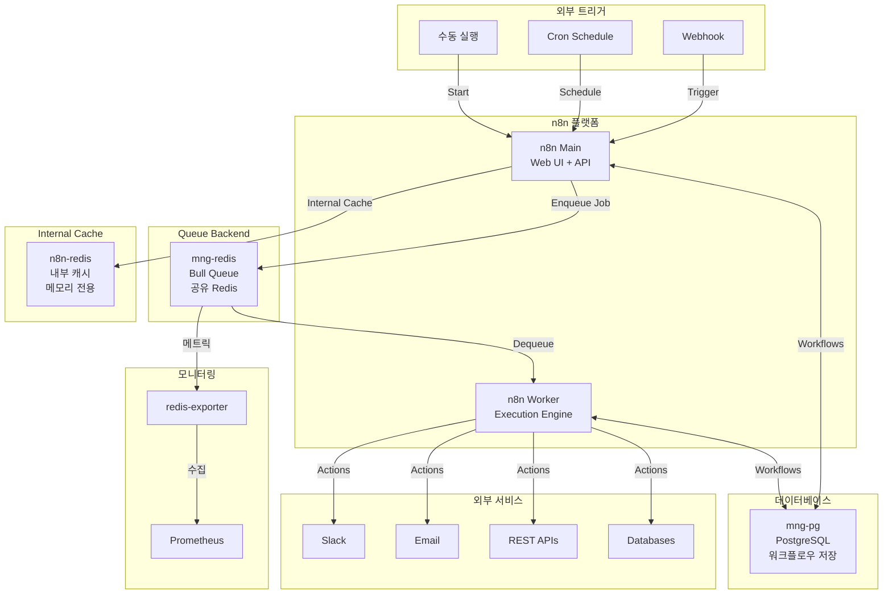

# n8n (워크플로우 자동화 플랫폼)

## 시스템 아키텍처에서의 역할

n8n은 **노코드/로우코드 워크플로우 자동화 플랫폼**으로서 다양한 서비스와 API를 연결하여 비즈니스 프로세스를 자동화합니다. 이벤트 기반 워크플로우, 데이터 파이프라인, 통합 자동화의 중심 허브 역할을 합니다.

**핵심 역할:**

- 🔄 **워크플로우 자동화**: 노드 기반 시각적 프로세스 구성
- 🔗 **시스템 통합**: 400+ 서비스 연동 (Zapier 대체)
- ⏰ **스케줄링**: Cron 기반 작업 스케줄링
- 📨 **이벤트 처리**: Webhook 기반 실시간 이벤트 처리
- 🚀 **확장성**: Worker 기반 분산 실행

## 아키텍처 구성



## 주요 구성 요소

### 1. n8n Main (웹 UI + API 서버)

- **컨테이너**: `n8n`
- **이미지**: `n8nio/n8n:1.123.1`
- **역할**: 워크플로우 편집 UI, REST API, Webhook 수신
- **포트**: `${N8N_PORT}` (기본 5678)
- **Traefik**: `https://n8n.${DEFAULT_URL}`
- **IP**: 172.19.0.14

**주요 설정:**

- `EXECUTIONS_MODE=queue`: Worker 기반 실행
- `N8N_PROTOCOL=https`
- `N8N_HOST=n8n.${DEFAULT_URL}`
- `WEBHOOK_URL=https://n8n.${DEFAULT_URL}/`
- `N8N_PUSH_BACKEND=websocket`: 실시간 UI 업데이트

**데이터베이스 연결 (mng-pg):**

- `DB_TYPE=postgresdb`
- `DB_POSTGRESDB_HOST=${POSTGRES_HOSTNAME}` (mng-pg)
- `DB_POSTGRESDB_DATABASE=n8n`
- **Note**: PostgreSQL HA Cluster가 아닌 mng-pg 사용

**Queue Redis (mng-redis):**

- `QUEUE_BULL_REDIS_HOST=${MNG_REDIS_HOST}` (mng-redis)
- `QUEUE_BULL_PREFIX=n8n`
- `QUEUE_HEALTH_CHECK_ACTIVE=true`
- **Note**: Bull Queue 백엔드로 mng-redis 공유 사용

**내부 캐시 (n8n-redis):**

- n8n 내부 메모리 캐시 전용
- 워크플로우 임시 데이터 저장

**메트릭:**

- `N8N_METRICS=true`
- `N8N_METRICS_PREFIX=n8n_`
- `N8N_METRICS_INCLUDE_WORKFLOW_ID_LABEL=true`

### 2. n8n Worker (실행 엔진)

- **컨테이너**: `n8n-worker`
- **이미지**: `n8nio/n8n:1.123.1`
- **역할**: 큐에서 작업을 가져와 워크플로우 실행
- **Command**: `worker`
- **IP**: 172.19.0.17

**설정:**

- Main과 동일한 DB, Redis, 암호화 키 사용
- 여러 Worker 인스턴스 확장 가능 (수평 확장)

### 3. n8n-redis (내부 캐시)

- **컨테이너**: `n8n-redis`
- **이미지**: `redis:8.2.3-bookworm`
- **역할**: n8n 내부 메모리 캐시 전용 (Bull Queue 아님)
- **포트**: 6379 (내부)
- **IP**: 172.19.0.15

**용도:**

- 워크플로우 임시 데이터 캐싱
- 세션 데이터 저장
- **Note**: Bull Queue는 mng-redis를 사용, 이 Redis는 내부 캐시 전용

**설정:**

- `--requirepass`: 비밀번호 인증
- `--appendonly yes`: AOF 영속성
- Docker Secrets 사용

### 4. Redis Exporter (모니터링)

- **컨테이너**: `n8n-redis-exporter`
- **이미지**: `oliver006/redis_exporter:v1.80.0-alpine`
- **역할**: n8n Redis 메트릭 수집
- **포트**: `${REDIS_EXPORTER_PORT}` (9121)
- **IP**: 172.19.0.16

## 환경 변수

### .env 파일

```bash
# n8n 기본 설정
N8N_PORT=5678
N8N_HOST_PORT=5678
N8N_ENCRYPTION_KEY=<random_32_char_string>

# 데이터베이스 (mng-pg, PostgreSQL HA Cluster 아님)
POSTGRES_HOSTNAME=mng-pg
POSTGRES_PORT=5432
N8N_DB_USER=n8n_user
N8N_DB_PASSWORD=<secure_password>

# Queue Redis (mng-redis, Redis Cluster 아님)
MNG_REDIS_HOST=mng-redis
REDIS_PORT=6379

# 타임존
DEFAULT_TIMEZONE=Asia/Seoul

# Exporter
REDIS_EXPORTER_PORT=9121

# 도메인
DEFAULT_URL=hy-home.local
```

### Docker Secrets

- `redis_password`: Redis 인증 비밀번호

## 네트워크

- **네트워크**: `infra_net`
- **서브넷**: 172.19.0.0/16
- **고정 IP**: 172.19.0.14-17

## 시작 방법

### 1. PostgreSQL 데이터베이스 생성 (mng-pg)

```bash
# mng-pg에 접속
docker exec -it mng-pg psql -U postgres

# 데이터베이스 및 사용자 생성
CREATE DATABASE n8n;
CREATE USER n8n_user WITH ENCRYPTED PASSWORD '<password>';
GRANT ALL PRIVILEGES ON DATABASE n8n TO n8n_user;
\q
```

### 2. 환경 설정

`.env` 파일에 암호화 키 생성:

```bash
# 32자 랜덤 키 생성
openssl rand -base64 32
```

### 3. 서비스 시작

```bash
cd d:\hy-home.docker\Infra\n8n
docker-compose up -d
```

### 4. 초기 설정

```bash
# n8n UI 접속
# https://n8n.hy-home.local

# 초기 관리자 계정 생성
```

## 접속 정보

### n8n Web UI

- **URL**: `https://n8n.hy-home.local`
- **초기 접속**: 관리자 계정 생성 필요

### Webhook URL 패턴

- **Production**: `https://n8n.hy-home.local/webhook/<webhook-path>`
- **Test**: `https://n8n.hy-home.local/webhook-test/<webhook-path>`

## 유용한 명령어

### n8n 관리

```bash
# n8n 버전 확인
docker exec n8n n8n --version

# 워크플로우 CLI
docker exec n8n n8n export:workflow --all --output=/tmp/workflows.json
docker exec n8n n8n import:workflow --input=/tmp/workflow.json

# 메트릭 확인
curl http://localhost:5678/metrics
```

### Worker 확장

```bash
# docker-compose.yml에서 worker를 복제하여 확장
# worker-2, worker-3 추가 가능
```

### Redis 큐 확인

```bash
# Redis CLI 접속
docker exec -it n8n-redis redis-cli -a <password>

# 큐 키 확인
KEYS n8n:*

# 큐 길이 확인
LLEN n8n:waiting
LLEN n8n:active
LLEN n8n:completed
```

## 워크플로우 예제

### 1. Webhook 트리거

```
Webhook → HTTP Request → Slack 알림
```

### 2. 스케줄링

```
Cron (매일 9AM) → PostgreSQL Query → Email 전송
```

### 3. 데이터 파이프라인

```
Kafka Consumer → Transform → PostgreSQL Insert
```

## 데이터 영속성

### 볼륨

- `n8n-data`: 워크플로우 파일, 자격증명 (`/home/node/.n8n`)
- `n8n-redis-data`: Redis AOF 파일 (`/data`)

### 백업

```bash
# PostgreSQL 백업 (mng-pg)
docker exec mng-pg pg_dump -U postgres n8n > n8n_backup.sql

# n8n 데이터 볼륨 백업
docker run --rm -v n8n-data:/data -v $(pwd):/backup busybox tar czf /backup/n8n-data.tar.gz /data
```

## 모니터링 및 경고

### Prometheus 메트릭

- `n8n_workflow_executions_total`: 워크플로우 실행 횟수
- `n8n_workflow_execution_duration_seconds`: 실행 시간
- `n8n_workflow_errors_total`: 에러 발생 횟수
- `redis_connected_clients`: Redis 연결 수
- `redis_used_memory_bytes`: Redis 메모리 사용량

### Grafana 대시보드

- n8n 전용 대시보드 생성 권장
- Bull Queue 메트릭 모니터링

## 문제 해결

### 워크플로우 실행 실패

```bash
# n8n 로그 확인
docker logs n8n

# Worker 로그 확인
docker logs n8n-worker

# Redis 연결 확인
docker exec n8n nc -zv n8n-redis 6379
```

### Webhook 수신 안됨

```bash
# Traefik 라우팅 확인
curl -I https://n8n.hy-home.local/webhook/test

# n8n Webhook 설정 확인
# UI에서 Webhook 노드의 URL 복사 후 테스트
```

### PostgreSQL 연결 실패

```bash
# DB 연결 테스트
docker exec n8n psql -h pg-router -p 5000 -U n8n_user -d n8n -c "SELECT 1"
```

## 시스템 통합

### 의존하는 서비스

- **mng-pg (PostgreSQL)**: 워크플로우 및 실행 이력 저장
- **mng-redis**: Bull Queue 백엔드 (공유 Redis)
- **n8n-redis**: 내부 캐시 전용 (메모리)
- **Traefik**: HTTPS 라우팅

**Note**: n8n은 PostgreSQL HA Cluster나 Redis Cluster를 사용하지 않고, 관리용 mng-db 서비스를 사용합니다.

### 이 서비스와 연동 가능한 시스템

- **Kafka**: 이벤트 스트림 소비/발행
- **Slack/Discord**: 알림 전송
- **PostgreSQL/MongoDB**: 데이터 CRUD
- **REST APIs**: 외부 서비스 통합
- **Email**: 이메일 자동화

## 고급 설정

### 환경별 설정

```bash
# Production 환경
N8N_ENFORCE_SETTINGS_FILE_PERMISSIONS=true

# 실행 타임아웃
N8N_TIMEOUT_WORKFLOW_EXECUTION=3600

# Worker 동시 실행 수
EXECUTIONS_PROCESS_MAX_CONCURRENT=10
```

### 보안 강화

```bash
# IP 화이트리스트
N8N_SECURITY_ALLOWED_ORIGINS='https://trusted-domain.com'

# Basic Auth (추가 보안)
N8N_BASIC_AUTH_USER=admin
N8N_BASIC_AUTH_PASSWORD=<password>
```

## 참고 자료

- [n8n 공식 문서](https://docs.n8n.io/)
- [n8n Community](https://community.n8n.io/)
- [Workflow Templates](https://n8n.io/workflows/)
- [Node 레퍼런스](https://docs.n8n.io/integrations/builtin/app-nodes/)
