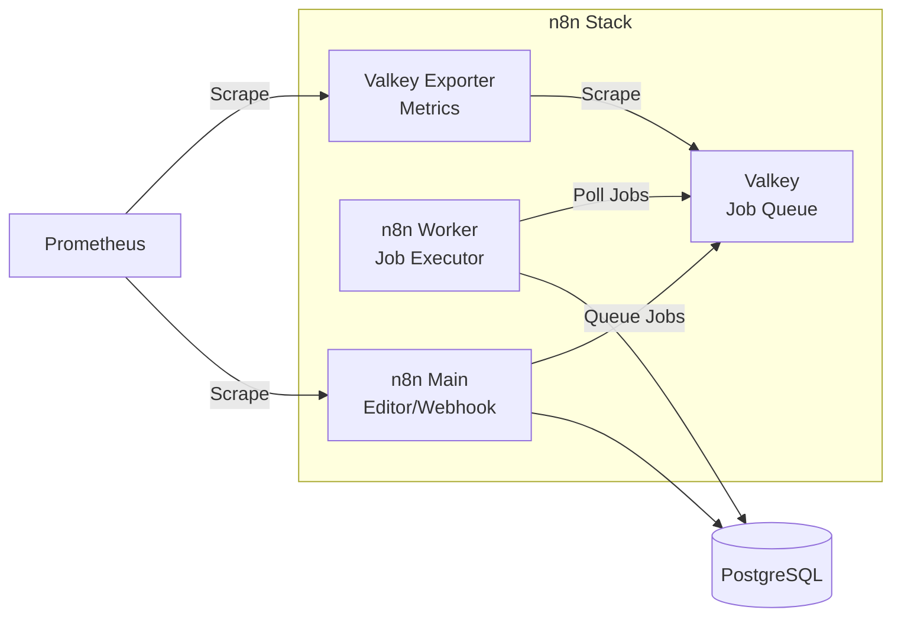
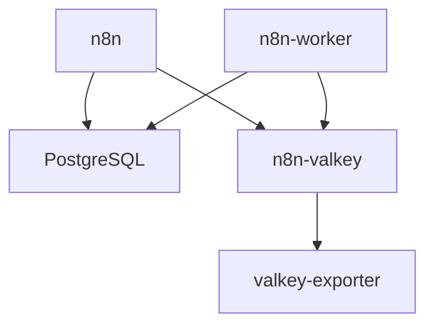

# n8n (Workflow Automation)

## Overview

n8n is an extendable workflow automation tool. This deployment is configured in **Queue Mode** (Scalable Architecture) to handle high-volume workloads by separating the Editor/Webhook handling from the actual execution processing.



## Services

| Service | Image | Role | Resources |
| :--- | :--- | :--- | :--- |
| `n8n` | `n8nio/n8n:2.3.0` | Main Node (Editor/Webhook) | 1 CPU / 2GB |
| `n8n-worker` | `n8nio/n8n:2.3.0` | Worker Node (Job Executor) | 1 CPU / 2GB |
| `n8n-valkey` | `valkey/valkey:9.0.1-alpine` | Job Queue (Redis-compatible) | 0.5 CPU / 256MB |
| `n8n-valkey-exporter` | `oliver006/redis_exporter:v1.80.1` | Prometheus Metrics Exporter | 0.1 CPU / 128MB |

## Networking

| Service | Static IP | Port | Traefik Domain |
| :--- | :--- | :--- | :--- |
| `n8n` | `172.19.0.14` | `${N8N_PORT}` (5678) | `n8n.${DEFAULT_URL}` |
| `n8n-worker` | `172.19.0.17` | - | - |
| `n8n-valkey` | `172.19.0.15` | `${VALKEY_PORT}` (6379) | - |
| `n8n-valkey-exporter` | `172.19.0.16` | `${VALKEY_EXPORTER_PORT}` | - |

## Persistence

| Volume | Mount Point | Description |
| :--- | :--- | :--- |
| `n8n-data` | `/home/node/.n8n` | Workflows, credentials, settings |
| `n8n-valkey-data` | `/data` | Queue persistence (AOF) |

## Configuration

### Core Settings

| Variable | Description | Default |
| :--- | :--- | :--- |
| `EXECUTIONS_MODE` | Execution architecture | `queue` |
| `N8N_ENCRYPTION_KEY` | Credential encryption key | `${N8N_ENCRYPTION_KEY}` |
| `WEBHOOK_URL` | Public webhook URL | `https://n8n.${DEFAULT_URL}` |
| `GENERIC_TIMEZONE` | Default timezone | `${DEFAULT_TIMEZONE}` |

### Database (PostgreSQL)

| Variable | Description | Default |
| :--- | :--- | :--- |
| `DB_TYPE` | Database type | `postgresdb` |
| `DB_POSTGRESDB_HOST` | Database host | `${POSTGRES_HOSTNAME}` |
| `DB_POSTGRESDB_PORT` | Database port | `${POSTGRES_PORT}` |
| `DB_POSTGRESDB_DATABASE` | Database name | `n8n` |
| `DB_POSTGRESDB_USER` | Database user | `${N8N_DB_USER}` |
| `DB_POSTGRESDB_PASSWORD` | Database password | `${N8N_DB_PASSWORD}` |

### Queue (Valkey/Redis)

| Variable | Description | Default |
| :--- | :--- | :--- |
| `QUEUE_BULL_REDIS_HOST` | Queue host | `${MNG_VALKEY_HOST}` |
| `QUEUE_BULL_REDIS_PORT` | Queue port | `${VALKEY_PORT}` |
| `QUEUE_BULL_PREFIX` | Redis key prefix | `n8n` |
| `QUEUE_HEALTH_CHECK_ACTIVE` | Enable health check | `true` |

### Metrics (Prometheus)

| Variable | Description | Default |
| :--- | :--- | :--- |
| `N8N_METRICS` | Enable metrics endpoint | `true` |
| `N8N_METRICS_PREFIX` | Metric name prefix | `n8n_` |
| `N8N_METRICS_INCLUDE_WORKFLOW_ID_LABEL` | Include workflow ID | `true` |
| `N8N_METRICS_INCLUDE_NODE_TYPE_LABEL` | Include node type | `true` |
| `N8N_METRICS_INCLUDE_QUEUE_METRICS` | Include queue metrics | `true` |

## Custom Build

This directory contains a `Dockerfile` for building n8n with custom dependencies.

### Features

- **Microsoft Fonts**: Pre-installed TTF fonts for PDF/Image generation
- **GraphicsMagick**: Image processing support
- **Custom n8n Version**: Specify version via build arg
- **ICU Support**: Full internationalization support

### Build Instructions

> [!WARNING]
> The current Dockerfile may fail due to Alpine package availability issues.
> For production use, prefer the official `n8nio/n8n` image.

1. Edit `docker-compose.yml`:

```yaml
services:
  n8n:
    # image: n8nio/n8n:2.3.0
    build:
      context: .
      dockerfile: Dockerfile
      args:
        - N8N_VERSION=2.3.0
        - NODE_VERSION=20
```

1. Build and start:

```bash
docker compose build n8n
docker compose up -d n8n
```

### Dockerfile Overview

```dockerfile
ARG NODE_VERSION=20
FROM node:${NODE_VERSION}-alpine

ARG N8N_VERSION=2.3.0

# Dependencies: graphicsmagick, tzdata, git, tini, su-exec
# Build deps: python3, build-base (removed after npm install)
# Fonts: msttcorefonts (Microsoft TrueType fonts)
```

### Files

| File | Description |
| :--- | :--- |
| `Dockerfile` | Custom n8n build with fonts and dependencies |
| `docker-entrypoint.sh` | Container entrypoint script |
| `docker-compose.yml` | Service definitions |

## Usage

### Starting Services

```bash
cd infra/n8n
docker compose up -d
```

### Accessing n8n

- **URL**: `https://n8n.${DEFAULT_URL}`
- **First Access**: Create admin account

### Scaling Workers

```bash
# Scale to 3 workers (requires unique container names)
docker compose up -d --scale n8n-worker=3
```

### Checking Queue Status

```bash
# Connect to Valkey CLI
docker exec -it n8n-valkey valkey-cli -a $(cat ../secrets/valkey_password.txt)

# Check queue length
KEYS n8n:*
LLEN n8n:bull:jobs:wait
```

### Viewing Metrics

```bash
# n8n metrics
curl http://172.19.0.14:5678/metrics

# Valkey exporter metrics
curl http://172.19.0.16:9121/metrics
```

## Troubleshooting

### Worker Not Processing Jobs

```bash
# Check worker logs
docker logs n8n-worker

# Verify Redis connection
docker exec n8n-worker nc -zv n8n-valkey 6379
```

### Database Connection Issues

```bash
# Test PostgreSQL connectivity
docker exec n8n nc -zv ${POSTGRES_HOSTNAME} 5432

# Check database exists
docker exec mng-pg psql -U postgres -c "\\l" | grep n8n
```

### Queue Backlog

```bash
# Check pending jobs
docker exec n8n-valkey valkey-cli -a $(cat ../secrets/valkey_password.txt) \
  LLEN n8n:bull:jobs:wait

# Clear stuck jobs (CAUTION: data loss)
docker exec n8n-valkey valkey-cli -a $(cat ../secrets/valkey_password.txt) \
  DEL n8n:bull:jobs:failed
```

## Dependencies



| Service | Depends On | Condition |
| :--- | :--- | :--- |
| `n8n` | `n8n-valkey` | `service_healthy` |
| `n8n-worker` | `n8n`, `n8n-valkey` | `service_healthy` |
| `n8n-valkey-exporter` | `n8n-valkey` | `service_healthy` |

## See Also

- [n8n Documentation](https://docs.n8n.io/)
- [Queue Mode Setup](https://docs.n8n.io/hosting/scaling/queue-mode/)
- [Observability Stack](../observability/README.md) - Prometheus & Grafana
- [PostgreSQL Cluster](../postgresql-cluster/README.md) - Database backend
