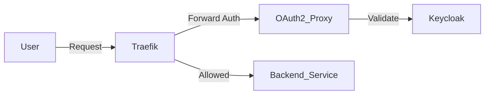

# OAuth2 Proxy

## 1. 서비스 개요 (Service Overview)
**서비스 정의**: OAuth2 Proxy는 인증을 제공하지 않는 백엔드 서비스나 정적 웹사이트 앞에 위치하여 OIDC(OpenID Connect) 기반의 인증을 강제하는 리버스 프록시입니다.

**주요 기능 (Key Features)**:
- **인증 강제**: 인증되지 않은 요청을 ID Provider 로그인 페이지로 리다이렉트.
- **헤더 주입**: 인증 성공 시 업스트림 서비스에 사용자 정보 헤더(`X-Auth-Request-User` 등) 전달.
- **세션 관리**: Redis를 사용하여 분산 세션 저장소 지원.

**기술 스택 (Tech Stack)**:
- **Image**: `quay.io/oauth2-proxy/oauth2-proxy:v7.13.0`
- **Cache**: Redis 8.4
- **Language**: Go

## 2. 아키텍처 및 워크플로우 (Architecture & Workflow)
**시스템 구조도**:


**데이터 흐름 (Data Flow)**:
1. Traefik이 `dashboard-auth` 미들웨어를 통해 요청을 OAuth2 Proxy로 전달.
2. Proxy가 쿠키/토큰 검증.
3. 유효하지 않으면 로그인 URL로 리다이렉트.
4. 유효하면 200 OK와 함께 사용자 헤더 반환 -> Traefik이 백엔드로 요청 진행.

**의존성 (Dependencies)**:
- **Keycloak**: ID Provider 역할.
- **Redis**: 세션 데이터 저장.

## 3. 시작 가이드 (Getting Started)
**사전 요구사항 (Prerequisites)**:
- Keycloak Client 설정 완료.

**실행 방법 (Deployment)**:
```bash
docker compose up -d
```

**초기 설정 (Initial Setup)**:
- `./config/oauth2-proxy.cfg` 파일 또는 환경 변수를 통해 Provider URL 및 Client ID/Secret 설정 필요.

## 4. 환경 설정 명세 (Configuration Reference)
**환경 변수 (Environment Variables)**:

| 변수명 | 설명 |
|---|---|
| `OAUTH2_PROXY_CLIENT_SECRET` | Keycloak Client Secret |
| `OAUTH2_PROXY_COOKIE_SECRET` | 쿠키 암호화 시크릿 (랜덤 생성) |
| `OAUTH2_PROXY_REDIS_CONNECTION_URL` | Redis 접속 주소 |
| `SSL_CERT_FILE` | SSL 루트 인증서 경로 (사설 CA 신뢰용) |

**볼륨 마운트 (Volume Mapping)**:
- `./config/oauth2-proxy.cfg`: 설정 파일.
- `./certs/rootCA.pem`: 사설 인증서 신뢰를 위한 CA 파일.

## 5. 통합 및 API 가이드 (Integration Guide)
**인증 및 인가 (Auth Strategy)**:
- `traefik-forward-auth` 패턴을 사용합니다.
- Traefik 미들웨어 설정 예시:
  ```yaml
  http:
    middlewares:
      sso-auth:
        forwardAuth:
          address: "http://oauth2-proxy:4180"
          trustForwardHeader: true
          authResponseHeaders:
            - "X-Auth-Request-User"
            - "X-Auth-Request-Email"
  ```

**엔드포인트 명세**:
- `/oauth2/start`: 로그인 시작
- `/oauth2/callback`: 인증 후 콜백
- `/oauth2/sign_out`: 로그아웃

## 6. 가용성 및 관측성 (Availability & Observability)
**상태 확인 (Health Check)**:
- `/ping` 엔드포인트 제공.

**모니터링 (Monitoring)**:
- Redis Exporter가 함께 배포되어 Redis 세션 저장소의 상태를 모니터링합니다.

## 7. 백업 및 복구 (Backup & Disaster Recovery)
**데이터 백업**:
- 세션 데이터는 임시적이므로 백업 중요도가 낮지만, Redis AOF(Append Only File)가 활성화되어 있어 재기동 시 데이터 보존.

## 8. 보안 및 강화 (Security Hardening)
**보안 가이드라인**:
- `COOKIE_SECRET`과 `CLIENT_SECRET`은 절대 노출되면 안 됩니다.
- 쿠키 설정 시 `cookie_secure = true`, `cookie_httponly = true`를 사용하십시오.

## 9. 트러블슈팅 (Troubleshooting)
**자주 발생하는 문제**:
- **500 Internal Server Error**: Redis 연결 실패 또는 시크릿 설정 오류.
- **Cookie domain error**: 접속하는 도메인과 쿠키 도메인 설정 불일치.

**진단 명령어**:
```bash
docker compose logs -f oauth2-proxy
```
