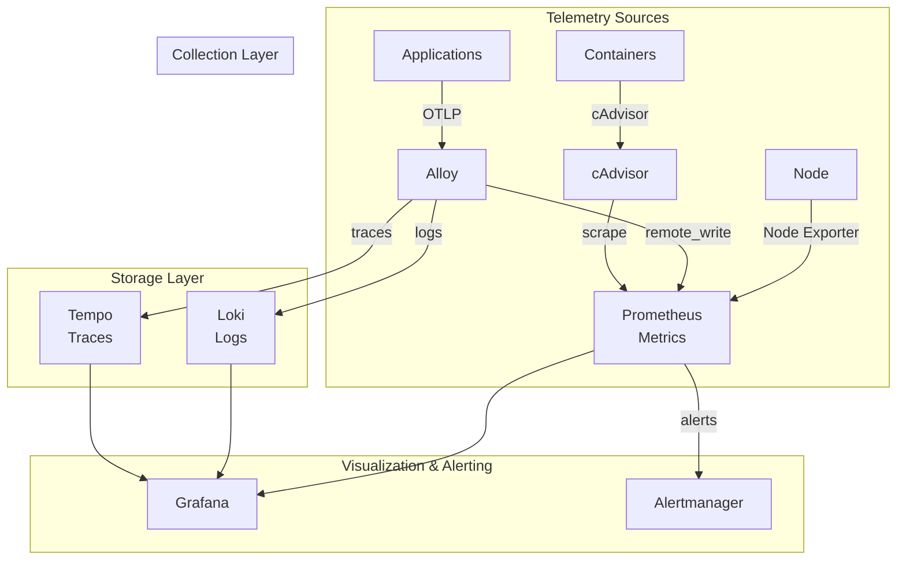

# Observability Stack (LGTM + Alloy)

## Overview

A comprehensive observability stack based on the **LGTM** (Loki, Grafana, Tempo, Mimir-like Prometheus) pattern, with **Grafana Alloy** as the central telemetry collector.



## Services

| Service | Image | Role | Resources |
| :--- | :--- | :--- | :--- |
| [`prometheus`](./prometheus/README.md) | `prom/prometheus:v3.9.0` | Metrics Database (Time Series) | 1 CPU / 1GB |
| [`loki`](./loki/README.md) | `grafana/loki:3.6.3` | Logs Aggregation System | 1 CPU / 1GB |
| [`tempo`](./tempo/README.md) | `grafana/tempo:2.9.0` | Distributed Tracing Backend | 1 CPU / 1GB |
| [`grafana`](./grafana/README.md) | `grafana/grafana:12.3.1` | Visualization Dashboard & Alerting UI | 0.5 CPU / 512MB |
| [`alloy`](./alloy/README.md) | `grafana/alloy:v1.12.1` | OpenTelemetry Collector & Scraper | 0.5 CPU / 512MB |
| `cadvisor` | `gcr.io/cadvisor/cadvisor:v0.55.1` | Container Metrics Exporter | 0.5 CPU / 512MB |
| [`alertmanager`](./alertmanager/README.md) | `prom/alertmanager:v0.30.0` | Alert Handling & Notification | 0.5 CPU / 256MB |
| [`pushgateway`](./pushgateway/README.md) | `prom/pushgateway:v1.11.2` | Ephemeral Metrics Push Endpoint | 0.2 CPU / 128MB |

## Networking

All services run on `infra_net` with static IPs (`172.19.0.3X`).

### IP & Port Mapping

| Service | Static IP | Internal Port | Host Port | Traefik Domain |
| :--- | :--- | :--- | :--- | :--- |
| `prometheus` | `172.19.0.30` | `${PROMETHEUS_PORT}` | - | `prometheus.${DEFAULT_URL}` |
| `loki` | `172.19.0.31` | `${LOKI_PORT}` | `${LOKI_HOST_PORT}` | - |
| `tempo` | `172.19.0.32` | `${TEMPO_PORT}` | `${TEMPO_HOST_PORT}` | - |
| `grafana` | `172.19.0.33` | `${GRAFANA_PORT}` | - | `grafana.${DEFAULT_URL}` |
| `alloy` | `172.19.0.34` | `${ALLOY_PORT}` (UI) | `${ALLOY_OTLP_GRPC_HOST_PORT}` (gRPC)<br>`${ALLOY_OTLP_HTTP_HOST_PORT}` (HTTP) | `alloy.${DEFAULT_URL}` |
| `cadvisor` | `172.19.0.35` | `${CADVISOR_PORT}` | - | - |
| `alertmanager` | `172.19.0.36` | `${ALERTMANAGER_PORT}` | - | `alertmanager.${DEFAULT_URL}` |
| `pushgateway` | `172.19.0.37` | `${PUSHGATEWAY_PORT}` | - | `pushgateway.${DEFAULT_URL}` |

## Persistence

Data is persisted in named volumes and configuration via bind mounts:

| Type | Volume/Path | Mount Point | Mode |
| :--- | :--- | :--- | :--- |
| Metrics | `prometheus-data` | `/prometheus` | RW |
| Logs | `loki-data` | `/loki` | RW |
| Traces | `tempo-data` | `/var/tempo` | RW |
| Dashboards | `grafana-data` | `/var/lib/grafana` | RW |
| Alerts | `alertmanager-data` | `/alertmanager` | RW |
| Prometheus Config | `./prometheus/config/` | `/etc/prometheus/` | RO |
| Loki Config | `./loki/config/` | `/etc/loki/` | RO |
| Tempo Config | `./tempo/config/` | `/etc/` | RO |
| Alloy Config | `./alloy/config/` | `/etc/alloy/` | RO |
| Grafana Dashboards | `./grafana/dashboards/` | `/etc/grafana/dashboards` | RO |

## Configuration

### Prometheus

- **Config**: [`prometheus/config/prometheus.yml`](./prometheus/config/prometheus.yml)
- **Alert Rules**: [`prometheus/config/alert_rules.yml`](./prometheus/config/alert_rules.yml)
- **K8s Alert Rules**: [`prometheus/config/alert_rules.k8s.yml`](./prometheus/config/alert_rules.k8s.yml) (optional)

#### Alert Rule Groups

| Group | Description | Count |
| :--- | :--- | :--- |
| `prometheus_alerts` | Prometheus self-monitoring | 9 |
| `infrastructure_alerts` | Container CPU/Memory/Network | 7 |
| `n8n_alerts` | n8n workflow automation | 2 |
| `redis_alerts` | Redis cluster health | 7 |
| `valkey_alerts` | Valkey (Redis-compatible) | 3 |
| `kafka_alerts` | Kafka broker & consumer lag | 4 |
| `postgres_alerts` | PostgreSQL connections, deadlocks | 8 |
| `opensearch_alerts` | OpenSearch cluster health | 7 |
| `minio_alerts` | MinIO storage | 3 |
| `ollama_alerts` | Ollama LLM service | 1 |
| `gateway_alerts` | HAProxy, Traefik, Nginx | 11 |
| `observability_alerts` | Loki, Alloy, Tempo | 6 |
| `keycloak_alerts` | Authentication failures | 3 |

### Grafana

#### Pre-configured Dashboards (14)

| Dashboard | Source | Description |
| :--- | :--- | :--- |
| Cadvisor exporter | Custom | Container CPU/Memory/Network |
| Kafka Exporter Overview | Grafana Labs | Kafka broker metrics |
| Keycloak Metrics | Grafana Labs | Keycloak authentication |
| Loki Logs App | Grafana Labs (13639) | Log exploration |
| MinIO Dashboard | Grafana Labs | Object storage |
| Node Exporter Full | Grafana Labs | Host system metrics |
| Ollama Exporter | Community | LLM inference metrics |
| OpenSearch | Grafana Labs | Search cluster health |
| PostgreSQL Database | Grafana Labs | Database performance |
| Prometheus 2.0 Overview | Grafana Labs (3662) | Prometheus self-monitoring |
| Qdrant Overview | Custom | Vector database |
| Redis Overview | Grafana Labs | Redis cluster |
| Traefik Official | Traefik Labs | Reverse proxy metrics |
| n8n Health & Performance | Custom | Workflow automation |

#### Authentication (Keycloak SSO)

Grafana is configured with Keycloak OAuth2:

```yaml
GF_AUTH_GENERIC_OAUTH_ENABLED: true
GF_AUTH_OAUTH_AUTO_LOGIN: true
GF_AUTH_DISABLE_LOGIN_FORM: true
```

Role mapping from Keycloak groups:

- `/admins` → Grafana Admin
- `/editors` → Grafana Editor
- Default → Viewer

### Alertmanager

Notification channels supported:

- **Email**: SMTP via `${SMTP_USERNAME}` / `${SMTP_PASSWORD}`
- **Slack**: Webhook via `${SLACK_ALERTMANAGER_WEBHOOK_URL}`

## Environment Variables

### Required Variables

| Variable | Description | Service |
| :--- | :--- | :--- |
| `DEFAULT_URL` | Base domain | All |
| `PROMETHEUS_PORT` | Prometheus port | Prometheus |
| `LOKI_PORT`, `LOKI_HOST_PORT` | Loki ports | Loki |
| `TEMPO_PORT`, `TEMPO_HOST_PORT` | Tempo ports | Tempo |
| `GRAFANA_PORT` | Grafana port | Grafana |
| `GRAFANA_ADMIN_USERNAME` | Admin user | Grafana |
| `GRAFANA_ADMIN_PASSWORD` | Admin password | Grafana |
| `OAUTH2_PROXY_CLIENT_ID` | Keycloak client ID | Grafana |
| `OAUTH2_PROXY_CLIENT_SECRET` | Keycloak client secret | Grafana |
| `ALLOY_PORT` | Alloy UI port | Alloy |
| `ALLOY_OTLP_GRPC_PORT` / `HOST_PORT` | OTLP gRPC | Alloy |
| `ALLOY_OTLP_HTTP_PORT` / `HOST_PORT` | OTLP HTTP | Alloy |
| `CADVISOR_PORT` | cAdvisor port | cAdvisor |
| `ALERTMANAGER_PORT` | Alertmanager port | Alertmanager |
| `SMTP_USERNAME`, `SMTP_PASSWORD` | Email credentials | Alertmanager |
| `SLACK_ALERTMANAGER_WEBHOOK_URL` | Slack webhook | Alertmanager |
| `PUSHGATEWAY_PORT` | Pushgateway port | Pushgateway |

## Usage

### Starting the Stack

```bash
cd infra/observability
docker compose up -d
```

### Accessing Services

| Service | URL | Authentication |
| :--- | :--- | :--- |
| **Grafana** | `https://grafana.${DEFAULT_URL}` | Keycloak SSO |
| **Prometheus** | `https://prometheus.${DEFAULT_URL}` | - |
| **Alertmanager** | `https://alertmanager.${DEFAULT_URL}` | - |
| **Alloy UI** | `https://alloy.${DEFAULT_URL}` | - |
| **Pushgateway** | `https://pushgateway.${DEFAULT_URL}` | - |

### Sending Telemetry

#### OTLP (OpenTelemetry)

```bash
# gRPC
export OTEL_EXPORTER_OTLP_ENDPOINT="http://localhost:${ALLOY_OTLP_GRPC_HOST_PORT}"

# HTTP
export OTEL_EXPORTER_OTLP_ENDPOINT="http://localhost:${ALLOY_OTLP_HTTP_HOST_PORT}"
```

#### Pushgateway (Batch Jobs)

```bash
echo "my_batch_job_duration_seconds 42.5" | curl --data-binary @- \
  http://localhost:${PUSHGATEWAY_HOST_PORT}/metrics/job/my_batch_job
```

## Directory Structure

```
observability/
├── alertmanager/
│   └── config/
│       └── config.yml          # Alert routing & receivers
├── alloy/
│   └── config/
│       └── config.alloy        # Alloy pipeline config
├── grafana/
│   ├── dashboards/             # JSON dashboard files (14)
│   └── provisioning/
│       ├── dashboards/         # Dashboard provisioning
│       └── datasources/        # Datasource provisioning
├── loki/
│   └── config/
│       └── loki-config.yaml    # Loki configuration
├── prometheus/
│   └── config/
│       ├── prometheus.yml      # Prometheus config
│       ├── alert_rules.yml     # Alert definitions
│       └── alert_rules.k8s.yml # K8s-specific alerts
├── pushgateway/
│   └── README.md
├── tempo/
│   └── config/
│       └── tempo.yaml          # Tempo configuration
├── docker-compose.yml          # Main compose file
└── README.md                   # This file
```

## Troubleshooting

### Prometheus

```bash
# Check configuration
docker exec infra-prometheus promtool check config /etc/prometheus/prometheus.yml

# Check alert rules
docker exec infra-prometheus promtool check rules /etc/prometheus/alert_rules.yml

# Reload configuration
curl -X POST http://localhost:${PROMETHEUS_PORT}/-/reload
```

### Grafana

```bash
# Check logs
docker logs infra-grafana

# Reset admin password
docker exec infra-grafana grafana-cli admin reset-admin-password newpassword
```

### Alloy

```bash
# Check pipeline status
curl http://localhost:${ALLOY_PORT}/metrics

# Debug config
docker exec infra-alloy alloy fmt /etc/alloy/config.alloy
```

## See Also

- [Prometheus Documentation](https://prometheus.io/docs/)
- [Grafana Documentation](https://grafana.com/docs/)
- [Loki Documentation](https://grafana.com/docs/loki/)
- [Tempo Documentation](https://grafana.com/docs/tempo/)
- [Grafana Alloy Documentation](https://grafana.com/docs/alloy/)
