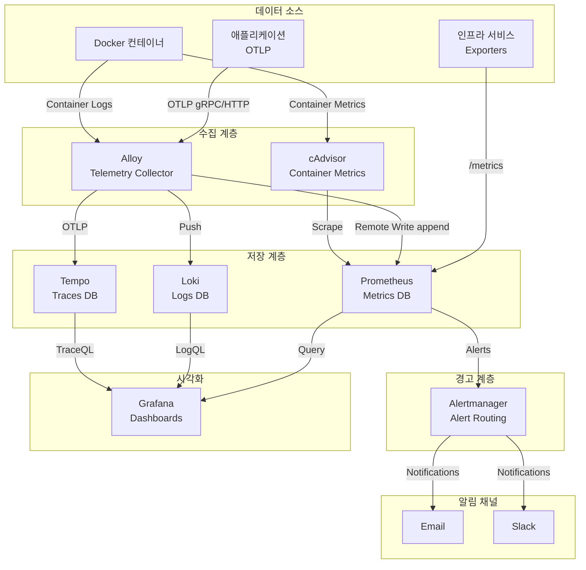

# Observability 스택 (Prometheus + Grafana + Loki + Tempo + Alloy)

## 시스템 아키텍처에서의 역할

Observability 스택은 **전체 인프라 및 애플리케이션 모니터링**을 담당하는 핵심 관측 계층입니다. 메트릭(Metrics), 로그(Logs), 트레이스(Traces)의 3대 관측 데이터를 수집, 저장, 시각화하여 시스템 건강성과 성능을 실시간으로 모니터링합니다.

**핵심 역할:**

- 📊 **메트릭 수집**: Prometheus를 통한 시계열 데이터 수집
- 📜 **로그 집계**: Loki를 통한 중앙화된 로그 관리
- 🔍 **분산 추적**: Tempo를 통한 마이크로서비스 트랜잭션 추적
- 📈 **시각화**: Grafana 대시보드를 통한 데이터 시각화
- 🚨 **경고**: Alertmanager를 통한 장애 알림

## 아키텍처 구성



## 주요 구성 요소

### 1. Prometheus (메트릭 저장소)

- **컨테이너**: `infra-prometheus`
- **이미지**: `prom/prometheus:v3.0.0`
- **역할**: 시계열 메트릭 데이터 수집 및 저장
- **포트**: `${PROMETHEUS_PORT}` (기본 9090)
- **Traefik**: `https://prometheus.${DEFAULT_URL}`
- **IP**: 172.19.0.30

**주요 기능:**

- Pull 기반 메트릭 스크래핑
- Remote Write Receiver (Alloy 연동)
- PromQL 쿼리 언어
- Alert Rules 평가
- 설정 Hot-Reload (`--web.enable-lifecycle`)

**설정 파일:**

- `./prometheus/prometheus.yml`: 스크래핑 타겟 및 규칙
- `./prometheus/alert_rules.yml`: 경고 규칙

### 2. Loki (로그 저장소)

- **컨테이너**: `infra-loki`
- **이미지**: `grafana/loki:3.2.1`
- **역할**: 로그 집계 및 인덱싱
- **포트**: `${LOKI_HOST_PORT}:${LOKI_PORT}` (기본 3100)
- **IP**: 172.19.0.31

**주요 기능:**

- 로그 압축 및 저장
- 라벨 기반 인덱싱
- LogQL 쿼리 언어
- Grafana 네이티브 통합

**설정 파일:**

- `./loki/loki-config.yaml`

### 3. Tempo (트레이스 저장소)

- **컨테이너**: `infra-tempo`
- **이미지**: `grafana/tempo:main-b4d6e55`
- **역할**: 분산 추적 데이터 저장
- **포트**: `${TEMPO_HOST_PORT}:${TEMPO_PORT}` (기본 3200)
- **IP**: 172.19.0.32

**주요 기능:**

- OTLP, Jaeger, Zipkin 프로토콜 지원
- TraceQL 쿼리
- 트레이스 샘플링
- Grafana 통합

**설정 파일:**

- `./tempo/tempo.yaml`

### 4. Grafana (시각화 플랫폼)

- **컨테이너**: `infra-grafana`
- **이미지**: `grafana/grafana:12.3.0`
- **역할**: 메트릭/로그/트레이스 통합 시각화
- **포트**: `${GRAFANA_PORT}` (기본 3000)
- **Traefik**: `https://grafana.${DEFAULT_URL}`
- **IP**: 172.19.0.33

**주요 기능:**

- 멀티 데이터소스 대시보드
- Keycloak OAuth2 SSO 연동
- Alert 시각화
- 역할 기반 접근 제어 (RBAC)

**Keycloak SSO 설정:**

- Auto Login: 활성화
- Role Mapping: `/admins` → Admin, `/editors` → Editor
- Logout URL: Keycloak 연동

**Provisioning:**

- `./grafana/provisioning`: 데이터소스 자동 설정
- `./grafana/dashboards`: 대시보드 자동 로드

### 5. Alloy (Telemetry Collector)

- **컨테이너**: `infra-alloy`
- **이미지**: `grafana/alloy:v1.11.3`
- **역할**: 통합 텔레메트리 수집 에이전트
- **포트**:
  - UI: `${ALLOY_PORT}` (기본 12345)
  - OTLP gRPC: `${ALLOY_OTLP_GRPC_HOST_PORT}:${ALLOY_OTLP_GRPC_PORT}` (4317)
  - OTLP HTTP: `${ALLOY_OTLP_HTTP_HOST_PORT}:${ALLOY_OTLP_HTTP_PORT}` (4318)
- **Traefik**: `https://alloy.${DEFAULT_URL}`
- **IP**: 172.19.0.34

**주요 기능:**

- Docker 컨테이너 로그 수집
- OTLP Receiver (애플리케이션 트레이스/메트릭)
- Prometheus Remote Write
- Loki Push
- Tempo OTLP

**볼륨:**

- `/var/lib/docker/containers:ro`: Docker 로그
- `/var/run/docker.sock:ro`: Docker API

**설정 파일:**

- `./alloy/config.alloy`

### 6. cAdvisor (컨테이너 메트릭)

- **컨테이너**: `cadvisor`
- **이미지**: `gcr.io/cadvisor/cadvisor:v0.52.0`
- **역할**: Docker 컨테이너 리소스 사용량 수집
- **포트**: `${CADVISOR_PORT}` (기본 8080)
- **IP**: 172.19.0.35

**수집 메트릭:**

- CPU 사용량
- 메모리 사용량
- 네트워크 I/O
- 디스크 I/O

**볼륨:**

- `/:/rootfs:ro`
- `/var/run:/var/run:ro`
- `/sys:/sys:ro`
- `/var/lib/docker/:/var/lib/docker:ro`

### 7. Alertmanager (경고 관리)

- **컨테이너**: `infra-alertmanager`
- **이미지**: `prom/alertmanager:v0.27.0`
- **역할**: Prometheus 경고 라우팅 및 알림
- **포트**: `${ALERTMANAGER_PORT}` (기본 9093)
- **Traefik**: `https://alertmanager.${DEFAULT_URL}`
- **IP**: 172.19.0.36

**알림 채널:**

- **Email**: SMTP 설정 (`$SMTP_USERNAME`, `$SMTP_PASSWORD`)
- **Slack**: Webhook URL (`$SLACK_ALERTMANAGER_WEBHOOK_URL`)

**설정 파일:**

- `./alertmanager/config.yml`

## 환경 변수

### .env 파일

```bash
# Prometheus
PROMETHEUS_PORT=9090
PROMETHEUS_HOST_PORT=9090

# Loki
LOKI_PORT=3100
LOKI_HOST_PORT=3100

# Tempo
TEMPO_PORT=3200
TEMPO_HOST_PORT=3200

# Grafana
GRAFANA_PORT=3000
GRAFANA_HOST_PORT=3000
GRAFANA_ADMIN_USERNAME=admin
GRAFANA_ADMIN_PASSWORD=<secure_password>

# Alloy
ALLOY_PORT=12345
ALLOY_HOST_PORT=12345
ALLOY_OTLP_GRPC_PORT=4317
ALLOY_OTLP_GRPC_HOST_PORT=4317
ALLOY_OTLP_HTTP_PORT=4318
ALLOY_OTLP_HTTP_HOST_PORT=4318

# cAdvisor
CADVISOR_PORT=8080

# Alertmanager
ALERTMANAGER_PORT=9093
ALERTMANAGER_HOST_PORT=9093
SMTP_USERNAME=<email>
SMTP_PASSWORD=<password>
SLACK_ALERTMANAGER_WEBHOOK_URL=<slack_webhook>

# OAuth2  
OAUTH2_PROXY_CLIENT_ID=<client_id>
OAUTH2_PROXY_CLIENT_SECRET=<client_secret>

# 도메인
DEFAULT_URL=127.0.0.1.nip.io
```

## 네트워크

- **네트워크**: `infra_net`
- **서브넷**: 172.19.0.0/16
- **고정 IP**: 172.19.0.30-36

## 시작 방법

### 1. 설정 파일 준비

```bash
cd d:\hy-home.docker\Infra\observability

# Prometheus 설정
vim prometheus/prometheus.yml
vim prometheus/alert_rules.yml

# Loki 설정
vim loki/loki-config.yaml

# Tempo 설정
vim tempo/tempo.yaml

# Alloy 설정
vim alloy/config.alloy

# Alertmanager 설정
vim alertmanager/config.yml
```

### 2. 서비스 시작

```bash
docker-compose up -d
```

### 3. 상태 확인

```bash
# Prometheus 타겟
curl https://prometheus.127.0.0.1.nip.io/api/v1/targets

# Grafana 접속
# https://grafana.127.0.0.1.nip.io (Keycloak SSO)
```

## 접속 정보

### Grafana

- **URL**: `https://grafana.127.0.0.1.nip.io`
- **인증**: Keycloak SSO (자동 로그인)
- **기본 계정** (비상 접근): admin / <설정한  비밀번호>

### Prometheus

- **URL**: `https://prometheus.127.0.0.1.nip.io`
- **UI**: Prometheus Expression Browser

### Alloy

- **URL**: `https://alloy.127.0.0.1.nip.io`
- **UI**: Alloy Configuration UI

### Alertmanager

- **URL**: `https://alertmanager.127.0.0.1.nip.io`
- **UI**: Alert 상태 및 Silence 관리

## 유용한 명령어

### Prometheus

```bash
# 설정 리로드
curl -X POST https://prometheus.127.0.0.1.nip.io/-/reload

# 타겟 확인
curl https://prometheus.127.0.0.1.nip.io/api/v1/targets | jq

# PromQL 쿼리
curl 'https://prometheus.127.0.0.1.nip.io/api/v1/query?query=up'
```

### Loki

```bash
# 로그 쿼리 (LogQL)
curl -G -s "http://localhost:3100/loki/api/v1/query_range" \
  --data-urlencode 'query={container_name="kafka-1"}' \
  --data-urlencode 'limit=10' | jq

# 라벨 확인
curl http://localhost:3100/loki/api/v1/labels | jq
```

### Grafana API

```bash
# 대시보드 목록
curl -u admin:<password> https://grafana.127.0.0.1.nip.io/api/search

# 데이터소스 목록
curl -u admin:<password> https://grafana.127.0.0.1.nip.io/api/datasources
```

## 데이터 영속성

### 볼륨

- `prometheus-data`: Prometheus TSDB (`/prometheus`)
- `loki-data`: Loki 인덱스 및 청크 (`/loki`)
- `tempo-data`: Tempo 트레이스 (`/var/tempo`)
- `grafana-data`: Grafana 대시보드 및 설정 (`/var/lib/grafana`)
- `alertmanager-data`: Alertmanager 상태 (`/alertmanager`)

### 보존 정책

**Prometheus:**

```yaml
# prometheus.yml
global:
  scrape_interval: 15s
  evaluation_interval: 15s

# 데이터 보존 기간 (기본15일, --storage.tsdb.retention.time 플래그로 변경)
```

**Loki:**

```yaml
# loki-config.yaml
limits_config:
  retention_period: 744h  # 31일
```

## 대시보드 및 시각화

### Grafana 대시보드

**자동 Provisioning:**

- `./grafana/dashboards/`: 대시보드 JSON 파일 배치
- 재시작 시 자동 로드

**추천 대시보드:**

- [Node Exporter Full (ID: 1860)](https://grafana.com/grafana/dashboards/1860)
- [Docker Container \u0026 Host Metrics (ID: 179)](https://grafana.com/grafana/dashboards/179)
- [Loki Dashboard (ID: 13639)](https://grafana.com/grafana/dashboards/13639)

## 모니터링 쿼리 예제

### PromQL

```promql
# CPU 사용률 (컨테이너별)
rate(container_cpu_usage_seconds_total[5m]) * 100

# 메모리 사용량
container_memory_usage_bytes

# 요청 처리율
rate(http_requests_total[5m])

# 에러율
rate(http_requests_total{status=~"5.."}[5m]) / rate(http_requests_total[5m])
```

### LogQL

```logql
# 특정 컨테이너 로그
{container_name="kafka-1"} |= "error"

# JSON 파싱
{job="docker"} | json | level="error"

# 집계
sum by (container_name) (rate({job="docker"}[5m]))
```

## 경고 규칙 예제

### prometheus/alert_rules.yml

```yaml
groups:
  - name: infrastructure
    rules:
      - alert: HighCPUUsage
        expr: rate(container_cpu_usage_seconds_total[5m]) > 0.8
        for: 5m
        labels:
          severity: warning
        annotations:
          summary: "High CPU usage detected"
          description: "Container {{ $labels.container_name }} CPU usage is above 80%"

      - alert: ServiceDown
        expr: up == 0
        for: 1m
        labels:
          severity: critical
        annotations:
          summary: "Service {{ $labels.job }} is down"
```

## 문제 해결

### Prometheus 스크래핑 실패

```bash
# 타겟 상태 확인
curl https://prometheus.127.0.0.1.nip.io/api/v1/targets | jq '.data.activeTargets[] | select(.health != "up")'

# 네트워크 연결 테스트
docker exec infra-prometheus wget -O- http://redis-exporter:9121/metrics
```

### Grafana 데이터소스 연결 실패

```bash
# 데이터소스 테스트
curl -u admin:<password> -X POST \
  https://grafana.127.0.0.1.nip.io/api/datasources/1/health
```

### Loki 로그 수집 안됨

```bash
# Alloy 로그 확인
docker logs infra-alloy

# Loki 상태
curl http://localhost:3100/ready
```

## 시스템 통합

### 의존하는 서비스

- **Traefik**: HTTPS 라우팅
- **Keycloak**: Grafana SSO 인증

### 이 서비스를 사용하는 시스템

- **모든 인프라 서비스**: Exporter를 통한 메트릭 노출
- **애플리케이션**: OTLP를 통한 트레이스/메트릭 전송
- **운영팀**: 대시보드 및 경고 모니터링

## 참고 자료

- [Prometheus 공식 문서](https://prometheus.io/docs/)
- [Grafana 문서](https://grafana.com/docs/grafana/latest/)
- [Loki 문서](https://grafana.com/docs/loki/latest/)
- [Tempo 문서](https://grafana.com/docs/tempo/latest/)
- [Alloy 문서](https://grafana.com/docs/alloy/latest/)
- [Alertmanager 문서](https://prometheus.io/docs/alerting/latest/alertmanager/)

## Grafana와 Keycloak 연동

Keycloak의 그룹(Group) 정보를 Grafana의 권한(Admin, Editor, Viewer)으로 자동 매핑하는 설정 방법입니다.

이 과정을 통해 Keycloak에서 사용자를 `admins` 그룹에 넣으면 Grafana에서도 자동으로 `Admin` 권한을 갖게 됩니다.

-----

### 1단계: Keycloak 설정 (그룹 정보 내보내기)

Keycloak은 기본적으로 토큰에 그룹 정보를 포함하지 않으므로, **Mapper** 설정을 통해 이를 추가해야 합니다.

1. **Realm 선택:** 본인이 생성한 Realm(예: `myrealm`)을 선택합니다.
2. **Client Scopes 설정:**
      - 왼쪽 메뉴 **Client scopes** -\> `roles` (또는 `profile`) 클릭.
      - **Mappers** 탭 -\> **Add mapper** -\> **By configuration** 선택.
      - **Group Membership** 선택.
3. **Mapper 세부 설정:**
      - **Name:** `groups`
      - **Token Claim Name:** `groups` (중요: Grafana가 이 이름으로 찾습니다)
      - **Full group path:** `On` (켜기) -\> 그래야 `/admin` 처럼 경로로 나옵니다.
      - **Add to ID token:** `On` (켜기)
      - **Add to access token:** `On` (켜기)
      - **Save** 클릭.

-----

### 2단계: Keycloak 그룹 생성

테스트를 위해 Keycloak에서 그룹을 만들고 사용자를 추가합니다.

1. **Groups** 메뉴 -\> **Create group** 클릭.
2. 그룹 이름 입력 (예: `admins`, `editors`).
3. **Users** 메뉴 -\> 사용자 선택 -\> **Groups** 탭 -\> `Join Group`으로 해당 그룹에 추가.

-----

### 3단계: Grafana 설정 (`docker-compose.yml`)

Grafana가 Keycloak 토큰의 `groups` 클레임을 읽어서 권한으로 변환하도록 **JMESPath** 설정을 추가합니다.

`docker-compose.yml`의 `grafana` 서비스 환경 변수를 아래와 같이 수정하세요.

```yaml
services:
  grafana:
    image: grafana/grafana:12.3.0
    container_name: infra-grafana
    environment:
      # ... 기존 기본 설정 ...
      - GF_SERVER_ROOT_URL=https://grafana.${DEFAULT_URL}
      
      # [Keycloak OAuth 설정]
      - GF_AUTH_GENERIC_OAUTH_ENABLED=true
      - GF_AUTH_GENERIC_OAUTH_NAME=Keycloak
      - GF_AUTH_GENERIC_OAUTH_ALLOW_SIGN_UP=true
      - GF_AUTH_GENERIC_OAUTH_CLIENT_ID=${KEYCLOAK_CLIENT_ID}
      - GF_AUTH_GENERIC_OAUTH_CLIENT_SECRET=${KEYCLOAK_CLIENT_SECRET}
      
      # [중요] Scopes에 'groups'가 포함되어야 함 (roles 스코프에 매퍼를 넣었다면 생략 가능하지만 명시 권장)
      - GF_AUTH_GENERIC_OAUTH_SCOPES=openid profile email
      
      - GF_AUTH_GENERIC_OAUTH_AUTH_URL=https://${DEFAULT_URL}/realms/${KEYCLOAK_REALM}/protocol/openid-connect/auth
      - GF_AUTH_GENERIC_OAUTH_TOKEN_URL=https://${DEFAULT_URL}/realms/${KEYCLOAK_REALM}/protocol/openid-connect/token
      - GF_AUTH_GENERIC_OAUTH_API_URL=https://${DEFAULT_URL}/realms/${KEYCLOAK_REALM}/protocol/openid-connect/userinfo
      
      # [핵심] 그룹 매핑 로직 (JMESPath)
      # 1. groups 배열에 '/grafana-admin'이 있으면 -> 'Admin' 권한
      # 2. groups 배열에 '/grafana-editor'가 있으면 -> 'Editor' 권한
      # 3. 그 외에는 -> 'Viewer' 권한
      - GF_AUTH_GENERIC_OAUTH_ROLE_ATTRIBUTE_PATH=contains(groups[*], '/grafana-admin') && 'Admin' || contains(groups[*], '/grafana-editor') && 'Editor' || 'Viewer'
      
      # (옵션) '/grafana-server-admin' 그룹에게 Grafana 서버 전체 관리자(Super Admin) 권한 부여
      - GF_AUTH_GENERIC_OAUTH_ALLOW_ASSIGN_GRAFANA_ADMIN=true
      - GF_AUTH_GENERIC_OAUTH_GRAFANA_ADMIN_ATTRIBUTE_PATH=contains(groups[*], '/grafana-server-admin')

      # [보안] 매핑되지 않은 신규 유저는 기본적으로 Viewer 권한 부여
      - GF_USERS_AUTO_ASSIGN_ORG_ROLE=Viewer
```

-----

### 4단계: 적용 및 확인

1. **재배포:**

    ```bash
    docker-compose up -d grafana
    ```

2. **로그인:**
      - Keycloak에서 `grafana-admin` 그룹에 속한 사용자로 로그인합니다.
3. **권한 확인:**
      - Grafana 좌측 하단 프로필 아이콘 -\> **Preferences** 또는 **Configuration** 메뉴가 보이는지 확인합니다. (Admin 권한이 있어야 설정 메뉴가 보입니다.)

이제 Keycloak에서 사용자의 그룹만 변경하면, 다음 로그인 시 Grafana 권한이 자동으로 업데이트됩니다.
