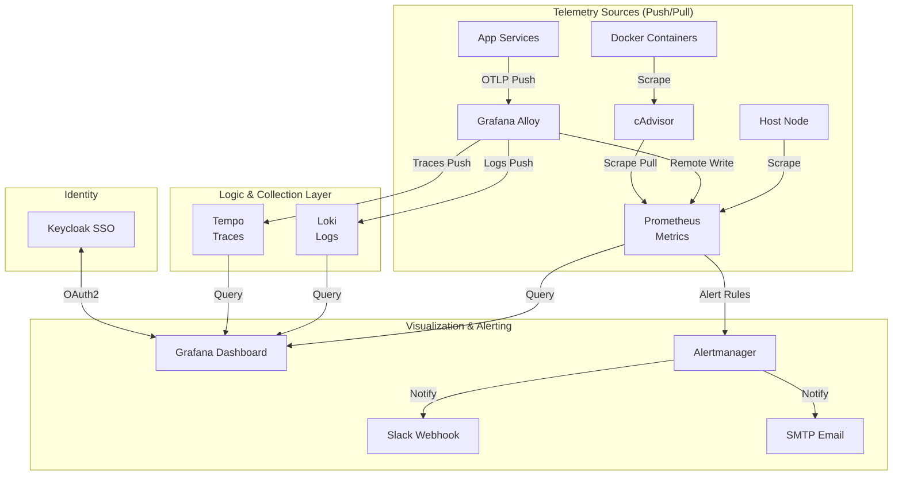

# Observability Stack (LGTM + Alloy)

## Overview

A comprehensive, enterprise-grade observability stack based on the **LGTM** pattern (Loki, Grafana, Tempo, Mimir/Prometheus). This stack provides full-spectrum visibility into infrastructure and application health, utilizing **Grafana Alloy** as a unified telemetry collector for metrics, logs, and distributed traces.



## Services

| Service | Image | Role | Resources |
| :--- | :--- | :--- | :--- |
| [`prometheus`](./prometheus/README.md) | `prom/prometheus:v3.9.0` | Metrics DB & Alerting Engine | 1.0 CPU / 1GB |
| [`loki`](./loki/README.md) | `grafana/loki:3.6.3` | Scalable Log Aggregation | 1.0 CPU / 1GB |
| [`tempo`](./tempo/README.md) | `grafana/tempo:2.9.0` | Distributed Tracing Backend | 1.0 CPU / 1GB |
| [`grafana`](./grafana/README.md) | `grafana/grafana:12.3.1` | Unified Visualization & SSO Portal | 0.5 CPU / 512MB |
| [`alloy`](./alloy/README.md) | `grafana/alloy:v1.12.1` | OTel Collector & Scraper (Unified Agent) | 0.5 CPU / 512MB |
| `cadvisor` | `cadvisor:v0.55.1`| Real-time Container Resource Analysis | 0.5 CPU / 512MB |
| [`alertmanager`](./alertmanager/README.md) | `prom/alertmanager:v0.30.0` | Notification Routing & Deduplication | 0.5 CPU / 256MB |
| [`pushgateway`](./pushgateway/README.md) | `prom/pushgateway:v1.11.2` | Short-lived Job Metrics Endpoint | 0.2 CPU / 128MB |

## Networking (Static IPs)

Services utilize the `172.19.0.3X` block on `infra_net` for deterministic internal routing.

| Service | Static IP | Port | Traefik Domain |
| :--- | :--- | :--- | :--- |
| `prometheus` | `172.19.0.30` | `9090` | `prometheus.${DEFAULT_URL}` |
| `loki` | `172.19.0.31` | `3100` | - |
| `tempo` | `172.19.0.32` | `3200` | - |
| `grafana` | `172.19.0.33` | `3000` | `grafana.${DEFAULT_URL}` |
| `alloy` | `172.19.0.34` | `12345`| `alloy.${DEFAULT_URL}` |
| `alertmanager`| `172.19.0.36` | `9093` | `alertmanager.${DEFAULT_URL}` |
| `pushgateway` | `172.19.0.37` | `9091` | `pushgateway.${DEFAULT_URL}` |

## Authentication (Keycloak SSO)

Grafana is integrated with **Keycloak** via Generic OAuth2 for secure, centralized access.

### Role Mapping Logic

Roles are dynamically assigned based on Keycloak groups (`groups` claim):

- **Grafana Admin**: Users in `/admins` group.
- **Grafana Editor**: Users in `/editors` group.
- **Grafana Viewer**: Default for all other authenticated users.

### Config Snippet

```yaml
GF_AUTH_GENERIC_OAUTH_ROLE_ATTRIBUTE_PATH: "contains(groups[*], '/admins') && 'Admin' || contains(groups[*], '/editors') && 'Editor' || 'Viewer'"
GF_AUTH_GENERIC_OAUTH_STRICT: "true"
```

## Alertmanager Integration

Supports multi-channel notifications with deduplication and grouping logic.

| Channel | Requirement | Usage |
| :--- | :--- | :--- |
| **Slack** | `SLACK_ALERTMANAGER_WEBHOOK_URL` | Critical/Warning alerts to OPS channels |
| **Email** | `SMTP_USERNAME` / `SMTP_PASSWORD` | Daily summaries and high-priority outages |

## Maintenance & Troubleshooting

### Reloading Configurations

Configurations can be reloaded without service restarts via HTTP POST:

```bash
# Reload Prometheus configuration and alert rules
curl -X POST https://prometheus.${DEFAULT_URL}/-/reload

# Reload Alertmanager configuration
curl -X POST https://alertmanager.${DEFAULT_URL}/-/reload
```

### Checking Scraping Status

- **Metric Targets**: Navigate to `https://prometheus.${DEFAULT_URL}/targets`.
- **Collector Status**: Navigate to `https://alloy.${DEFAULT_URL}` to view the internal component graph.

## See Also

- [Grafana Alloy Dashboard Guide](./alloy/README.md)
- [Prometheus Alerting Rules Reference](./prometheus/README.md)
