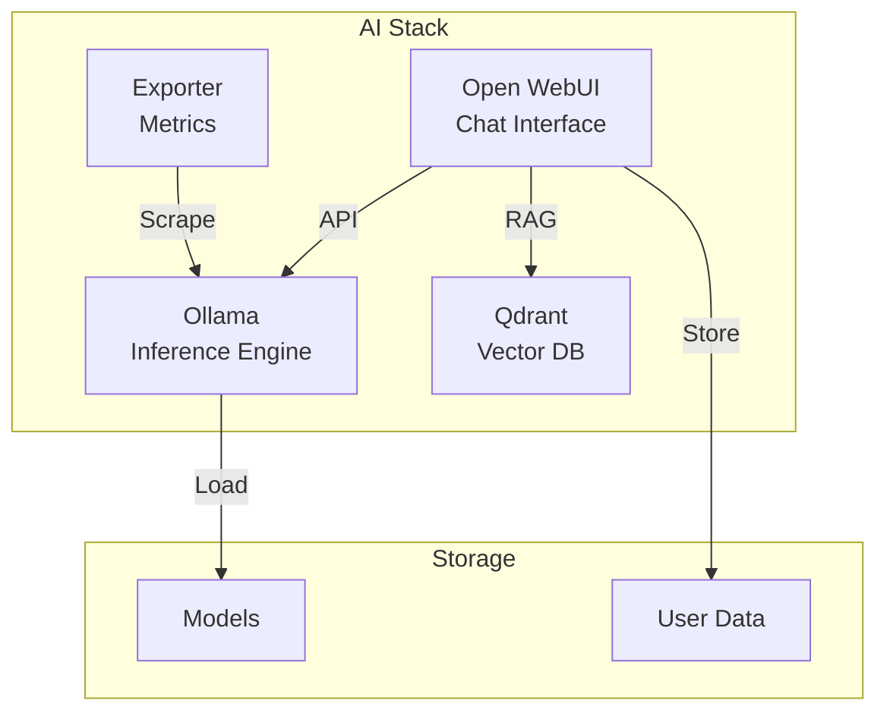

# Ollama & Open WebUI

## Overview

A local **LLM (Large Language Model)** inference stack featuring **Ollama** as the backend engine and **Open WebUI** as the ChatGPT-like frontend. It creates a private, offline-capable AI environment with **RAG (Retrieval-Augmented Generation)** support via Qdrant and GPU acceleration.



## Services

| Service | Image | Role | Resources |
| :--- | :--- | :--- | :--- |
| `ollama` | `ollama/ollama:0.13.5` | Inference Engine | 4 CPU / 8GB RAM / 1 NVIDIA GPU |
| `open-webui` | `ghcr.io/open-webui/open-webui:main` | Chat UI & RAG Controller | 1 CPU / 1GB RAM |
| `ollama-exporter` | `lucabecker42/ollama-exporter:latest` | Prometheus Metrics | 0.1 CPU / 128MB RAM |

## Networking

Services run on `infra_net` with static IPs (172.19.0.4X).

| Service | Static IP | Port | Host Port | Traefik Domain |
| :--- | :--- | :--- | :--- | :--- |
| `ollama` | `172.19.0.40` | `${OLLAMA_PORT}` (11434) | - | `ollama.${DEFAULT_URL}` |
| `open-webui` | `172.19.0.42` | `8080` | - | `chat.${DEFAULT_URL}` |
| `ollama-exporter` | `172.19.0.43` | `${OLLAMA_EXPORTER_PORT}` | `${OLLAMA_EXPORTER_HOST_PORT}` | - |

## Persistence

| Volume | Mount Point | Description |
| :--- | :--- | :--- |
| `ollama-data` | `/root/.ollama` | LLM model files (blobs/manifests) |
| `ollama-webui` | `/app/backend/data` | Chat history, user profiles, RAG docs |

## Configuration

### Ollama Environment Variables

| Variable | Description | Default |
| :--- | :--- | :--- |
| `OLLAMA_HOST` | Bind address | `0.0.0.0:${OLLAMA_PORT}` |
| `NVIDIA_VISIBLE_DEVICES` | GPU allocation | `all` |

### Open WebUI Environment Variables

| Variable | Description | Default |
| :--- | :--- | :--- |
| `OLLAMA_BASE_URL` | Implementation backend | `http://ollama:${OLLAMA_PORT}` |
| `VECTOR_DB_URL` | RAG Vector DB | `http://qdrant:${QDRANT_PORT}` |
| `RAG_EMBEDDING_ENGINE` | Embedding Engine | `ollama` |
| `RAG_EMBEDDING_MODEL` | Embedding Model | `qwen3-embedding:0.6b` |

## Model Management

Since this is a local setup, you must download models before using them.

### 1. Pulling Models via CLI

```bash
# Connect to Ollama container
docker exec -it ollama ollama pull llama3
docker exec -it ollama ollama pull qwen3-embedding:0.6b
```

### 2. Pulling Models via Web UI

1. Go to **Settings > Models** in Open WebUI.
2. Enter the model tag (e.g., `llama3`, `mistral`) in "Pull a model from Ollama.com".
3. Click download.

## Usage

### Web Interface

- **URL**: `https://chat.${DEFAULT_URL}`
- **Login**: First account created becomes the **Admin**.

### API Access

- **URL**: `https://ollama.${DEFAULT_URL}`
- **Endpoint**: `https://ollama.${DEFAULT_URL}/api/generate`

### Verifying GPU Acceleration

Check if the container sees the GPU:

```bash
docker exec -it ollama nvidia-smi
```

Check loaded models via API:

```bash
curl https://ollama.${DEFAULT_URL}/api/tags
```

## Troubleshooting

### "Model not found"

Ensure you have pulled the model using the steps in [Model Management](#model-management). The environment variable `RAG_EMBEDDING_MODEL` defines the default embedding model; ensure this specific model is pulled.

### GPU Not Utilized

1. Check host NVIDIA drivers.
2. Verify Docker NVIDIA Runtime is installed.
3. Ensure `deploy.resources.reservations.devices` is uncommented in `docker-compose.yml`.

### RAG Issues

If document retrieval fails:

1. Verify Qdrant service is running (`infra/qdrant`).
2. Check `VECTOR_DB_URL` connectivity from `open-webui` container.
3. Confirm embedding model is loaded in Ollama.
