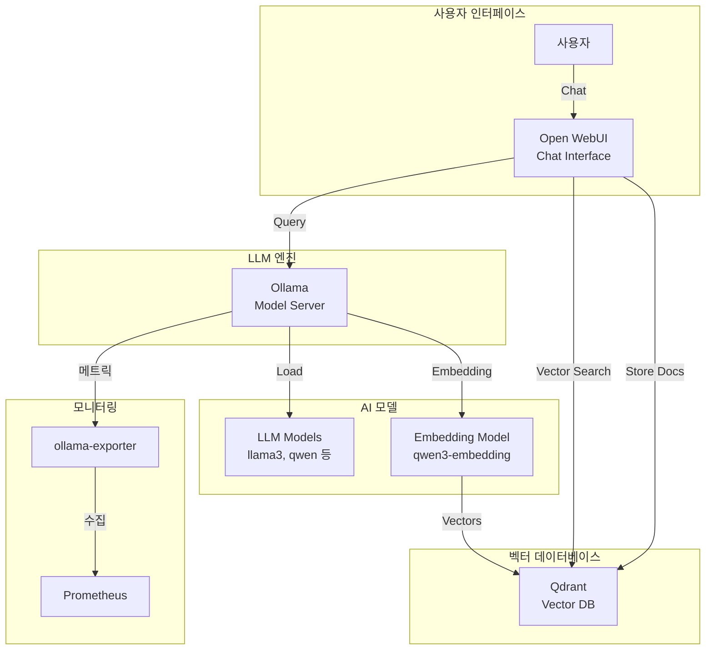

# Ollama (로컬 LLM 플랫폼)

## 시스템 아키텍처에서의 역할

Ollama는 **로컬 대규모 언어 모델(LLM) 실행 플랫폼**으로서 On-Premise 환경에서 AI 모델을 구동합니다. Qdrant 벡터 데이터베이스와 Open WebUI를 통합하여 RAG(Retrieval-Augmented Generation) 기반 챗봇 및 AI 애플리케이션을 제공합니다.

**핵심 역할:**

- 🤖 **로컬 LLM 실행**: GPU 기반 대규모 언어 모델 호스팅
- 🔍 **RAG 시스템**: 벡터 검색 기반 문서 참조형 응답
- 💬 **챗봇 인터페이스**: ChatGPT 스타일 웹 UI
- 📚 **임베딩 생성**: 텍스트 벡터화 및 의미 검색
- 🔐 **데이터 프라이버시**: 외부 API 의존 없는 완전한 로컬 처리

## 아키텍처 구성



## 주요 구성 요소

### 1. Ollama (LLM 서버)

- **컨테이너**: `ollama`
- **이미지**: `ollama/ollama:0.13.1`
- **역할**: 대규모 언어 모델 실행 엔진
- **포트**: `${OLLAMA_PORT}` (기본 11434)
- **Traefik**: `https://ollama.${DEFAULT_URL}`
- **IP**: 172.19.0.40

**GPU 설정:**

```yaml
deploy:
  resources:
    reservations:
      devices:
        - driver: nvidia
          count: 1
          capabilities: [gpu]
```

**환경 변수:**

- `OLLAMA_HOST=0.0.0.0:${OLLAMA_PORT}`: 모든 인터페이스에서 수신
- `NVIDIA_VISIBLE_DEVICES=all`: 모든 GPU 사용

**볼륨:**

- `ollama-data:/root/.ollama`: 모델 저장소

### 2. Qdrant (벡터 데이터베이스)

- **컨테이너**: `qdrant`
- **이미지**: `qdrant/qdrant:latest`
- **역할**: 벡터 임베딩 저장 및 의미 검색
- **포트**: `${QDRANT_HOST_PORT}:${QDRANT_PORT}` (기본 6333)
- **Traefik**: `https://qdrant.${DEFAULT_URL}`
- **IP**: 172.19.0.41

**주요 기능:**

- 고성능 벡터 유사도 검색
- 웹 UI 대시보드
- REST API 및 gRPC
- 메트릭 수집 (`QDRANT__TELEMETRY_DISABLED=false`)

**볼륨:**

- `qdrant-data:/qdrant/storage`

### 3. Open WebUI (챗봇 UI)

- **컨테이너**: `open-webui`
- **이미지**: `ghcr.io/open-webui/open-webui:main`
- **역할**: ChatGPT 스타일 웹 인터페이스
- **포트**: 8080 (내부)
- **Traefik**: `https://chat.${DEFAULT_URL}`
- **IP**: 172.19.0.42

**Ollama 연결:**

- `OLLAMA_BASE_URL=http://ollama:${OLLAMA_PORT}`

**RAG 설정:**

- `VECTOR_DB_URL=http://qdrant:${QDRANT_PORT}`
- `RAG_EMBEDDING_ENGINE=ollama`
- `RAG_EMBEDDING_MODEL=qwen3-embedding:0.6b`

**볼륨:**

- `ollama-webui:/app/backend/data`: 채팅 기록, 사용자 설정

### 4. Ollama Exporter (모니터링)

- **컨테이너**: `ollama-exporter`
- **이미지**: `lucabecker42/ollama-exporter:latest`
- **역할**: Ollama 메트릭 수집
- **포트**: `${OLLAMA_EXPORTER_HOST_PORT}:${OLLAMA_EXPORTER_PORT}` (기본 9090)
- **IP**: 172.19.0.43

**메트릭:**

- 모델 로드 상태
- 추론 요청 수
- GPU 사용률

## 환경 변수

### .env 파일

```bash
# Ollama
OLLAMA_PORT=11434
OLLAMA_HOST_PORT=11434

# Qdrant
QDRANT_PORT=6333
QDRANT_HOST_PORT=6333

# Open WebUI
OLLAMA_WEBUI_PORT=8080
OLLAMA_WEBUI_HOST_PORT=3000

# Exporter
OLLAMA_EXPORTER_PORT=9090
OLLAMA_EXPORTER_HOST_PORT=9090

# 도메인
DEFAULT_URL=127.0.0.1.nip.io
```

## 네트워크

- **네트워크**: `infra_net`
- **서브넷**: 172.19.0.0/16
- **고정 IP**: 172.19.0.40-43

## 시작 방법

### 1. GPU 드라이버 확인 (필수)

```bash
# NVIDIA GPU 확인
nvidia-smi

# Docker GPU 런타임 확인
docker run --rm --gpus all ubuntu nvidia-smi
```

### 2. 서비스 시작

```bash
cd d:\hy-home.docker\Infra\ollama
docker-compose up -d
```

### 3. 모델 다운로드

```bash
# Ollama 컨테이너에서 모델 pull
docker exec -it ollama ollama pull llama3.2:3b
docker exec -it ollama ollama pull qwen3-embedding:0.6b

# 사용 가능한 모델
# llama3, qwen, mistral, gemma, phi 등
# https://ollama.com/library
```

### 4. 모델 확인

```bash
# 다운로드된 모델 목록
docker exec ollama ollama list
```

## 접속 정보

### Open WebUI (Chat Interface)

- **URL**: `https://chat.127.0.0.1.nip.io`
- **초기 접속**: 사용자 계정 생성 필요
- **기능**: 채팅, 문서 업로드, RAG 검색

### Qdrant Dashboard

- **URL**: `https://qdrant.${DEFAULT_URL}` or `http://localhost:6333/dashboard`
- **기능**: 컬렉션 관리, 벡터 검색 테스트

### Ollama API

- **URL**: `https://ollama.${DEFAULT_URL}`
- **Endpoint**: `/api/generate`, `/api/chat`, `/api/embeddings`

## 유용한 명령어

### 모델 관리

```bash
# 모델 다운로드
docker exec ollama ollama pull llama3.2:latest

# 모델 목록
docker exec ollama ollama list

# 모델 삭제
docker exec ollama ollama rm llama3.2:3b

# 모델 정보
docker exec ollama ollama show llama3.2:3b
```

### CLI 테스트

```bash
# 대화형 모드
docker exec -it ollama ollama run llama3.2:3b

# 단일 질문
docker exec ollama ollama run llama3.2:3b "What is Docker?"
```

### API 테스트

```bash
# Generate 엔드포인트
curl https://ollama.127.0.0.1.nip.io/api/generate -d '{
  "model": "llama3.2:3b",
  "prompt": "Why is the sky blue?",
  "stream": false
}'

# 임베딩 생성
curl https://ollama.127.0.0.1.nip.io/api/embeddings -d '{
  "model": "qwen3-embedding:0.6b",
  "prompt": "Hello World"
}'
```

### Qdrant 관리

```bash
# 컬렉션 생성
curl -X PUT https://qdrant.127.0.0.1.nip.io/collections/documents \
  -H "Content-Type: application/json" \
  -d '{
    "vectors": {
      "size": 384,
      "distance": "Cosine"
    }
  }'

# 벡터 삽입
curl -X PUT https://qdrant.127.0.0.1.nip.io/collections/documents/points \
  -H "Content-Type: application/json" \
  -d '{
    "points": [
      {
        "id": 1,
        "vector": [0.05, 0.61, ...],
        "payload": {"text": "Sample document"}
      }
    ]
  }'

# 유사도 검색
curl -X POST https://qdrant.127.0.0.1.nip.io/collections/documents/points/search \
  -H "Content-Type: application/json" \
  -d '{"vector": [0.05, 0.61, ...], "limit": 5}'
```

## 데이터 영속성

### 볼륨

- `ollama-data`: Ollama 모델 및 설정 (`/root/.ollama`)
- `qdrant-data`: 벡터 데이터 (`/qdrant/storage`)
- `ollama-webui`: 채팅 기록 및 업로드 파일 (`/app/backend/data`)

### 모델 저장 위치

```bash
# 컨테이너 내부
/root/.ollama/models/

# 호스트 볼륨
docker volume inspect ollama-data
```

## RAG 워크플로우

### 1. 문서 업로드

```
사용자 → Open WebUI → 문서 업로드 → Ollama Embedding → Qdrant 저장
```

### 2. 질문 응답

```
사용자 질문 → Embedding → Qdrant 검색 → 관련 문서 조회 → LLM 추론 → 응답
```

### 3. 지원 파일 형식

- PDF, DOC, DOCX
- TXT, MD
- CSV, JSON
- Images (OCR)

## 모니터링 및 최적화

### GPU 사용량 확인

```bash
# nvidia-smi (호스트)
nvidia-smi

# 컨테이너 GPU 사용량
docker stats ollama
```

### 성능 튜닝

```bash
# 동시 요청 수 제한
OLLAMA_MAX_LOADED_MODELS=1

# 컨텍스트 길이
OLLAMA_NUM_CTX=2048

# GPU 레이어 수
OLLAMA_GPU_LAYERS=32
```

## 문제 해결

### GPU 인식 안됨

```bash
# GPU 할당 확인
docker exec ollama nvidia-smi

# Docker GPU 런타임 재설정
sudo systemctl restart docker
```

### 모델 다운로드 느림

```bash
# 프록시 설정
HTTPS_PROXY=http://proxy:port docker exec ollama ollama pull llama3.2:3b
```

### Out of Memory

```bash
# 더 작은 모델 사용
ollama pull llama3.2:1b  # 대신 llama3.2:3b

# 모델 언로드
ollama stop llama3.2:8b
```

## 시스템 통합

### 의존하는 서비스

- **NVIDIA GPU 드라이버**: 필수
- **Docker GPU Runtime**: 필수
- **Traefik**: HTTPS 라우팅

### 이 서비스를 사용하는 애플리케이션

- **챗봇**: 고객 지원, FAQ
- **문서 검색**: 사내 지식 베이스
- **코드 생성**: AI 코딩 어시스턴트
- **데이터 분석**: 자연어 쿼리

## 추천 모델

### 대화형

- `llama3.2:3b` - 빠른 응답, 중간 품질
- `qwen2.5:14b` - 고품질 한국어 지원
- `gemma2:9b` - Google 모델, 우수한 성능

### 임베딩

- `qwen3-embedding:0.6b` - 빠르고 가벼움
- `nomic-embed-text` - 영어 최적화

### 코드 생성

- `codellama:7b` - 코드 생성 전문
- `qwen2.5-coder:7b` - 다국어 코드 지원

## 참고 자료

- [Ollama 공식 사이트](https://ollama.com/)
- [Ollama 모델 라이브러리](https://ollama.com/library)
- [Qdrant 문서](https://qdrant.tech/documentation/)
- [Open WebUI GitHub](https://github.com/open-webui/open-webui)
- [RAG 가이드](https://docs.llamaindex.ai/en/stable/)
