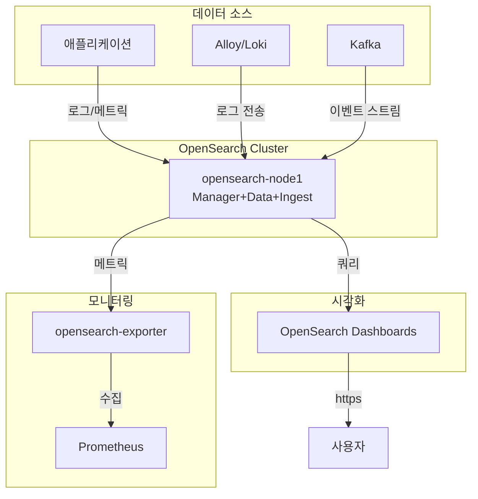

# OpenSearch (검색 및 분석 플랫폼)

## 시스템 아키텍처에서의 역할

OpenSearch는 **분산 검색 및 분석 엔진**으로서 시스템의 로그 수집, 전문 검색, 실시간 분석을 담당합니다. Elasticsearch의 오픈소스 포크로서 강력한 검색 기능과 시각화 도구를 제공합니다.

**핵심 역할:**

- 🔍 **전문 검색**: 텍스트 전문 검색 및 분석
- 📊 **로그 집계**: Loki/Alloy로부터 로그 수집 및 인덱싱
- 📈 **실시간 분석**: 대용량 데이터 실시간 집계 및 분석
- 📉 **시각화**: OpenSearch Dashboards를 통한 데이터 시각화
- 🔔 **경고**: 이상 탐지 및 경고 기능

## 아키텍처 구성



## 주요 구성 요소

### 1. OpenSearch 노드

- **컨테이너**: `opensearch-node1`
- **이미지**: `opensearchproject/opensearch:3.3.2`
- **모드**: Single Node (확장 가능)
- **역할**: cluster_manager + data + ingest + remote_cluster_client
- **포트**:
  - REST API: `${ES_PORT}` (기본 9200) - HTTPS
  - Performance Analyzer: `${ES_PERFORMANCE_ANALYZER_PORT}` (기본 9600)
- **Traefik**: `https://opensearch.${DEFAULT_URL}`
- **IP**: 172.19.0.44

**주요 설정:**

- `discovery.type=single-node`
- `bootstrap.memory_lock=true`
- `OPENSEARCH_JAVA_OPTS=-Xms1g -Xmx1g`
- `OPENSEARCH_INITIAL_ADMIN_PASSWORD`: Admin 계정 초기 비밀번호

**TLS/SSL:**

- `plugins.security.ssl.http.enabled=true`
- 인증서 위치: `/usr/share/opensearch/config/certs/`
  - `cert.pem`: 서버 인증서
  - `key.pem`: 개인 키
  - `rootCA.pem`: CA 인증서

**볼륨**: `opensearch-data1:/usr/share/opensearch/data`

**ulimits:**

- memlock: unlimited (스왑 방지)
- nofile: 65536 (파일 디스크립터)

**shm_size**: 1GB (Performance Analyzer용)

### 2. OpenSearch Dashboards

- **컨테이너**: `opensearch-dashboards`
- **이미지**: `opensearchproject/opensearch-dashboards:3.3.0`
- **역할**: 데이터 시각화 및 관리 UI (Kibana와 유사)
- **포트**: `${KIBANA_PORT}` (기본 5601)
- **Traefik**: `https://opensearch-dashboard.${DEFAULT_URL}`
- **IP**: 172.19.0.47

**OpenSearch 연결:**

- `OPENSEARCH_HOSTS=["https://opensearch-node1:9200"]`
- `OPENSEARCH_USERNAME`: admin
- `OPENSEARCH_PASSWORD`: 설정한 비밀번호
- `OPENSEARCH_SSL_VERIFICATIONMODE=full`
- CA 인증서: `/usr/share/opensearch-dashboards/config/rootCA.pem`

### 3. OpenSearch Exporter

- **컨테이너**: `opensearch-exporter`
- **이미지**: `prometheuscommunity/elasticsearch-exporter:v1.7.0`
- **역할**: Prometheus 메트릭 수집 (Elasticsearch Exporter 호환)
- **포트**: `${ES_EXPORTER_HOST_PORT}:${ES_EXPORTER_PORT}` (기본 9114)
- **IP**: 172.19.0.48

**옵션:**

- `--es.uri=https://opensearch-node1:9200`
- `--es.all`: 모든 메트릭 수집
- `--es.indices`: 인덱스별 메트릭
- `--es.ssl-skip-verify`: Self-signed 인증서 허용

## 환경 변수

### .env 파일

```bash
# OpenSearch 클러스터
OPENSEARCH_CLUSTER_NAME=opensearch-cluster

# OpenSearch 인증
ELASTIC_USERNAME=admin
ELASTIC_PASSWORD=<Strong_Password_123!>

# OpenSearch 포트
ES_PORT=9200
ES_HOST_1_PORT=9200
ES_PERFORMANCE_ANALYZER_PORT=9600
ES_PERFORMANCE_ANALYZER_HOST_PORT=9600

# Dashboards
KIBANA_PORT=5601
KIBANA_HOST_PORT=5601

# Exporter
ES_EXPORTER_PORT=9114
ES_EXPORTER_HOST_PORT=9114

# 도메인
DEFAULT_URL=hy-home.local
```

## 네트워크

- **네트워크**: `infra_net`
- **서브넷**: 172.19.0.0/16
- **고정 IP**: 안정적인 서비스 통신

## 시작 방법

### 1. SSL 인증서 생성

```bash
cd d:\hy-home.docker\Infra\opensearch

# 인증서 생성 스크립트 실행 (있을 경우)
# 또는 수동 생성:
mkdir -p certs
cd certs

# Root CA 생성
openssl genrsa -out rootCA-key.pem 2048
openssl req -new -x509 -sha256 -key rootCA-key.pem -out rootCA.pem -days 730 \
  -subj "/C=KR/ST=Seoul/L=Seoul/O=HyHome/CN=RootCA"

# 노드 인증서 생성
openssl genrsa -out key.pem 2048
openssl req -new -key key.pem -out cert.csr \
  -subj "/C=KR/ST=Seoul/L=Seoul/O=HyHome/CN=opensearch-node1"
openssl x509 -req -in cert.csr -CA rootCA.pem -CAkey rootCA-key.pem \
  -CAcreateserial -out cert.pem -days 730
```

### 2. 환경 설정

`.env` 파일에 강력한 비밀번호 설정

### 3. 서비스 시작

```bash
docker-compose up -d
```

### 4. 클러스터 상태 확인

```bash
# 클러스터 헬스
curl -k -u admin:<password> https://localhost:9200/_cluster/health?pretty

# 노드 정보
curl -k -u admin:<password> https://localhost:9200/_cat/nodes?v
```

## 접속 정보

### OpenSearch Dashboards

- **URL**: `https://opensearch-dashboard.hy-home.local`
- **인증**: admin / <설정한 비밀번호>

### OpenSearch API

- **URL**: `https://opensearch.hy-home.local`
- **Basic Auth**: admin / <비밀번호>

### CLI 접근

```bash
# 클러스터 정보
curl -k -u admin:<password> https://localhost:9200

# 인덱스 목록
curl -k -u admin:<password> https://localhost:9200/_cat/indices?v
```

## 유용한 명령어

### 클러스터 관리

```bash
# 클러스터 헬스
curl -k -u admin:<pass> https://localhost:9200/_cluster/health?pretty

# 클러스터 통계
curl -k -u admin:<pass> https://localhost:9200/_cluster/stats?pretty

# 노드 통계
curl -k -u admin:<pass> https://localhost:9200/_nodes/stats?pretty
```

### 인덱스 관리

```bash
# 인덱스 목록
curl -k -u admin:<pass> https://localhost:9200/_cat/indices?v

# 인덱스 생성
curl -k -u admin:<pass> -X PUT https://localhost:9200/my-index \
  -H 'Content-Type: application/json' \
  -d '{
    "settings": {
      "number_of_shards": 1,
      "number_of_replicas": 0
    }
  }'

# 인덱스 삭제
curl -k -u admin:<pass> -X DELETE https://localhost:9200/my-index

# 인덱스 설정 조회
curl -k -u admin:<pass> https://localhost:9200/my-index/_settings?pretty
```

### 문서 작업

```bash
# 문서 추가
curl -k -u admin:<pass> -X POST https://localhost:9200/my-index/_doc \
  -H 'Content-Type: application/json' \
  -d '{"message": "Hello OpenSearch", "timestamp": "2025-12-03"}'

# 문서 검색
curl -k -u admin:<pass> https://localhost:9200/my-index/_search?pretty

# 전문 검색
curl -k -u admin:<pass> https://localhost:9200/my-index/_search?pretty \
  -H 'Content-Type: application/json' \
  -d '{"query": {"match": {"message": "Hello"}}}'
```

### 템플릿 관리

```bash
# 인덱스 템플릿 생성
curl -k -u admin:<pass> -X PUT https://localhost:9200/_index_template/logs-template \
  -H 'Content-Type: application/json' \
  -d '{
    "index_patterns": ["logs-*"],
    "template": {
      "settings": {
        "number_of_shards": 1,
        "number_of_replicas": 0
      }
    }
  }'
```

## 데이터 영속성

### 볼륨

- `opensearch-data1`: 인덱스 데이터 (`/usr/share/opensearch/data`)

### 스냅샷 및 복구

```bash
# 스냅샷 리포지토리 생성
curl -k -u admin:<pass> -X PUT https://localhost:9200/_snapshot/my_backup \
  -H 'Content-Type: application/json' \
  -d '{
    "type": "fs",
    "settings": {
      "location": "/mnt/snapshots"
    }
  }'

# 스냅샷 생성
curl -k -u admin:<pass> -X PUT https://localhost:9200/_snapshot/my_backup/snapshot_1?wait_for_completion=true
```

## 모니터링 및 경고

### Prometheus 메트릭

- `elasticsearch_cluster_health_status`: 클러스터 헬스
- `elasticsearch_indices_docs`: 문서 수
- `elasticsearch_indices_store_size_bytes`: 저장소 크기
- `elasticsearch_jvm_memory_used_bytes`: JVM 메모리

### Grafana 대시보드

- [OpenSearch Dashboard (ID: 266)](https://grafana.com/grafana/dashboards/266)

## 문제 해결

### 클러스터 상태 Red/Yellow

```bash
# 샤드 할당 확인
curl -k -u admin:<pass> https://localhost:9200/_cat/shards?v

# Unassigned 샤드 확인
curl -k -u admin:<pass> https://localhost:9200/_cat/shards?h=index,shard,prirep,state,unassigned.reason | grep UNASSIGNED

# 샤드 재할당
curl -k -u admin:<pass> -X POST https://localhost:9200/_cluster/reroute
```

### 메모리 부족

```bash
# JVM Heap 사용량 확인
curl -k -u admin:<pass> https://localhost:9200/_nodes/stats/jvm?pretty

# docker-compose.yml에서 OPENSEARCH_JAVA_OPTS 조정
# -Xms2g -Xmx2g
```

### 인덱스 성능 저하

```bash
# 인덱스 통계
curl -k -u admin:<pass> https://localhost:9200/my-index/_stats?pretty

# 강제 머지 (조각 모음)
curl -k -u admin:<pass> -X POST https://localhost:9200/my-index/_forcemerge?max_num_segments=1
```

## 시스템 통합

### 의존하는 서비스

- **Traefik**: HTTPS 라우팅 및 TLS 처리
- **Prometheus**: 메트릭 수집

### 이 서비스를 사용하는 시스템

- **Alloy/Loki**: 로그 전송
- **Kafka**: 실시간 이벤트 인덱싱
- **애플리케이션**: 전문 검색 기능

## 고급 설정

### 클러스터 확장 (Multi-Node)

docker-compose.yml에서 주석 처리된 node2, node3 활성화:

```yaml
# discovery.type=single-node 제거
# cluster.name, discovery.seed_hosts 설정
```

### 보안 강화

```bash
# SSL 클라이언트 인증 활성화
# plugins.security.ssl.http.clientauth_mode=REQUIRE

# Role-Based Access Control (RBAC) 설정
# OpenSearch Dashboards → Security → Roles
```

## 참고 자료

- [OpenSearch 공식 문서](https://opensearch.org/docs/)
- [OpenSearch Dashboards](https://opensearch.org/docs/latest/dashboards/)
- [Security Plugin](https://opensearch.org/docs/latest/security/)
- [REST API Reference](https://opensearch.org/docs/latest/api-reference/)
