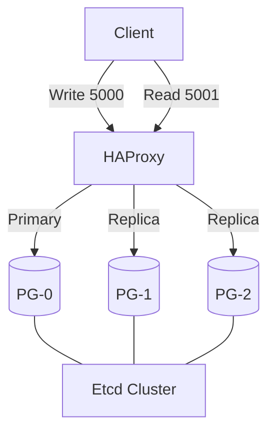

# PostgreSQL Cluster (HA)

## 1. 서비스 개요 (Service Overview)
**서비스 정의**: Patroni, Etcd, HAProxy를 기반으로 한 고가용성(High Availability) PostgreSQL 클러스터입니다. 자동 장애 조치(Failover)와 리더 선출 기능을 제공합니다.

**주요 기능 (Key Features)**:
- **Automatic Failover**: Primary 노드 장애 시 Standby가 즉시 승격됨.
- **Etcd DCS**: 분산 합의 시스템을 통한 클러스터 상태 관리.
- **RW/RO Routing**: HAProxy가 Write 요청은 Primary로, Read 요청은 Replica로 분산.

**기술 스택 (Tech Stack)**:
- **Engine**: PostgreSQL 17 (Spilo Image)
- **HA**: Patroni
- **DCS**: Etcd v3.6.7
- **Proxy**: HAProxy 3.3.1

## 2. 아키텍처 및 워크플로우 (Architecture & Workflow)
**시스템 구조도**:


## 3. 시작 가이드 (Getting Started)
**실행 방법 (Deployment)**:
```bash
docker compose up -d
```
> **주의**: 전체 클러스터가 정상 궤도에 오르기까지 약 1~2분이 소요될 수 있습니다.

## 4. 환경 설정 명세 (Configuration Reference)
**환경 변수 (Environment Variables)**:
- `SCOPE`: 클러스터 이름 (`pg-ha`)
- `ETCD3_HOSTS`: Etcd 노드 목록
- `PATRONI_Name`: 각 노드 식별자

**네트워크 포트 (Network Ports)**:
- **Write (Master)**: 5000 (HAProxy)
- **Read (Replica)**: 5001 (HAProxy)
- **Stats**: 8404 (Traefik 통해 노출)

## 5. 통합 및 API 가이드 (Integration Guide)
**클라이언트 설정**:
- **Write Connection**: `host=pg-router port=5000`
- **Read Connection**: `host=pg-router port=5001`

**엔드포인트 명세**:
- HAProxy Stats: `https://pg-haproxy.${DEFAULT_URL}`

## 6. 가용성 및 관측성 (Availability & Observability)
**상태 확인 (Health Check)**:
- `etcdctl endpoint health`
- `pg_isready`

**모니터링 (Monitoring)**:
- 각 노드별 `postgres-exporter` 사이드카 배포.

## 7. 백업 및 복구 (Backup & Disaster Recovery)
**복구 절차**:
- 노드 장애 시 Patroni가 자동 복구 시도.
- 영구 손상 시 데이터 볼륨 초기화 후 재참여(Reinitialize) 시도.

## 8. 보안 및 강화 (Security Hardening)
- Etcd 통신은 현재 HTTP로 구성되어 있으므로 신뢰할 수 있는 내부 네트워크(`infra_net`)에서만 접근해야 합니다.

## 9. 트러블슈팅 (Troubleshooting)
**진단 명령어**:
```bash
# 클러스터 상태 확인 (리더 확인)
docker exec -it pg-0 patronictl -c /etc/patroni/patroni.yml list
```
