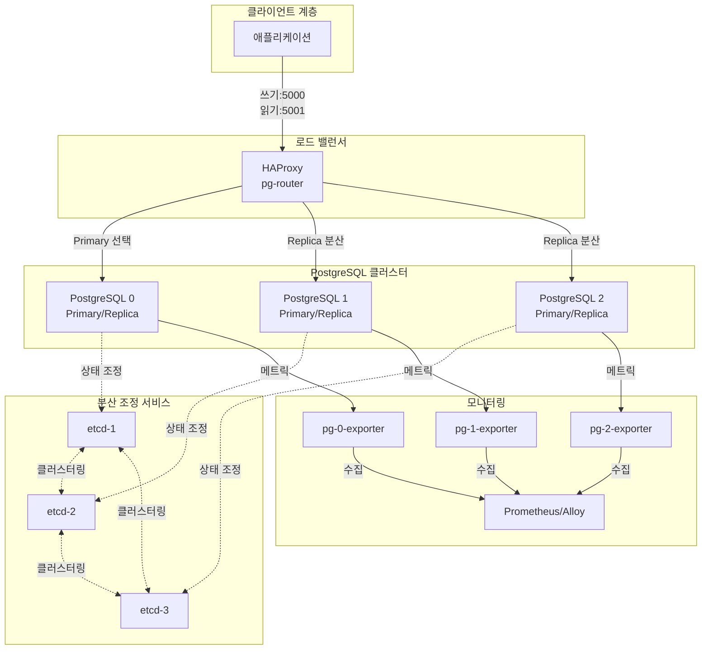

# PostgreSQL 고가용성 클러스터

## 시스템 아키텍처에서의 역할

PostgreSQL 클러스터는 **애플리케이션 데이터의 영구 저장 및 관리**를 담당하는 핵심 인프라로, 전체 시스템의 주 데이터베이스 계층입니다. 자동 장애 조치(Auto-Failover), 읽기/쓰기 분리, 메트릭 수집을 통해 고가용성 및 확장성을 제공합니다.

**핵심 역할:**

- 📊 **관계형 데이터 저장소**: 트랜잭션 데이터, 사용자 정보, 비즈니스 로직 데이터 관리
- 🔄 **고가용성 보장**: 자동 장애 조치를 통한 무중단 서비스
- ⚖️ **로드 밸런싱**: 읽기 작업 분산으로 성능 최적화
- 📈 **관측성**: Prometheus 메트릭을 통한 모니터링 및 경고

## 아키텍처 구성



## 주요 구성 요소

### 1. Etcd 클러스터 (분산 조정 서비스)

- **컨테이너**: `etcd-1`, `etcd-2`, `etcd-3`
- **이미지**: `quay.io/coreos/etcd:v3.5.15`
- **역할**: Patroni의 분산 설정 저장소 (DCS)로 클러스터 리더 선출 및 상태 관리
- **포트**:
  - `${ETCD_CLIENT_PORT}` (기본 2379): 클라이언트 통신
  - `${ETCD_PEER_PORT}` (기본 2380): 노드 간 통신
- **볼륨**: `etcd1-data`, `etcd2-data`, `etcd3-data`
- **IP**: 172.19.0.50-52

### 2. Patroni + PostgreSQL 노드

- **컨테이너**: `pg-0`, `pg-1`, `pg-2`
- **이미지**: `ghcr.io/zalando/spilo-17:4.0-p3` (PostgreSQL 17)
- **역할**: Patroni가 관리하는 PostgreSQL 인스턴스 (Primary 1개, Replica 2개)
- **기능**:
  - 자동 장애 조치 (Automatic Failover)
  - 동기/비동기 복제
  - SSL 지원
- **포트**: `${POSTGRES_PORT}` (기본 5432)
- **환경 파일**: `.env.postgres`
- **주요 환경 변수**:
  - `SCOPE`: `pg-ha` (클러스터 이름)
  - `ETCD3_HOSTS`: etcd 클러스터 주소
  - `PATRONI_NAME`: 노드 식별자
  - `PATRONI_RESTAPI_PORT`: REST API 포트 (기본 8008)
- **볼륨**: `pg0-data`, `pg1-data`, `pg2-data`
- **IP**: 172.19.0.53-55

### 3. HAProxy 라우터

- **컨테이너**: `pg-router`
- **이미지**: `haproxy:3.2`
- **역할**: 쓰기/읽기 트래픽 분리 및 로드 밸런싱
- **포트**:
  - `${POSTGRES_WRITE_HOST_PORT}:${POSTGRES_WRITE_PORT}` (쓰기 엔드포인트)
  - `${POSTGRES_READ_HOST_PORT}:${POSTGRES_READ_PORT}` (읽기 엔드포인트)
  - `${HAPROXY_METRICS_HOST_PORT}:${HAPROXY_METRICS_PORT}` (메트릭)
- **설정 파일**: `./haproxy/haproxy.cfg`
- **Traefik 통합**: `https://pg-haproxy.${DEFAULT_URL}`
- **IP**: 172.19.0.56

### 4. Postgres Exporter (메트릭)

- **컨테이너**: `pg-0-exporter`, `pg-1-exporter`, `pg-2-exporter`
- **이미지**: `prometheuscommunity/postgres-exporter`
- **역할**: 각 PostgreSQL 노드의 메트릭 수집 및 노출
- **포트**: `${POSTGRES_EXPORTER_PORT}` (기본 9187)
- **메트릭 엔드포인트**: `http://<exporter>:9187/metrics`
- **IP**: 172.19.0.57-59

## 환경 변수

### .env 파일

```bash
# PostgreSQL 포트
POSTGRES_PORT=5432
POSTGRES_WRITE_HOST_PORT=5000
POSTGRES_READ_HOST_PORT=5001
POSTGRES_WRITE_PORT=5000
POSTGRES_READ_PORT=5001

# etcd 포트
ETCD_CLIENT_PORT=2379
ETCD_PEER_PORT=2380

# Patroni API
PATRONI_RESTAPI_PORT=8008

# HAProxy
HAPROXY_PORT=8404
HAPROXY_METRICS_PORT=8404
HAPROXY_METRICS_HOST_PORT=8484

# Exporter
POSTGRES_EXPORTER_PORT=9187

# 도메인
DEFAULT_URL=127.0.0.1.nip.io
```

### .env.postgres 파일

```bash
# PostgreSQL 인증
POSTGRES_USER=postgres
POSTGRES_PASSWORD=<비밀번호>

# Spilo/Patroni 설정
PGVERSION=17
```

## 네트워크

- **네트워크**: `infra_net`
- **서브넷**: 172.19.0.0/16
- **고정 IP 할당**: 안정적인 서비스 간 통신

## 시작 방법

### 1. 환경 설정

`.env.postgres` 파일 생성:

```bash
cd d:\hy-home.docker\Infra\postgresql-cluster
cp .env.postgres.example .env.postgres
# 비밀번호 설정
```

### 2. 서비스 시작

```bash
docker-compose up -d
```

### 3. 클러스터 상태 확인

```bash
# Patroni 클러스터 상태
docker exec pg-0 patronictl -c /home/postgres/postgres.yml list

# etcd 클러스터 상태
docker exec etcd-1 etcdctl --endpoints=http://etcd-1:2379,http://etcd-2:2379,http://etcd-3:2379 endpoint health
```

## 접속 정보

### 데이터베이스 연결

**쓰기 작업 (Primary):**

```bash
psql -h localhost -p 5000 -U postgres -d postgres
```

**읽기 작업 (Replicas):**

```bash
psql -h localhost -p 5001 -U postgres -d postgres
```

**직접 연결 (디버깅용):**

```bash
# pg-0에 직접 연결
docker exec -it pg-0 psql -U postgres
```

### 관리 UI

- **HAProxy Stats**:
  - Traefik: `https://pg-haproxy.127.0.0.1.nip.io`
  - 직접: `http://localhost:8484`
- **Patroni API**: `http://<pg-node>:8008` (내부 네트워크)

## 유용한 명령어

### Patroni 관리

```bash
# 클러스터 상태 확인
docker exec pg-0 patronictl -c /home/postgres/postgres.yml list

# Primary 변경 (수동 스위치오버)
docker exec pg-0 patronictl -c /home/postgres/postgres.yml switchover

# 노드 재시작
docker exec pg-1 patronictl -c /home/postgres/postgres.yml restart pg-ha pg-1

# 설정 확인
docker exec pg-0 patronictl -c /home/postgres/postgres.yml show-config
```

### PostgreSQL 관리

```bash
# 복제 상태 확인
docker exec pg-0 psql -U postgres -c "SELECT * FROM pg_stat_replication;"

# 데이터베이스 목록
docker exec pg-0 psql -U postgres -c "\l"

# 테이블 크기 확인
docker exec pg-0 psql -U postgres -c "SELECT pg_size_pretty(pg_database_size('postgres'));"
```

### 백업 및 복구

```bash
# 데이터베이스 백업
docker exec pg-0 pg_dump -U postgres <database> > backup.sql

# 복구
docker exec -i pg-0 psql -U postgres <database> < backup.sql
```

## 데이터 영속성

### 볼륨

- `etcd1-data`, `etcd2-data`, `etcd3-data`: etcd 데이터
- `pg0-data`, `pg1-data`, `pg2-data`: PostgreSQL 데이터 (`/home/postgres/pgdata`)

### 백업 권장사항

- WAL 아카이빙 설정
- 정기적인 pg_dump 실행
- 볼륨 스냅샷 활용

## 모니터링 및 경고

### Prometheus 메트릭

각 PostgreSQL 노드의 Exporter가 수집하는 주요 메트릭:

- `pg_up`: PostgreSQL 가용성
- `pg_stat_database_*`: 데이터베이스 통계
- `pg_stat_replication_*`: 복제 상태
- `pg_locks_*`: 락 정보

### HAProxy 메트릭

- `haproxy_backend_status`: 백엔드 서버 상태
- `haproxy_server_up`: 서버 가용성
- `haproxy_backend_current_sessions`: 현재 세션 수

## 문제 해결

### Primary 노드 확인

```bash
docker exec pg-0 patronictl -c /home/postgres/postgres.yml list
```

→ `Role` 컬럼에서 `Leader` 확인

### 복제 지연 확인

```bash
docker exec pg-0 psql -U postgres -c "SELECT client_addr, state, sync_state, replay_lag FROM pg_stat_replication;"
```

### etcd 클러스터 문제

```bash
# etcd 멤버 목록
docker exec etcd-1 etcdctl --endpoints=http://etcd-1:2379 member list

# etcd 키 확인
docker exec etcd-1 etcdctl --endpoints=http://etcd-1:2379 get --prefix "/service/"
```

### HAProxy 연결 실패

1. HAProxy 설정 확인: `./haproxy/haproxy.cfg`
2. 백엔드 서버 상태 확인: HAProxy Stats UI
3. PostgreSQL 노드 상태 확인: Patroni list

## 시스템 통합

### 의존하는 서비스

- **Traefik**: HTTPS 라우팅 및 인증서 관리
- **Prometheus/Alloy**: 메트릭 수집 및 경고
- **Grafana**: 메트릭 시각화

### 이 서비스를 사용하는 애플리케이션

- FastAPI 백엔드
- Django 애플리케이션
- NestJS 서비스
- 기타 PostgreSQL 클라이언트

## 고급 설정

### Patroni 설정 변경

`.env.postgres` 또는 `PATRONI_*` 환경 변수를 통해 설정 가능:

- 복제 모드 (동기/비동기)
- WAL 레벨
- 최대 연결 수
- 공유 버퍼 크기

### SSL/TLS 설정

Spilo 이미지는 기본적으로 SSL을 활성화합니다.

- 인증서 위치: `/home/postgres/pgdata/server.crt`
- 클라이언트 연결 시 `sslmode=require` 사용

## 참고 자료

- [Patroni 공식 문서](https://patroni.readthedocs.io/)
- [Spilo 이미지 저장소](https://github.com/zalando/spilo)
- [HAProxy 문서](http://www.haproxy.org/)
- [etcd 문서](https://etcd.io/docs/)
- [PostgreSQL 17 문서](https://www.postgresql.org/docs/17/)
