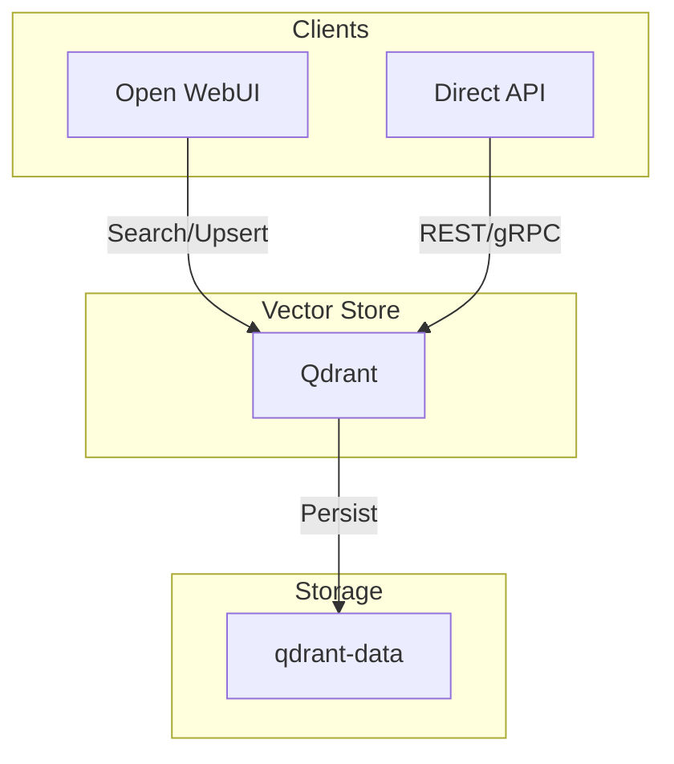

# Qdrant Vector Database

## Overview

A high-performance **Vector Database** optimized for AI applications, specifically acting as the Knowledge Base for the local RAG (Retrieval-Augmented Generation) stack. It stores high-dimensional vectors generated by embedding models.



## Services

| Service | Image | Role | Resources |
| :--- | :--- | :--- | :--- |
| `qdrant` | `qdrant/qdrant:v1.16.3` | Vector Search Engine | 1 CPU / 1GB |

## Networking

Service runs on `infra_net` with a static IP.

| Service | Static IP | Port (Internal) | Host Port | Traefik Domain |
| :--- | :--- | :--- | :--- | :--- |
| `qdrant` | `172.19.0.41` | `6333` (HTTP)<br>`6334` (gRPC) | `${QDRANT_HOST_PORT}` | `qdrant.${DEFAULT_URL}` |

## Persistence

| Volume | Mount Point | Description |
| :--- | :--- | :--- |
| `qdrant-data` | `/qdrant/storage` | Vector indices and payloads |

## Configuration

### Environment Variables

| Variable | Description | Value |
| :--- | :--- | :--- |
| `QDRANT__TELEMETRY_DISABLED` | Telemetry | `false` |

## Usage

### 1. Web UI (Dashboard)

- **URL**: `https://qdrant.${DEFAULT_URL}`
- **Features**: View collections, memory usage, and basic point browsing.

### 2. API Operations

**Create a Collection:**

```bash
curl -X PUT "https://qdrant.${DEFAULT_URL}/collections/my_documents" \
     -H "Content-Type: application/json" \
     --data '{
       "vectors": {
         "size": 768,
         "distance": "Cosine"
       }
     }'
```

**Search Vectors:**

```bash
curl -X POST "https://qdrant.${DEFAULT_URL}/collections/my_documents/points/search" \
     -H "Content-Type: application/json" \
     --data '{
       "vector": [0.1, 0.2, ...],
       "limit": 3
     }'
```

### 3. Integration with Open WebUI

Open WebUI connects internally via:

- **URL**: `http://qdrant:6333`
- **Context**: Used automatically for RAG when "Docs" are active in a chat.

## Troubleshooting

### "Transport Error"

If Open WebUI cannot connect:

1. Verify `infra_net` connectivity.
2. Ensure Qdrant is healthy: `curl http://localhost:${QDRANT_HOST_PORT}/readyz`

### High Memory Usage

Vector databases hold indices in RAM for speed. If Qdrant OOMs:

1. Increase memory limit in `docker-compose.yml`.
2. Configure `memmap_threshold` in `config.yaml` (advanced).
