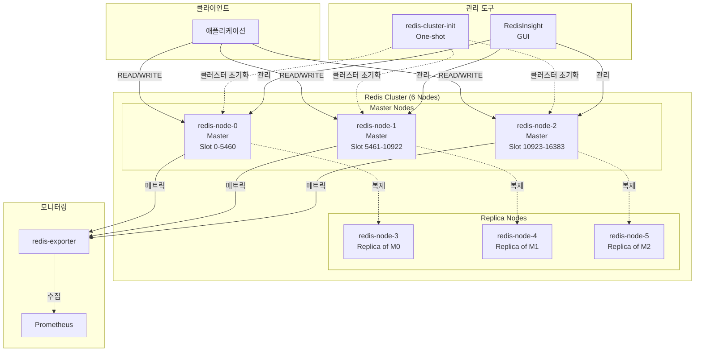

# Redis Cluster

## 시스템 아키텍처에서의 역할

Redis Cluster는 **고속 캐싱 및 세션 관리**를 담당하는 핵심 인메모리 데이터 저장소입니다. 시스템의 성능 최적화 계층으로서 애플리케이션 응답 시간을 대폭 단축하고, 수평 확장(sharding)을 통해 대규모 데이터 처리를 지원합니다.

**핵심 역할:**

- ⚡ **캐시 레이어**: 데이터베이스 부하 감소 및 빠른 데이터 액세스
- 🔑 **세션 스토어**: 분산 환경에서 사용자 세션 공유
- 📨 **메시지 브로커**: Pub/Sub 기능을 통한 실시간 이벤트 전달
- 🎯 **속도 제한**: Rate limiting 및 API 스로틀링
- 📊 **실시간 데이터**: 실시간 통계, 리더보드, 카운터 관리

## 아키텍처 구성



## 주요 구성 요소

### 1. Redis Cluster 노드 (6개)

- **컨테이너**: `redis-node-0` ~ `redis-node-5`
- **이미지**: `redis:8.2.3-bookworm` (Redis 8.2.x)
- **구성**: 3 Master + 3 Replica
- **Sharding**: 16,384 슬롯을 3개 마스터에 균등 분배
  - `redis-node-0`: Slot 0-5460
  - `redis-node-1`: Slot 5461-10922
  - `redis-node-2`: Slot 10923-16383
  
**노드별 포트:**

```
redis-node-0: ${REDIS0_PORT}:${REDIS0_PORT} + ${REDIS0_BUS_PORT}:${REDIS0_BUS_PORT}
redis-node-1: ${REDIS1_PORT}:${REDIS1_PORT} + ${REDIS1_BUS_PORT}:${REDIS1_BUS_PORT}
redis-node-2: ${REDIS2_PORT}:${REDIS2_PORT} + ${REDIS2_BUS_PORT}:${REDIS2_BUS_PORT}
redis-node-3: ${REDIS3_PORT}:${REDIS3_PORT} + ${REDIS3_BUS_PORT}:${REDIS3_BUS_PORT}
redis-node-4: ${REDIS4_PORT}:${REDIS4_PORT} + ${REDIS4_BUS_PORT}:${REDIS4_BUS_PORT}
redis-node-5: ${REDIS5_PORT}:${REDIS5_PORT} + ${REDIS5_BUS_PORT}:${REDIS5_BUS_PORT}
```

**볼륨**: `redis-data-0` ~ `redis-data-5` (`/data`)  
**IP**: 172.19.0.60-65

**주요 기능:**

- 자동 샤딩 (데이터 분산 저장)
- 자동 장애 조치 (마스터 실패 시 레플리카 승격)
- 비밀번호 인증 (Docker Secrets)
- AOF/RDB 영속성
- 헬스체크 (PING/PONG)

### 2. Redis Cluster 초기화 컨테이너

- **컨테이너**: `redis-cluster-init`
- **이미지**: `redis:8.2`
- **역할**: 클러스터 토폴로지 자동 구성 (one-shot)
- **스크립트**: `./scripts/redis-cluster-init.sh`
- **동작**:
  1. 모든 노드가 healthy 상태일 때까지 대기
  2. `redis-cli --cluster create` 실행
  3. 마스터/레플리카 관계 설정
  4. 슬롯 할당
- **재시작 정책**: `restart: no` (완료 후 종료)
- **IP**: 172.19.0.66

### 3. Redis Exporter

- **컨테이너**: `redis-exporter`
- **이미지**: `oliver006/redis_exporter:v1.80.0-alpine`
- **역할**: Prometheus용 메트릭 수집
- **포트**: `${REDIS_EXPORTER_HOST_PORT}:${REDIS_EXPORTER_PORT}`
- **연결**: `redis-node-0:6379` (대표 노드)
- **메트릭 엔드포인트**: `http://localhost:${REDIS_EXPORTER_HOST_PORT}/metrics`
- **IP**: 172.19.0.67

**주요 메트릭:**

- `redis_up`: Redis 가용성
- `redis_connected_clients`: 연결된 클라이언트 수
- `redis_used_memory_bytes`: 메모리 사용량
- `redis_cluster_slots_*`: 클러스터 슬롯 상태

### 4. RedisInsight (GUI)

- **컨테이너**: `redisinsight`
- **이미지**: `redis/redisinsight:latest`
- **역할**: Redis 클러스터 관리 및 모니터링 GUI
- **포트**: `${REDIS_INSIGHT_PORT}` (기본 5540)
- **Traefik 통합**: `https://redisinsight.${DEFAULT_URL}`
- **인증**: Keycloak SSO (`sso-auth@file` 미들웨어)
- **볼륨**: `redisinsight-data:/db`
- **IP**: 172.19.0.68

**기능:**

- 클러스터 토폴로지 시각화
- 키 브라우저 및 검색
- CLI 인터페이스
- 쿼리 프로파일러
- Pub/Sub 모니터링

## 환경 변수

### .env 파일

```bash
# Redis 노드 포트 (각 노드별)
REDIS0_PORT=6379
REDIS0_BUS_PORT=16379
REDIS1_PORT=6380
REDIS1_BUS_PORT=16380
REDIS2_PORT=6381
REDIS2_BUS_PORT=16381
REDIS3_PORT=6382
REDIS3_BUS_PORT=16382
REDIS4_PORT=6383
REDIS4_BUS_PORT=16383
REDIS5_PORT=6384
REDIS5_BUS_PORT=16384

# RedisInsight
REDIS_INSIGHT_PORT=5540
REDIS_INSIGHT_HOST_PORT=5540  # Traefik 사용 시 주석 처리

# Redis Exporter
REDIS_EXPORTER_PORT=9121
REDIS_EXPORTER_HOST_PORT=9121

# 도메인
DEFAULT_URL=hy-home.local
```

### Docker Secrets

- `redis_password`: Redis 인증 비밀번호 (`/run/secrets/redis_password`)

## 네트워크

- **네트워크**: `infra_net`
- **서브넷**: 172.19.0.0/16
- **고정 IP**: 안정적인 클러스터 통신

## 시작 방법

### 1. 환경 설정

Redis 비밀번호 secrets 파일 생성:

```bash
cd d:\hy-home.docker\Infra
echo "your_secure_password" > redis_password.txt
```

### 2. 서비스 시작

```bash
cd d:\hy-home.docker\Infra\redis-cluster
docker-compose up -d
```

### 3. 클러스터 초기화 확인

```bash
# 초기화 컨테이너 로그 확인
docker logs redis-cluster-init

# 클러스터 상태 확인
docker exec redis-node-0 redis-cli -a $(cat ../redis_password.txt) cluster info
```

### 4. 클러스터 노드 확인

```bash
docker exec redis-node-0 redis-cli -a $(cat ../redis_password.txt) cluster nodes
```

## 접속 정보

### RedisInsight GUI

- **URL**: `https://redisinsight.hy-home.local`
- **인증**: Keycloak SSO 필요

### CLI 연결

**클러스터 모드 연결:**

```bash
# 컨테이너 외부에서
redis-cli -c -h localhost -p 6379 -a <password>

# 컨테이너 내부에서
docker exec -it redis-node-0 redis-cli -c -a <password>
```

**특정 노드 연결:**

```bash
docker exec -it redis-node-1 redis-cli -p 6380 -a <password>
```

## 유용한 명령어

### 클러스터 관리

```bash
# 클러스터 정보
docker exec redis-node-0 redis-cli -a <password> cluster info

# 클러스터 노드 목록
docker exec redis-node-0 redis-cli -a <password> cluster nodes

# 슬롯 분배 확인
docker exec redis-node-0 redis-cli -a <password> cluster slots

# 클러스터 상태 체크
docker exec redis-node-0 redis-cli -a <password> --cluster check 172.19.0.60:6379

# 클러스터 재균형 (리샤딩)
docker exec redis-node-0 redis-cli -a <password> --cluster rebalance 172.19.0.60:6379
```

### 데이터 작업

```bash
# 키 설정 (자동 샤딩)
docker exec redis-node-0 redis-cli -c -a <password> SET mykey "Hello Redis Cluster"

# 키 조회
docker exec redis-node-0 redis-cli -c -a <password> GET mykey

# 모든 키 확인 (주의: 프로덕션에서는 SCAN 사용 권장)
docker exec redis-node-0 redis-cli -a <password> --cluster call 172.19.0.60:6379 keys "*"

# 키 개수 확인 (모든 노드)
for i in {0..5}; do
  echo "Node $i:"
  docker exec redis-node-$i redis-cli -a <password> dbsize
done
```

### 모니터링

```bash
# 메모리 사용량
docker exec redis-node-0 redis-cli -a <password> info memory

# 클라이언트 연결 수
docker exec redis-node-0 redis-cli -a <password> info clients

# 통계 정보
docker exec redis-node-0 redis-cli -a <password> info stats

# 실시간 명령어 모니터링
docker exec redis-node-0 redis-cli -a <password> monitor
```

### 백업 및 복구

```bash
# RDB 스냅샷 생성
docker exec redis-node-0 redis-cli -a <password> BGSAVE

# AOF 재작성
docker exec redis-node-0 redis-cli -a <password> BGREWRITEAOF

# 스냅샷 파일 위치
docker exec redis-node-0 ls -lh /data/dump.rdb
```

## 데이터 영속성

### 볼륨

- `redis-data-0` ~ `redis-data-5`: 각 노드의 데이터 (`/data`)
- `redisinsight-data`: RedisInsight 설정

### 영속성 모드

Redis는 `./conf/redis.conf`에서 설정된 영속성 옵션 사용:

- **RDB (Redis Database)**: 주기적인 스냅샷
- **AOF (Append Only File)**: 모든 쓰기 작업 로깅

**권장 설정:**

```conf
# AOF 활성화
appendonly yes
appendfsync everysec

# RDB 스냅샷
save 900 1
save 300 10
save 60 10000
```

## 모니터링 및 경고

### Prometheus 메트릭

- **Exporter 엔드포인트**: `http://localhost:9121/metrics`
- **주요 메트릭**:
  - `redis_up`: 1 = UP, 0 = DOWN
  - `redis_cluster_state`: 0 = OK, 1 = FAIL
  - `redis_used_memory_bytes`: 메모리 사용량
  - `redis_connected_clients`: 연결된 클라이언트
  - `redis_keyspace_hits_total` / `redis_keyspace_misses_total`: 캐시 히트율

### Grafana 대시보드

- Redis 클러스터 전용 대시보드 사용 권장
- 예: [Redis Dashboard (ID: 763)](https://grafana.com/grafana/dashboards/763)

## 문제 해결

### 클러스터 상태 확인

```bash
# 클러스터 상태 (OK / FAIL)
docker exec redis-node-0 redis-cli -a <password> cluster info | grep cluster_state

# 슬롯 커버리지 확인 (16384/16384)
docker exec redis-node-0 redis-cli -a <password> cluster info | grep cluster_slots
```

### 노드 장애 처리

```bash
# 실패한 마스터 확인
docker exec redis-node-0 redis-cli -a <password> cluster nodes | grep fail

# 수동 페일오버 (레플리카에서 실행)
docker exec redis-node-3 redis-cli -a <password> cluster failover

# 실패한 노드 제거
docker exec redis-node-0 redis-cli -a <password> --cluster del-node 172.19.0.60:6379 <node-id>
```

### 슬롯 마이그레이션 실패

```bash
# 안정 모드로 슬롯 수정
docker exec redis-node-0 redis-cli -a <password> --cluster fix 172.19.0.60:6379
```

### 메모리 부족

```bash
# 메모리 사용량 확인
docker exec redis-node-0 redis-cli -a <password> info memory | grep used_memory_human

# 최대 메모리 설정 (redis.conf 또는 런타임)
docker exec redis-node-0 redis-cli -a <password> CONFIG SET maxmemory 2gb
docker exec redis-node-0 redis-cli -a <password> CONFIG SET maxmemory-policy allkeys-lru
```

## 시스템 통합

### 의존하는 서비스

- **Traefik**: RedisInsight HTTPS 라우팅
- **Keycloak**: RedisInsight SSO 인증
- **Prometheus**: 메트릭 수집

### 이 서비스를 사용하는 애플리케이션

- **FastAPI**: 캐싱, 세션, Celery 브로커
- **Django**: 캐싱, 세션 백엔드
- **NestJS**: 캐싱, 큐, Pub/Sub
- **n8n**: 워크플로우 상태 저장

## 고급 설정

### 클러스터 재구성

**노드 추가:**

```bash
# 새 노드를 기존 클러스터에 추가
docker exec redis-node-0 redis-cli -a <password> --cluster add-node <new-node-ip>:<port> 172.19.0.60:6379

# 레플리카로 추가
docker exec redis-node-0 redis-cli -a <password> --cluster add-node <new-node-ip>:<port> 172.19.0.60:6379 --cluster-slave --cluster-master-id <master-id>
```

**리샤딩 (슬롯 재분배):**

```bash
docker exec redis-node-0 redis-cli -a <password> --cluster reshard 172.19.0.60:6379
```

### 성능 튜닝

**redis.conf 최적화:**

```conf
# TCP 백로그
tcp-backlog 511

# 최대 클라이언트 연결
maxclients 10000

# Output 버퍼 제한
client-output-buffer-limit normal 0 0 0
client-output-buffer-limit replica 256mb 64mb 60
client-output-buffer-limit pubsub 32mb 8mb 60

# 느린 명령어 로그
slowlog-log-slower-than 10000
slowlog-max-len 128
```

## 참고 자료

- [Redis Cluster 공식 문서](https://redis.io/docs/management/scaling/)
- [Redis Commands](https://redis.io/commands/)
- [Redis Cluster Specification](https://redis.io/docs/reference/cluster-spec/)
- [redis-cli Cluster 관리](https://redis.io/docs/management/cli/)
- [Best Practices](https://redis.io/docs/management/optimization/)
