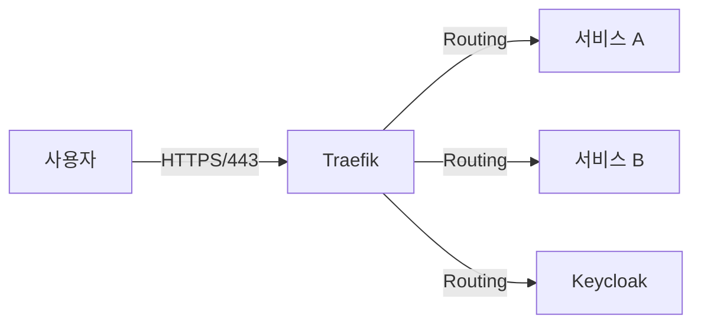

# Traefik

## 1. 서비스 개요 (Service Overview)
**서비스 정의**: Traefik은 모던 HTTP 리버스 프록시 및 로드 밸런서입니다. 마이크로서비스 아키텍처에서 서비스 디스커버리를 자동화하고, 단일 진입점(Gateway) 역할을 수행합니다.

**주요 기능 (Key Features)**:
- **자동 서비스 감지**: Docker 라벨을 통해 새로운 서비스를 자동으로 인식하고 라우팅합니다.
- **SSL/TLS 종료**: Let's Encrypt 또는 로컬 인증서를 사용해 HTTPS 통신을 처리합니다.
- **미들웨어 지원**: 인증, 속도 제한(Rate Limiting), 재시도 등 다양한 미들웨어를 체이닝할 수 있습니다.
- **대시보드**: 실시간 트래픽 및 라우팅 상태를 시각적으로 확인할 수 있는 웹 UI를 제공합니다.

**기술 스택 (Tech Stack)**:
- **Image**: `traefik:v3.6.2`
- **Language**: Go

## 2. 아키텍처 및 워크플로우 (Architecture & Workflow)
**시스템 구조도**:


**데이터 흐름 (Data Flow)**:
1. 클라이언트 요청 수신 (443/80 포트)
2. 라우터(Router) 규칙 매칭 (Host, Path 등)
3. 미들웨어(Middleware) 처리 (인증, 헤더 조작 등)
4. 서비스(Service)로 로드 밸런싱

**의존성 (Dependencies)**:
- **Docker Socket**: 컨테이너 이벤트를 감지하기 위해 `/var/run/docker.sock`에 접근합니다.

## 3. 시작 가이드 (Getting Started)
**사전 요구사항 (Prerequisites)**:
- Docker & Docker Compose
- `infra_net` 외부 네트워크 생성 필요

**실행 방법 (Deployment)**:
```bash
docker compose up -d
```

**초기 설정 (Initial Setup)**:
- 필요한 인증서 파일이 `./certs` 디렉토리에 존재해야 합니다.
- 정적 설정 파일 `config/traefik.yml` 및 동적 설정 파일 `dynamic/` 디렉토리를 확인하십시오.

## 4. 환경 설정 명세 (Configuration Reference)
**환경 변수 (Environment Variables)**:

| 변수명 | 기본값 | 설명 |
|---|---|---|
| `HTTP_HOST_PORT` | - | HTTP 호스트 포트 (80) |
| `HTTP_PORT` | - | HTTP 컨테이너 포트 |
| `HTTPS_HOST_PORT` | - | HTTPS 호스트 포트 (443) |
| `HTTPS_PORT` | - | HTTPS 컨테이너 포트 |
| `TRAEFIK_DASHBOARD_HOST_PORT` | - | 대시보드 호스트 포트 |
| `TRAEFIK_DASHBOARD_PORT` | - | 대시보드 컨테이너 포트 (8080) |
| `DEFAULT_URL` | - | 기본 도메인 주소 |

**볼륨 마운트 (Volume Mapping)**:
- `/var/run/docker.sock`: Docker API 접근
- `./certs`: SSL 인증서 저장소
- `./config/traefik.yml`: 정적 설정 파일
- `./dynamic`: 동적 설정 파일

**네트워크 포트 (Network Ports)**:
- **Inbound**: 80 (HTTP), 443 (HTTPS), 8080 (Dashboard)
- **Monitoring**: 8082 (Metrics)

## 5. 통합 및 API 가이드 (Integration Guide)
**인증 및 인가 (Auth Strategy)**:
- 대시보드 접근은 Basic Auth(`dashboard-auth`) 미들웨어로 보호됩니다.

**엔드포인트 명세**:
- `https://dashboard.${DEFAULT_URL}`: Traefik 대시보드

**클라이언트 설정 (Client Setup)**:
다른 서비스에서 Traefik을 통해 노출되려면 `deploy.labels`에 다음과 같이 설정합니다:
```yaml
labels:
  - "traefik.enable=true"
  - "traefik.http.routers.myservice.rule=Host(`myservice.example.com`)"
  - "traefik.http.routers.myservice.entrypoints=websecure"
  - "traefik.http.routers.myservice.tls=true"
  - "traefik.http.services.myservice.loadbalancer.server.port=8080"
```

## 6. 가용성 및 관측성 (Availability & Observability)
**상태 확인 (Health Check)**:
- Traefik 자체 헬스체크 명령(`ping`)을 사용할 수 있습니다.

**모니터링 (Monitoring)**:
- 메트릭 엔드포인트가 활성화되어 있으면 `/metrics` 경로에서 Prometheus 포맷의 메트릭을 수집할 수 있습니다.

**로그 관리 (Logging)**:
- 로그 레벨: `config/traefik.yml`에서 설정 (DEBUG, INFO, ERROR 등)
- Access Log: 활성화 시 모든 요청 로그 기록

## 7. 백업 및 복구 (Backup & Disaster Recovery)
**데이터 백업**:
- Traefik은 상태를 가지지 않는(Stateless) 서비스이므로 별도의 데이터 백업이 필요 없습니다.
- `./certs` 및 설정 파일만 백업하면 됩니다.

**복구 절차**:
- 컨테이너 재생성 시 설정 파일과 인증서만 있으면 즉시 복구 가능합니다.

## 8. 보안 및 강화 (Security Hardening)
**보안 가이드라인**:
- 대시보드는 반드시 인증된 사용자만 접근하도록 제한하십시오.
- `docker.sock` 마운트는 보안 위험이 있으므로 가능한 경우 Socket Proxy를 사용하거나 권한을 최소화하십시오.

**네트워크 보안**:
- 80 포트는 모두 443으로 리다이렉트하도록 설정하는 것을 권장합니다.

## 9. 트러블슈팅 (Troubleshooting)
**자주 발생하는 문제**:
- **Gateway Timeout (504)**: 백엔드 서비스가 응답하지 않거나 네트워크 연결 문제.
- **404 Not Found**: 라우팅 규칙(Host Rule)이 일치하지 않음.

**진단 명령어**:
```bash
docker compose logs -f traefik
```
