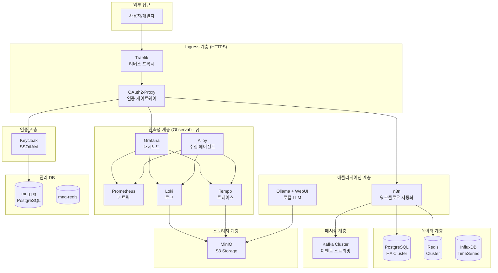

# Docker Infrastructure & Projects

## 개요

이 저장소는 로컬 개발 및 테스트를 위한 **Docker Compose 기반의 완전한 인프라 환경**을 제공합니다.
**13개의 활성화된 핵심 인프라 서비스**와 개발 프로젝트 템플릿으로 구성된 On-Premise 통합 개발 환경입니다.

## 📂 디렉토리 구조

```text
hy-home.docker/
├── Infra/                      # 인프라 서비스 (13개 활성화)
│   ├── docker-compose.yml      # 통합 Compose (includes 방식)
│   ├── .env                    # 환경 변수
│   ├── README.md               # 인프라 전체 가이드
│   │
│   ├── postgresql-cluster/     # ✅ PostgreSQL HA (Patroni+etcd+HAProxy)
│   ├── redis-cluster/          # ✅ Redis Cluster (6노드)
│   ├── kafka/                  # ✅ Kafka (KRaft) + Schema Registry + Connect
│   ├── observability/          # ✅ Prometheus+Grafana+Loki+Tempo+Alloy
│   ├── minio/                  # ✅ S3 호환 객체 스토리지
│   ├── influxdb/               # ✅ 시계열 데이터베이스
│   ├── n8n/                    # ✅ 워크플로우 자동화
│   ├── ollama/                 # ✅ 로컬 LLM + Qdrant + WebUI
│   ├── traefik/                # ✅ 리버스 프록시 (HTTPS 라우팅)
│   ├── keycloak/               # ✅ SSO/IAM 통합 인증
│   ├── oauth2-proxy/           # ✅ OAuth2 인증 게이트웨이
│   ├── mng-db/                 # ✅ 관리용 PostgreSQL + Redis
│   ├── mail/                   # ✅ MailHog (테스트 SMTP)
│   │
│   └── (비활성화 17개)         # mongodb, opensearch, airflow, nginx 등
│
├── Projects/                   # 개발 프로젝트 템플릿
│   ├── docker-compose.yml
│   ├── Django/                 # Python Django
│   ├── FastAPI/                # Python FastAPI
│   ├── NestJS/                 # Node.js NestJS
│   ├── NextJS/                 # Node.js NextJS
│   ├── ReactJS/                # ReactJS (Vite)
│   ├── ExpressJS/              # Node.js Express
│   ├── Maven/                  # Java Spring Boot (Maven)
│   └── Gradle/                 # Java Spring Boot (Gradle)
│
├── secrets/                    # Docker Secrets (비밀번호 파일)
├── Certs/                      # SSL/TLS 인증서 (mkcert)
└── README.md                   # 이 파일
```

## 🎯 Infra 전체 시스템 아키텍처



## 🚀 활성화된 인프라 서비스 (13개)

### 1. 리버스 프록시 & 인증

| 서비스 | 설명 | 접속 URL |
| :--- | :--- | :--- |
| [Traefik](./Infra/traefik) | 동적 리버스 프록시, HTTPS 라우팅 | `https://dashboard.hy-home.local` |
| [OAuth2-Proxy](./Infra/oauth2-proxy) | Forward Auth 인증 미들웨어 | `https://auth.hy-home.local` |
| [Keycloak](./Infra/keycloak) | SSO/IAM, 통합 인증 시스템 | `https://keycloak.hy-home.local` |

### 2. 핵심 데이터베이스

| 서비스 | 구성 | 시스템 역할 |
| :--- | :--- | :--- |
| [PostgreSQL HA](./Infra/postgresql-cluster) | 3노드 Patroni + etcd + HAProxy + Exporters | 관계형 데이터 주 저장소, 자동 장애 조치 |
| [Redis Cluster](./Infra/redis-cluster) | 6노드 (3M+3R) + RedisInsight + Exporter | 캐싱, 세션, Pub/Sub 메시징 |
| [mng-db](./Infra/mng-db) | PostgreSQL + Redis + Exporters | 인프라 메타데이터, Keycloak DB |

### 3. 메시징 & 스트리밍

| 서비스 | 구성 | 시스템 역할 |
| :--- | :--- | :--- |
| [Kafka](./Infra/kafka) | 3노드 KRaft + Schema Registry + Connect + REST + UI | 이벤트 스트리밍, 메시지 브로커 |

### 4. 스토리지

| 서비스 | 구성 | 시스템 역할 |
| :--- | :--- | :--- |
| [MinIO](./Infra/minio) | S3 API 서버 + 자동 버킷 생성 | 객체 스토리지, Loki/Tempo 백엔드 |
| [InfluxDB](./Infra/influxdb) | InfluxDB 2.7 | 시계열 데이터, IoT 메트릭 |

### 5. 관측성 (Full Stack)

| 서비스 | 구성 | 시스템 역할 |
| :--- | :--- | :--- |
| [Observability](./Infra/observability) | Prometheus + Grafana + Loki + Tempo + Alloy + cAdvisor + Alertmanager | 메트릭/로그/트레이스 통합 모니터링 |

### 6. 애플리케이션

| 서비스 | 구성 | 시스템 역할 |
| :--- | :--- | :--- |
| [n8n](./Infra/n8n) | Main + Worker + Redis + Exporter | 노코드 워크플로우 자동화, 시스템 통합 |
| [Ollama](./Infra/ollama) | Ollama + Qdrant + Open WebUI + Exporter | 로컬 LLM, RAG 시스템, AI 챗봇 |

### 7. 기타

| 서비스 | 설명 | 용도 |
| :--- | :--- | :--- |
| [mail](./Infra/mail) | MailHog | 개발용 SMTP 테스트 |

## 📦 개발 프로젝트 템플릿 (8개)

| 프로젝트 | 설명 | 주요 기술 |
| :--- | :--- | :--- |
| [Django](./Projects/Django) | Python Django 개발 환경 | Python 3.12, Django 5.x |
| [FastAPI](./Projects/FastAPI) | Python FastAPI 개발 환경 | Python 3.12, FastAPI, Uvicorn |
| [NestJS](./Projects/NestJS) | Node.js NestJS 개발 환경 | Node.js 20, NestJS, TypeScript |
| [NextJS](./Projects/NextJS) | Node.js NextJS 개발 환경 | Node.js 20, Next.js, React |
| [ReactJS](./Projects/ReactJS) | ReactJS (Vite) 개발 환경 | Vite, React, TypeScript |
| [ExpressJS](./Projects/ExpressJS) | Node.js Express 개발 환경 | Node.js 20, Express |
| [Maven](./Projects/Maven) | Java Spring Boot (Maven) | Java 17, Spring Boot, Maven |
| [Gradle](./Projects/Gradle) | Java Spring Boot (Gradle) | Java 17, Spring Boot, Gradle |

## 🛠 빠른 시작

### 1. 사전 준비

**필수 도구:**

- Docker Engine 24.0+
- Docker Compose v2.20+
- (Ollama 사용 시) NVIDIA GPU + Driver

**Secrets 디렉토리 생성:**

```bash
mkdir -p secrets

# 비밀번호 파일 생성
echo "your_postgres_password" > secrets/postgres_password.txt
echo "your_redis_password" > secrets/redis_password.txt
echo "minio_admin" > secrets/minio_root_user.txt
echo "minio_password" > secrets/minio_root_password.txt
echo "minio_app_user" > secrets/minio_app_user.txt
echo "minio_app_password" > secrets/minio_app_user_password.txt
```

### 2. Infra 전체 실행

```bash
cd Infra
docker-compose up -d
```

### 3. 개별 서비스 실행

```bash
# PostgreSQL만 실행
cd Infra/postgresql-cluster
docker-compose up -d

# Observability만 실행
cd Infra/observability
docker-compose up -d
```

### 4. 프로젝트 실행

```bash
cd Projects/FastAPI
docker-compose up -d
```

## 🌐 주요 접속 정보

### 관측성

- **Grafana**: `https://grafana.hy-home.local` (Keycloak SSO)
- **Prometheus**: `https://prometheus.hy-home.local`
- **Alloy**: `https://alloy.hy-home.local`
- **Alertmanager**: `https://alertmanager.hy-home.local`

### 데이터베이스 UI

- **RedisInsight**: `https://redisinsight.hy-home.local`
- **Kafka UI**: `https://kafka-ui.hy-home.local`
- **MinIO Console**: `https://minio-console.hy-home.local`
- **InfluxDB**: `https://influxdb.hy-home.local`

### 애플리케이션

- **n8n**: `https://n8n.hy-home.local`
- **Ollama WebUI**: `https://chat.hy-home.local`
- **Keycloak Admin**: `https://keycloak.hy-home.local/admin`
- **Traefik Dashboard**: `https://dashboard.hy-home.local`
- **MailHog**: `https://mail.hy-home.local`

### 데이터베이스 연결

**PostgreSQL (쓰기):**

```bash
Host: localhost
Port: 5000
User: postgres
Password: <secrets/postgres_password.txt>
```

**PostgreSQL (읽기):**

```bash
Host: localhost
Port: 5001
User: postgres
Password: <secrets/postgres_password.txt>
```

**Redis:**

```bash
Host: localhost
Port: 6379
Password: <secrets/redis_password.txt>
```

## 🔧 시스템 설정

### 네트워크

- **infra_net**: 172.19.0.0/16 (모든 Infra 서비스)
- **project_net**: 외부 네트워크 (Projects 연결용)

### 필요 리소스

**최소 사양:**

- CPU: 8 코어
- RAM: 16GB
- Disk: 100GB SSD

**권장 사양:**

- CPU: 16 코어
- RAM: 32GB
- Disk: 500GB NVMe SSD
- GPU: NVIDIA GPU (Ollama 사용 시)

## 📖 상세 문서

- **[Infra 전체 가이드](./Infra/README.md)**: 인프라 서비스 상세 설명
- **[각 서비스 README](./Infra/)**: 서비스별 상세 운영 가이드

## ⚠️ 주의사항

1. **비밀번호 보안**: `secrets/` 디렉토리는 `.gitignore`에 포함되어 있습니다
2. **포트 충돌**: 기본 포트(5432, 6379, 9092 등) 사용 중인지 확인
3. **리소스 관리**: 전체 실행 시 많은 리소스 필요, 필요한 서비스만 선택 실행 권장
4. **Docker Desktop**: WSL2 기반 Docker Desktop 권장 (Windows)

## 🐛 트러블슈팅

### 공통 문제

**1. 포트 충돌**

```bash
netstat -an | findstr "5432"  # Windows
lsof -i :5432                 # Linux/Mac
```

**2. DNS 해석 실패**

```
# C:\Windows\System32\drivers\etc\hosts 또는 /etc/hosts에 추가
127.0.0.1 grafana.hy-home.local
127.0.0.1 keycloak.hy-home.local
127.0.0.1 kafka-ui.hy-home.local
```

**3. 볼륨 권한 문제**

```bash
# Linux/WSL
docker-compose down
docker volume prune  # 주의: 데이터 삭제됨
```

### 로그 확인

```bash
# 전체 로그
docker-compose logs -f

# 특정 서비스
docker logs <container-name> -f
```

## 🔒 보안 권장사항

1. 모든 기본 비밀번호 변경
2. 프로덕션에서는 Let's Encrypt 사용
3. 불필요한 포트 외부 노출 차단
4. 정기적인 보안 업데이트
5. 중요 데이터 정기 백업

## 📚 참고 자료

- [Docker 공식 문서](https://docs.docker.com/)
- [Docker Compose](https://docs.docker.com/compose/)
- [Infra 상세 가이드](./Infra/README.md)

## Docker에서 `latest` 태그를 사용하는 컨테이너를 최신 버전으로 업데이트

단순히 컨테이너를 재시작(`restart`)하는 것만으로는 부족하다. 
Docker는 **로컬에 이미 `latest`라는 이름의 이미지가 있다면, 레지스트리(Docker Hub 등)에서 새로 다운로드하지 않고 로컬 캐시를 사용**하기 때문이다. 

`docker-compose` 환경에서 이를 업데이트하는 가장 정석적인 방법

-----

### 방법 1. 수동 업데이트 (Docker Compose 사용 시) - 권장

명시적으로 이미지를 당겨오고(Pull), 변경 사항을 적용한다. 

**1. 최신 이미지 다운로드**

```bash
docker-compose pull
```

- 이 명령어를 실행하면 `docker-compose.yml`에 명시된 모든 서비스의 `latest` 이미지를 레지스트리에서 새로 받아온다. 

**2. 컨테이너 재생성**

```bash
docker-compose up -d
```

- `up` 명령어는 이미지가 변경된 것을 감지하고, **변경된 컨테이너만** 자동으로 지우고 새로 생성(Recreate)한다. 변경되지 않은 컨테이너는 건드리지 않는다.

**3. (선택) 이전 이미지 정리**
업데이트 후에는 이름 없는(dangling) 이전 버전의 이미지가 남게 된다 (`<none>:<none>`). 디스크 공간 확보를 위해 지워주는 것이 좋다.

```bash
docker image prune -f
```

-----
