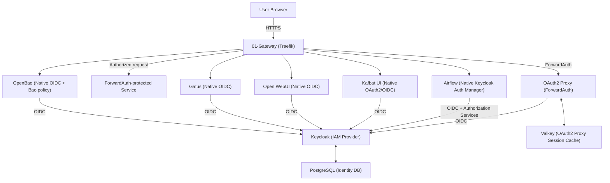

# 02-Auth Architecture Description

> This document defines the technical architecture for Identity and Access Management (IAM), Gateway ForwardAuth, and application-native OIDC.

## Context and Stakeholders

`02-auth` 아키텍처는 중앙 IAM 역할을 수행하는 `Keycloak`과 gateway 인증 계층인
`OAuth2 Proxy`를 중심으로 구성한다. 모든 애플리케이션이 동일한 ingress auth
패턴을 강제받는 것은 아니다. 자체 OIDC와 application-level RBAC를 제공하는
서비스는 Keycloak에 직접 연결하고, 자체 OIDC가 없거나 gateway authentication이
적합한 서비스는 OAuth2 Proxy ForwardAuth를 사용한다.

### Status

- **Proposed**: 2026-03-26
- **Status**: Active (Standardized)
- **Stakeholders**: AI Platform Team, DevOps Team, Security Team

### Principles

- **Central Identity**: 사용자 identity source는 Keycloak을 기준으로 한다.
- **Protocol Standardization**: OIDC를 기본 인증 프로토콜로 사용한다.
- **Selective Enforcement**: ForwardAuth와 Native OIDC를 서비스 특성에 따라 선택한다.
- **No Double Auth by Default**: Native OIDC 서비스 앞에 OAuth2 Proxy ForwardAuth를 기본적으로 중복 적용하지 않는다.
- **Fail Closed**: 인증/권한 검증 실패 시 보호 자원 접근을 허용하지 않는다.
- **Secret Boundary**: Compose가 주입하는 client/cookie/JWT secret은 파일 기반 Secret을 사용한다. 승인된 OpenBao native OIDC client secret은 OpenBao auth backend에 저장한다.

## Components

The auth system provides one central identity source with two ingress authentication patterns.

### System Architecture Diagram



### Pattern 1: Gateway ForwardAuth

적용 예:

- Flower
- n8n
- 자체 OIDC가 없는 관리 UI

흐름:

```text
Request: Browser -> Traefik -> /oauth2/auth check -> Traefik -> Service
Login when needed: Browser <-> OAuth2 Proxy <-> Keycloak
After login: Proxy session cookie -> repeat original request
```

### Pattern 2: Application-native OIDC

현재 승인:

- Apache Airflow
- Kafbat UI
- Open WebUI
- Gatus
- OpenBao (owner-approved native OIDC; operator login verified)

흐름:

```text
Browser -> Traefik -> Application -> Keycloak
```

Traefik은 TLS와 routing/gateway middleware만 담당한다. application이 직접 OIDC
flow와 application authorization을 수행한다.

### State and Persistence

- Keycloak identity metadata: `mng-pg`
- OAuth2 Proxy session: 기본 `mng-valkey`
- `dedicated-valkey` profile: `oauth2-proxy-valkey`를 추가
- Native OIDC application session/RBAC: 각 application이 소유

## Traceability

- **IAM Engine**: Keycloak
- **Gateway SSO**: OAuth2 Proxy
- **Native OIDC**: Airflow, Kafbat UI, Open WebUI, Gatus, OpenBao
- **Session Manager**: Valkey for OAuth2 Proxy
- **Storage**: PostgreSQL for Keycloak realm/user/client state

## Data Flow

브라우저 요청은 Traefik HTTPS ingress로 진입한 뒤 서비스의 auth pattern에 따라
분기한다.

ForwardAuth 대상 서비스는 OAuth2 Proxy `/oauth2/auth` 검사를 거쳐 Keycloak
OIDC와 Valkey session을 사용한다.

Native OIDC 대상인 Airflow, Kafbat UI, Open WebUI, Gatus, OpenBao는 OAuth2 Proxy를 거치지 않고
애플리케이션이 Keycloak과 직접 OIDC flow를 수행한다. Airflow는 추가로
Keycloak Authorization Services를 사용해 resource authorization을 평가한다.

Keycloak realm/user/session metadata는 PostgreSQL에 저장한다.

Compose가 주입하는 client/cookie/DB/JWT secret은 `/run/secrets`에서 읽는다.
OpenBao native OIDC client secret은 승인된 bootstrap 과정에서 OpenBao auth
backend에 저장되며 공개 Compose나 문서에 포함하지 않는다.

## System Boundaries

- **Owns**:
  - Keycloak-based identity boundary
  - ForwardAuth vs Native OIDC 선택 기준
  - OAuth2 Proxy session boundary
  - OIDC issuer/redirect trust relationship
- **Consumes**:
  - `01-gateway` HTTPS ingress/routing
  - `04-data` PostgreSQL/Valkey
- **Does Not Own**:
  - 애플리케이션별 세부 RBAC 구현
  - 비인증 비즈니스 로직
  - secret 값 자체
  - 개별 실행의 evidence
- **Native OIDC Boundary**:
  - Airflow/Kafbat RBAC와 OpenBao policy는 각 application과 Operations 문서가 소유한다.
  - OAuth2 Proxy가 해당 RBAC를 대체하지 않는다.
- **Non-goals**:
  - 신규 identity provider 도입
  - fail-open 기본 정책
  - 모든 서비스의 인증 구현을 하나의 middleware로 강제

## Quality Attributes

- **Performance**: ForwardAuth 대상은 `/oauth2/auth` 경량 검증을 사용한다.
- **Security**: Native OIDC 앱에 불필요한 `Authorization` header injection을 피한다.
- **Reliability**: Keycloak/Valkey/PostgreSQL health 상태와 application login flow를 분리 검증한다.
- **Operability**: auth pattern을 service onboarding 문서에 명시한다.
- **Observability**: Keycloak/OAuth2 Proxy/application 로그에서 실패 지점을 분리할 수 있어야 한다.

## Deployment View

Keycloak은 `infra/02-auth/keycloak/docker-compose.yml`, OAuth2 Proxy는
`infra/02-auth/oauth2-proxy/docker-compose.yml`에서 운영한다.

Airflow는 `infra/07-workflow/airflow/docker-compose.yml`에서
`KeycloakAuthManager`를 사용하며 router는 `gateway-standard-chain@file`만 적용한다.

Kafbat UI는 `infra/05-messaging/kafka/docker-compose.yml`과
`kafbat-ui/dynamic_config.template.yaml`에서 native OAuth2를 구성하며 router는
`gateway-standard-chain@file`만 적용한다.

OpenBao router도 `gateway-standard-chain@file`만 사용한다. Keycloak 그룹
`/openbao-admins`는 OpenBao OIDC role `home-admin`의 조건이며, 로그인 결과는
`hy-home-operator` 정책의 OpenBao 토큰이다. Keycloak 사용자·그룹과 OpenBao
role·policy는 별도 객체다. 실제 로그인 검증은
[OpenBao 작업 기록](../../98.archive/completed/03.specs/0180-home-dev-convergence/tasks/tsk-0002-openbao-access-and-env-convergence.md)이 소유한다.

## Related Documents

- **Requirement Package**: [REQ-0002 Auth requirements](../../01.requirements/0002-auth.md)
- **Decision**: [ADR-0002 Keycloak and OAuth2 Proxy choice](../decisions/0002-keycloak-oauth2-proxy-choice.md)
- **Decision**: [ADR-0017 Runtime hardening and fail-closed](../decisions/0017-auth-hardening-runtime-and-fail-closed.md)
- **Decision**: [ADR-0038 Selective Native OIDC](../decisions/0038-selective-native-oidc-for-native-auth-apps.md)
- **Operations**: [Keycloak guide](../../05.operations/guides/0014-keycloak.md)
- **Operations**: [OAuth2 Proxy guide](../../05.operations/guides/0015-oauth2-proxy.md)
- **Operations**: [Application authentication integration](../../05.operations/guides/0079-application-auth-integration.md)

Runtime pins are owned by Compose/Dockerfile declarations; the [derived Compose image projection](../../../infra/tech-stack.versions.json) supplies drift verification.
