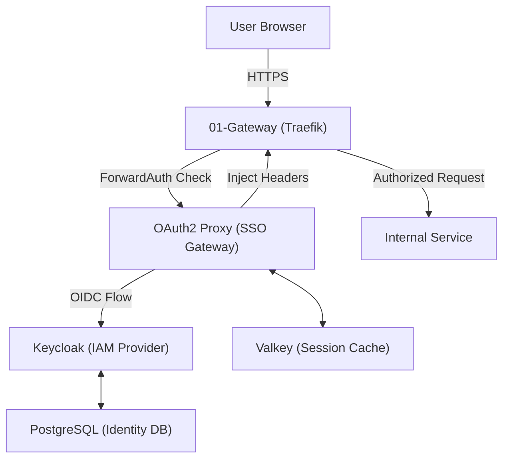

# 02-Auth Architecture Description

> This document defines the technical architecture for Identity and Access Management (IAM) and Authentication ForwardAuth Gateway.

---

## Context and Stakeholders

`02-auth` 아키텍처는 사용자 식별 및 액세스 제어를 위한 두 가지 핵심 계층으로 구성된다. 중앙 IAM 역할을 수행하는 `Keycloak`과 트래픽 가로채기를 통해 SSO를 강제하는 `OAuth2 Proxy`가 긴밀하게 연동된다. 이 구조는 `Traefik`의 ForwardAuth 메커니즘을 활용하여 모든 백엔드 서비스에 대한 통일된 인증 게이트웨이를 제공한다.

### Status

- **Proposed**: 2026-03-26
- **Status**: Active (Standardized)
- **Stakeholders**: AI Platform Team, DevOps Team, Security Team

### Principles

- **Zero-Trust Enforcement**: All requests must be explicitly authenticated.
- **Protocol Standardization**: Use OIDC (OpenID Connect) for all internal integrations.
- **Stateless Verification**: Leverage JWT (JSON Web Tokens) where applicable, backed by server-side sessions.
- **High Availability**: Identity data and sessions must be resilient to container failures.

### Stakeholders and Concerns

요구사항 소유자, 구현자와 운영자는 인증 경계, 시크릿 파일 주입, 최소 권한
실행과 장애 시 fail-closed 동작을 공유 관심사로 다룬다. 이 Description은
구조와 품질 기대를 설명하며, 실행 절차와 검증 결과는 각각 Operations 문서와
해당 작업의 Task가 소유한다.

## Components

The auth system sits between the `01-gateway` and other internal services. It validates user presence before traffic enters any protected container.

### System Architecture Diagram (Mermaid)

Keycloak은 `04-data`의 `mng-pg` PostgreSQL 서비스에 identity 상태를 저장한다. OAuth2 Proxy의
기본 session 저장소는 공유 `mng-valkey`다. `dedicated-valkey` profile은
`oauth2-proxy-valkey`와 exporter를 추가로 선택하며, Proxy의 실제 접속 대상은
`OAUTH2_PROXY_VALKEY_HOST` 설정으로 결정된다. Profile 선택만으로 기본 접속
대상이 자동 전환된다고 가정하지 않는다. 환경별 연결과 시크릿 주입 경로의
절차는 [Proxy guide](../../05.operations/catalog/02-auth/0015-oauth2-proxy/guide.md)가 소유한다.

### AI Agent Architecture

Agents access services using Service Account tokens issued by Keycloak. All agent-initiated actions must include the `X-Auth-Request-User` header for auditing.

## Traceability

- **IAM Engine**: Keycloak (Quarkus distribution) for robust OIDC/SAML support.
- **SSO Gateway**: OAuth2 Proxy for standardized ForwardAuth implementation.
- **Session Manager**: Valkey as a high-performance Redis-compatible session store.
- **Storage**: PostgreSQL for identity persistence (Realms, Users, Clients).

## Data Flow

브라우저 요청은 Traefik의 HTTPS ingress를 거쳐 OAuth2 Proxy의 ForwardAuth
검사를 받는다. Proxy는 Keycloak의 OIDC issuer/callback과 연동하고,
`/oauth2/auth` 경량 검증 경로 및 Valkey의 cookie/session 상태를 사용한다.
Keycloak realm/user/session metadata의 지속성은 PostgreSQL이 담당한다.

Client, cookie 및 DB 시크릿은 `/run/secrets` 파일 주입 경계를 사용한다.
평문 시크릿을 Compose나 문서에 넣지 않는다. 세부 claims, realm 구성과 세션의
만료·갱신·도메인 설정은 [Keycloak guide](../../05.operations/catalog/02-auth/0014-keycloak/guide.md)와
[Proxy policy](../../05.operations/catalog/02-auth/0015-oauth2-proxy/policy.md)를 따른다.

## System Boundaries

- **Owns**: 인증 토큰 발급·검증 경로, ForwardAuth 진입점 및 인증 세션 정책의 구조.
- **Consumes**: `01-gateway`의 HTTPS ingress·routing과 `04-data`의 PostgreSQL·Valkey.
- **Does Not Own**: 애플리케이션별 RBAC 세부 구현, 비인증 비즈니스 로직, 시크릿 값,
  운영 절차 또는 특정 실행의 검증 증거.
- **Non-goals**: 인증 프로토콜 변경, 신규 인증 스택·시크릿 백엔드 도입 및 fail-open 기본 정책.

## Quality Attributes

- **Performance**: 기본 `/oauth2/auth` 경량 검증 경로로 인증 오버헤드를 제한한다.
- **Security**: 파일 시크릿 주입과 Proxy non-root 실행을 유지한다. 인증이 불가능하면
  보호 서비스 접근을 허용하지 않는 fail-closed가 기본이다.
- **Reliability**: 상태 저장소, healthcheck와 정적 검증을 연결한다. 제한적 degraded-mode는
  [Proxy policy](../../05.operations/catalog/02-auth/0015-oauth2-proxy/policy.md)의 별도 운영 승인과
  [runbook](../../05.operations/catalog/02-auth/0015-oauth2-proxy/runbook.md)의 종료·원복 조건을 따른다.
- **Scalability**: 환경별 도메인과 세션 설정을 명시적으로 구성하며 세션의 복원력을 유지한다.
- **Observability**: 컨테이너 로그, health 상태와 agent audit header를 증거원으로 사용한다.
  로그 보존과 실제 증거 수집은 운영 문서 및 해당 Task의 책임이다.
- **Operability**: CI 정적 검사와 운영 문서의 검증 절차를 연결한다. 정적 PASS는
  실제 로그인, 장애 복구 또는 운영 배포 성공을 증명하지 않는다.

## Deployment View

Docker Compose에서 Keycloak은 상태 저장 특성을 고려한 `template-infra-high`를
유지하고 DB/Admin 시크릿을 파일로 주입한다. OAuth2 Proxy는 custom Alpine
image와 non-root 사용자, `template-infra-readonly-med`를 사용한다. 실행 경로와
계정 차이는 [Proxy guide](../../05.operations/catalog/02-auth/0015-oauth2-proxy/guide.md)가 설명한다.
이 선택과 fail-closed 근거는 [ADR-0017](../decisions/0017-auth-hardening-runtime-and-fail-closed.md)에 보존된다.

Profile 정적 검증과 hardening 검사는 적용 가능한 CI 실행 계약 및
[Keycloak policy](../../05.operations/catalog/02-auth/0014-keycloak/policy.md),
[Proxy policy](../../05.operations/catalog/02-auth/0015-oauth2-proxy/policy.md)의 검증 경로를 따른다.
인증 계층의 단계적 반영과 장애 원복은 승인된 운영 절차의 책임이며,
이 문서의 정비가 운영 실행이나 새로운 배포 계획을 승인하지 않는다.

## Related Documents

- **Requirement Package**: [REQ-0002 Auth requirements](../../01.requirements/0002-auth.md)
- **Decision**: [ADR-0002 Keycloak and OAuth2 Proxy choice](../decisions/0002-keycloak-oauth2-proxy-choice.md)
- **Decision**: [ADR-0017 Runtime hardening and fail-closed](../decisions/0017-auth-hardening-runtime-and-fail-closed.md)
- **Operations**: [Keycloak guide](../../05.operations/catalog/02-auth/0014-keycloak/guide.md),
  [Proxy guide](../../05.operations/catalog/02-auth/0015-oauth2-proxy/guide.md) and
  [Proxy recovery runbook](../../05.operations/catalog/02-auth/0015-oauth2-proxy/runbook.md)
