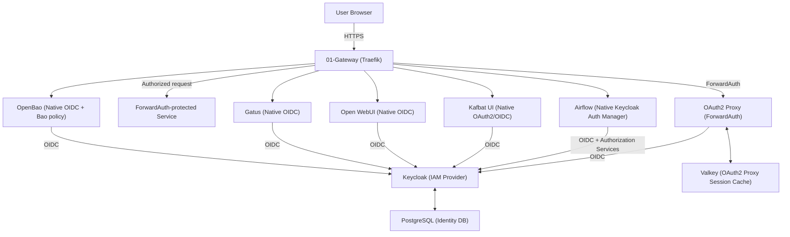

# 02-Auth Architecture Description

> This document defines the technical architecture for Identity and Access Management (IAM), Gateway ForwardAuth, and application-native OIDC.

## Context and Stakeholders

The `02-auth` architecture centers on `Keycloak`, which serves the central IAM role, and `OAuth2 Proxy`, the gateway authentication layer. Not every application is forced into the same ingress auth pattern. Services that provide their own OIDC and application-level RBAC connect directly to Keycloak, while services without their own OIDC, or for which gateway authentication fits, use OAuth2 Proxy ForwardAuth.

### Status

- **Proposed**: 2026-03-26
- **Status**: Active (Standardized)
- **Stakeholders**: AI Platform Team, DevOps Team, Security Team

### Principles

- **Central Identity**: The user identity source is anchored on Keycloak.
- **Protocol Standardization**: OIDC is the default authentication protocol.
- **Selective Enforcement**: ForwardAuth and Native OIDC are chosen based on service characteristics.
- **No Double Auth by Default**: OAuth2 Proxy ForwardAuth is not applied redundantly in front of Native OIDC services by default.
- **Fail Closed**: Access to protected resources is not allowed when authentication/authorization verification fails.
- **Secret Boundary**: The client/cookie/JWT secrets Compose injects use file-based Secrets. Approved OpenBao native OIDC client secrets are stored in the OpenBao auth backend.

## Components

The auth system provides one central identity source with two ingress authentication patterns.

### System Architecture Diagram


```mermaid
graph TD
    Client["User Browser"]
    Gateway["01-Gateway (Traefik)"]
    OAuth2Proxy["OAuth2 Proxy (ForwardAuth)"]
    Keycloak["Keycloak (IAM Provider)"]
    ForwardApp["ForwardAuth-protected Service"]
    Airflow["Airflow (Native Keycloak Auth Manager)"]
    Kafbat["Kafbat UI (Native OAuth2/OIDC)"]
    OpenWebUI["Open WebUI (Native OIDC)"]
    Gatus["Gatus (Native OIDC)"]
    OpenBao["OpenBao (Native OIDC + Bao policy)"]
    PostgreSQL["PostgreSQL (Identity DB)"]
    Valkey["Valkey (OAuth2 Proxy Session Cache)"]

    Client -->|HTTPS| Gateway

    Gateway -->|ForwardAuth| OAuth2Proxy
    OAuth2Proxy -->|OIDC| Keycloak
    Gateway -->|Authorized request| ForwardApp
    OAuth2Proxy <--> Valkey

    Gateway --> Airflow
    Airflow -->|OIDC + Authorization Services| Keycloak

    Gateway --> Kafbat
    Kafbat -->|OIDC| Keycloak

    Gateway --> OpenWebUI
    OpenWebUI -->|OIDC| Keycloak

    Gateway --> Gatus
    Gatus -->|OIDC| Keycloak

    Gateway --> OpenBao
    OpenBao -->|OIDC| Keycloak

    Keycloak <--> PostgreSQL
```

### Pattern 1: Gateway ForwardAuth

Applies to:

- Flower
- n8n
- Admin UIs without their own OIDC

Flow:

```text
Request: Browser -> Traefik -> /oauth2/auth check -> Traefik -> Service
Login when needed: Browser <-> OAuth2 Proxy <-> Keycloak
After login: Proxy session cookie -> repeat original request
```

### Pattern 2: Application-native OIDC

Currently approved:

- Apache Airflow
- Kafbat UI
- Open WebUI
- Gatus
- OpenBao (owner-approved native OIDC; operator login verified)

Flow:

```text
Browser -> Traefik -> Application -> Keycloak
```

Traefik handles only TLS and routing/gateway middleware. The application performs the OIDC flow and application authorization directly.

### State and Persistence

- Keycloak identity metadata: `mng-pg`
- OAuth2 Proxy session: `mng-valkey` by default
- `dedicated-valkey` profile: adds `oauth2-proxy-valkey`
- Native OIDC application session/RBAC: owned by each application

## Traceability

- **IAM Engine**: Keycloak
- **Gateway SSO**: OAuth2 Proxy
- **Native OIDC**: Airflow, Kafbat UI, Open WebUI, Gatus, OpenBao
- **Session Manager**: Valkey for OAuth2 Proxy
- **Storage**: PostgreSQL for Keycloak realm/user/client state

## Data Flow

The browser request enters through Traefik HTTPS ingress and then branches according to the service's auth pattern.

Services targeted for ForwardAuth pass the OAuth2 Proxy `/oauth2/auth` check and use Keycloak OIDC and a Valkey session.

For Native OIDC targets, Airflow, Kafbat UI, Open WebUI, Gatus, and OpenBao, the application performs the OIDC flow directly with Keycloak without going through OAuth2 Proxy. Airflow additionally uses Keycloak Authorization Services to evaluate resource authorization.

Keycloak realm/user/session metadata is stored in PostgreSQL.

The client/cookie/DB/JWT secrets Compose injects are read from `/run/secrets`. The OpenBao native OIDC client secret is stored in the OpenBao auth backend during the approved bootstrap process and is not included in public Compose files or documents.

## System Boundaries

- **Owns**:
  - Keycloak-based identity boundary
  - The selection criteria between ForwardAuth and Native OIDC
  - OAuth2 Proxy session boundary
  - OIDC issuer/redirect trust relationship
- **Consumes**:
  - `01-gateway` HTTPS ingress/routing
  - `04-data` PostgreSQL/Valkey
- **Does Not Own**:
  - Detailed RBAC implementation per application
  - Non-authentication business logic
  - Secret values themselves
  - Evidence of individual execution
- **Native OIDC Boundary**:
  - Airflow/Kafbat RBAC and OpenBao policy are owned by each application and the Operations documents.
  - OAuth2 Proxy does not replace that RBAC.
- **Non-goals**:
  - Introducing a new identity provider
  - A fail-open default policy
  - Forcing every service's authentication implementation into a single middleware

## Quality Attributes

- **Performance**: ForwardAuth targets use the lightweight `/oauth2/auth` check.
- **Security**: Avoids unnecessary `Authorization` header injection into Native OIDC apps.
- **Reliability**: Verifies Keycloak/Valkey/PostgreSQL health state and the application login flow separately.
- **Operability**: Documents the auth pattern in the service onboarding document.
- **Observability**: Failure points must be separable in Keycloak/OAuth2 Proxy/application logs.

## Deployment View

Keycloak runs in `infra/02-auth/keycloak/docker-compose.yml`, and OAuth2 Proxy runs in `infra/02-auth/oauth2-proxy/docker-compose.yml`.

Airflow uses `KeycloakAuthManager` in `infra/07-workflow/airflow/docker-compose.yml`, and its router applies only `gateway-standard-chain@file`.

Kafbat UI configures native OAuth2 in `infra/05-messaging/kafka/docker-compose.yml` and `kafbat-ui/dynamic_config.template.yaml`, and its router applies only `gateway-standard-chain@file`.

The OpenBao router also uses only `gateway-standard-chain@file`. The Keycloak group `/openbao-admins` is a condition for the OpenBao OIDC role `home-admin`, and the login result is an OpenBao token under the `hy-home-operator` policy. Keycloak users/groups and OpenBao roles/policies are separate objects. The actual login verification is owned by the
[OpenBao work record](../../98.archive/completed/03.specs/0180-home-dev-convergence/tasks/tsk-0002-openbao-access-and-env-convergence.md).

## Related Documents

- **Requirement Package**: [REQ-0002 Auth requirements](../../01.requirements/0002-auth.md)
- **Decision**: [ADR-0002 Keycloak and OAuth2 Proxy choice](../decisions/0002-keycloak-oauth2-proxy-choice.md)
- **Decision**: [ADR-0017 Runtime hardening and fail-closed](../decisions/0017-auth-hardening-runtime-and-fail-closed.md)
- **Decision**: [ADR-0038 Selective Native OIDC](../decisions/0038-selective-native-oidc-for-native-auth-apps.md)
- **Operations**: [Keycloak guide](../../05.operations/guides/0014-keycloak.md)
- **Operations**: [OAuth2 Proxy guide](../../05.operations/guides/0015-oauth2-proxy.md)
- **Operations**: [Application authentication integration](../../05.operations/guides/0079-application-auth-integration.md)

Runtime pins are owned by Compose/Dockerfile declarations; the [derived Compose image projection](../../../infra/tech-stack.versions.json) supplies drift verification.
