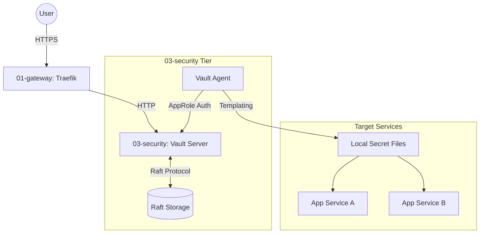

# Security Tier Architecture Description

## Context and Stakeholders

`03-security` 티어는 HashiCorp Vault를 기반으로 하는 비밀 정보 관리 시스템이다. 현재 구현은 단일 노드 Raft 통합 스토리지를 사용하며, 애플리케이션 서비스에 비밀 정보를 안전하게 주입하기 위해 Vault Agent 서비스 패턴을 채택한다. 외부 접근은 Traefik Gateway를 통해 HTTPS로 보호된다.

### Stakeholders and Concerns

요구사항 소유자, 구현자와 운영자는 이 절과 후속 뷰에 기록된 관심사를 공유한다. 여기서는 기존 문서에서 확인되는 관심사만 다룬다.

This section was added for template alignment. Existing architecture content in this existing Architecture Description remains the source of truth; no runtime behavior is changed.

#### Additional Boundaries and Constraints

- **Owns**: The architecture scope already described in this document.
- **Consumes**: Upstream requirements and downstream specs listed in Related Documents.
- **Does Not Own**: Secret values, runtime changes, or execution evidence outside this Architecture Description.
- **Non-goals**: Semantic rewriting of the historical architecture record.

## System Boundaries

이 절은 현재 문서가 이미 기록한 시스템 경계, 소비 관계, non-goal과 제약을 보존한다.

- **Storage**: Raft 통합 스토리지를 사용하여 외부 데이터베이스 의존성 제거.
- **Network**: `infra_net` 내부망을 통해 상호 통신하며, 외부 노출은 Traefik을 통해서만 허용.
- **Auth**: AppRole 인증 방식을 사용하여 서비스 컨테이너의 Vault 접근 권한 자동화.

### Alternative Scopes

- **Direct API Call**: SDK를 통한 직접 조회가 가능하나, 코드 수정 최소화를 위해 템플릿 방식 우선.
- **OIDC Auth**: 관리자 접속을 위해 Keycloak OIDC 연동 가능 (향후 고도화).

## Components

### Viewpoints and Views

이 절의 컨텍스트, 구성 요소 또는 배치 표현을 해당 관심사의 뷰로 사용한다.

### Container Diagram (Mermaid)

### Component Architecture

#### 1. Vault Server

- **Role**: 비밀 정보 저장, 암호화, 정책 엔진, 감사 로그 제공.
- **Storage**: Raft (`/vault/data`).
- **Ingress**: `vault.${DEFAULT_URL}`를 통해 UI 및 API 제공.

#### 2. Vault Agent

- **Role**: 인증 관리, 토큰 갱신, 템플릿 기반 비밀 정보 주입.
- **Pattern**: Sidecar/Dedicated agent service.
- **Auth Method**: `approle` (RoleID/SecretID 기반).

#### 3. Templating System

- **Process**: Vault Agent가 Consul Template 구문을 사용하여 Vault의 시크릿을 로컬 파일로 렌더링.
- **Targets**: PostgreSQL Password, Keycloak Credentials, Grafana Secrets 등.

## Quality Attributes

### Quality Scenarios

품질 시나리오는 아래 속성이 적용되는 기존 구성, 실패 경계와 연결된 검증 기대를 가리킨다. 구체적인 실행 증거는 관련 Spec과 Operations 문서가 소유한다.

- **Performance**: Use the existing service-specific constraints in this document.
- **Security**: Preserve the security boundaries already described in this document.
- **Reliability**: Preserve the availability and failure-mode notes already described in this document.
- **Scalability**: Use existing capacity and deployment notes where present.
- **Observability**: Use downstream operations and spec documents for runtime evidence.
- **Operability**: Use downstream operations documents for procedures.

### Additional Architecture Views

The existing architecture diagram, component, constraint, or reliability sections in this document provide the system context. This alignment section does not introduce new architecture facts.

### Reliability & Scalability

- **Availability**: 현재는 단일 노드 Raft 운영 상태이며, Raft cluster 확장은 별도 전환 절차로 준비.
- **Fault Tolerance**: Vault Agent의 캐싱 기능을 통해 서버 일시 장애 시 조회 가용성 확보.

## Data Flow

### Data and Control Flows

데이터 및 제어 흐름은 이 절과 기존 인프라·배치 설명에 명시된 상호작용만 포함한다.

The existing storage, secret templating, and Vault Agent sections in this document describe data handling boundaries for this existing Architecture Description. This alignment section does not introduce new data architecture facts.

## Deployment View

The existing constraints, component architecture, and reliability sections describe the Vault runtime and deployment boundaries for this existing Architecture Description. Operational procedures remain in the linked operations documents.

## Traceability

상위 요구사항의 disposition과 관련 결정·구현 명세는 `Related Documents`의 PRD, ADR, Spec 링크가 소유한다. 이 설명은 그 문서의 역할을 대체하지 않는다.

## Related Documents

- [Security PRD](../../01.requirements/0003-security.md)
- [Vault ADR](../decisions/0003-vault-as-secrets-manager.md)
- [Security spec](0003-security-architecture.md)
- Security standardization plan
