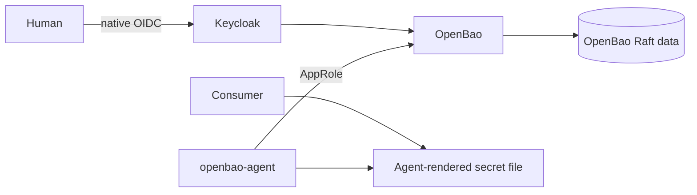

# Security Tier Architecture Description

## Context and Stakeholders

`03-security` owns machine-secret storage and rendering. OpenBao plus
`openbao-agent` is the canonical HOME implementation; Vault and `vault-agent`
were removed in SPEC-0180 S08. Security operators own
seal/unseal custody, policy, authentication methods, snapshots, and migration;
consumer tiers own the least-privilege paths they request.

## System Boundaries

- **OpenBao:** selected by `core`, `dev`, `local`, `security`, or `secrets`;
  single-node integrated Raft storage; AppRole Agent rendering; native Keycloak
  OIDC for humans; Traefik UI route.
- **Storage:** Raft snapshots
  protect stored state; Shamir/unseal or recovery custody protects access to it.
- **Credentials:** root tokens, unseal shares, AppRole RoleID/SecretID, Agent
  tokens, OIDC client secret, and rendered values remain outside Git and evidence.
- **Non-goals:** this architecture does not claim automatic credential generation,
  completed Vault-to-OpenBao data migration, multi-node Raft HA, or deployed
  OpenBao metrics scraping.

## Components

The OpenBao Agent reads AppRole material from mounted secret files, obtains a
renewable token, and writes approved templates to the declared output volume.
Human OIDC group claims map to narrow Bao policies; root remains break-glass.
The initial and temporary recovery roots are revoked only after a working non-root
administrative path, Agent rendering, protected snapshot, and denial tests exist.

## Data Flow

An operator or Agent authenticates to OpenBao, policy limits the requested KV
paths, and the Agent writes only declared templates to the consumer output volume.
Snapshots flow from the authenticated Raft API to protected operator custody;
unseal shares follow a separate custodial path and never enter the snapshot.

## Deployment View

The root Compose project owns shared networks, secrets, and selection. Runtime
commands name `openbao`/`openbao-agent`; leaf-only Compose
execution is not valid root-stack readiness evidence. The preserved Vault data
path stays out of service and must never share storage with OpenBao.

## Quality Attributes

- **Security:** fail closed on auth/seal/CA failure; trust the Keycloak CA; never
  disable TLS validation or expose unauthenticated generate-root on the ordinary
  listener.
- **Reliability:** health, unsealed status, Agent authentication, token renewal,
  render output, and consumer acceptance are separate evidence.
- **Recoverability:** capture authenticated Raft snapshots and rehearse restore on
  isolated new storage with consumers/egress disabled. A snapshot can restore the
  token state present at capture, so recovered root tokens must be rechecked.
- **Scalability:** current single-node Raft is not HA. Cluster expansion requires
  a separate design and failure-domain evidence.

## Traceability

Operational detail lives in [OpenBao operations](../../05.operations/catalog/03-security/0085-openbao/guide.md).

## Related Documents

- [Security requirement](../../01.requirements/0003-security.md)
- [Central secrets manager decision](../decisions/0003-vault-as-secrets-manager.md)
- [Current convergence Spec](../../03.specs/0180-home-dev-convergence/spec.md)

Runtime pins are owned by Compose/Dockerfile declarations; the
[derived Compose image projection](../../../infra/tech-stack.versions.json) supplies drift verification.
