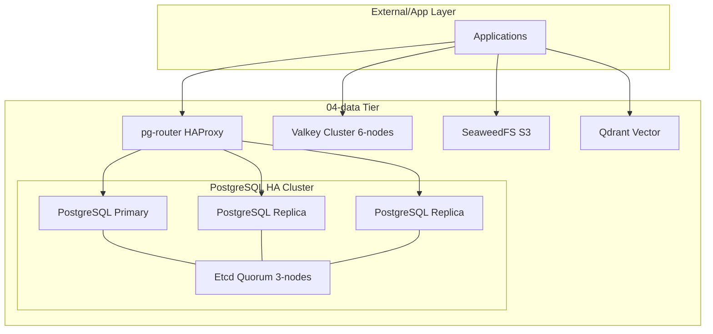

# Data Tier (04-data) Architecture Description

## Context and Stakeholders

This document defines the reference architecture and quality attributes of the `04-data` tier. It is the baseline document that organizes the system boundary, responsibilities, data flow, and operational perspective. This architecture targets a multi-model persistence layer, with high availability (HA) and security isolation as its core design principles.

### Stakeholders and Concerns

Requirement owners, implementers, and operators share the concerns recorded in this section and the following views. Only concerns confirmed in the existing document are covered here.

The `04-data` tier owns all persistent data of the platform and provides infrastructure that meets diverse data requirements: relational, NoSQL, cache, object, and vector.

## System Boundaries

This section preserves the system boundaries, consumption relationships, non-goals, and constraints the current document already records.

- **Owns**: Database instances, storage volumes, backup data, data-only networks (`mng_data_net`, `lab_net`).
- **Consumes**: Docker Secrets, OpenBao secrets, system resources (CPU/RAM/Storage).
- **Does Not Own**: Application business code, user UI, external network exposure (owned by Gateway).
- **Non-goals**: Real-time dashboard visualization (owned by the Observability tier).

## Quality Attributes

### Quality Scenarios

Quality scenarios point to the existing configuration these attributes apply to and the verification expectations tied to the failure boundary. Concrete execution evidence belongs to the related Spec and Operations documents.

- **Performance**: Guarantees millisecond-scale response through the Valkey cluster.
- **Security**: Per-flow network isolation and Docker Secrets-based authentication.
- **Reliability**: Automatic failover based on Patroni/Etcd.
- **Scalability**: A microservice-friendly configuration that eases data sharding and node expansion.
- **Observability**: Real-time status monitoring through the Prometheus Exporter.
- **Operability**: Provides a standardized backup/recovery runbook.

## Components

### Viewpoints and Views

This section uses the context, component, or deployment representation as the view for the relevant concern.

The `04-data` tier is the foundation layer of `hy-home.docker`, supplying data storage to all upper tiers (Auth, AI, App, and others).

## Data Flow

### Data and Control Flows

Data and control flows include only the interactions specified in this section and the existing infrastructure/deployment description.

- **Key Entities / Flows**: Transaction data (SQL), unstructured assets (S3), search index (Vector).
- **Storage Strategy**: Host volume bind mounts (`${DEFAULT_DATA_DIR}`).
- **Data Boundaries**: Each service keeps an independent volume and physical isolation.

## Deployment View

- **Runtime / Platform**: Docker Compose / Linux.
- **Deployment Model**: Multi-node Cluster (HA).
- **Operational Evidence**: `docker ps`, `patronictl list`, `valkey-cli cluster nodes`.

## Traceability

The disposition of the upstream requirement and the related decision/implementation specs are owned by the PRD, ADR, and Spec links in `Related Documents`. This description does not replace the role of those documents.

## Related Documents

- **PRD**: [../../01.requirements/0004-data.md](../../01.requirements/0004-data.md)
- **Spec**: [../../03.specs/004-data/spec.md](0004-data-architecture.md)
- **ADR**: [../decisions/0004-postgresql-ha-patroni.md](../decisions/0004-postgresql-ha-patroni.md)

Runtime pins are owned by Compose/Dockerfile declarations; the [curated version projection](../../../infra/tech-stack.versions.json) supplies drift verification.
