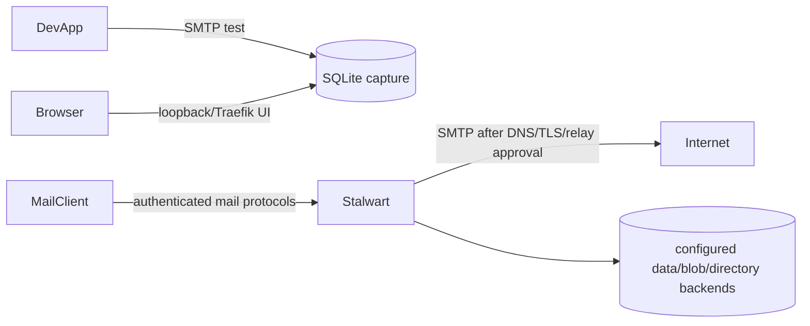

# Communication Tier Architecture Description

## Context and Stakeholders

The communication tier separates development message capture from an optional
real mail server. Mailpit is a DEV SMTP sink/UI selected by `dev`, `local`, or
`mail-dev`. Stalwart is selected only by `mail-server` and requires mail-domain,
DNS, TLS, authentication, relay, abuse, and backup ownership before use.

## System Boundaries

- **Mailpit owns:** test-message capture in persistent SQLite
  `/data/mailpit.db`, loopback-published SMTP/UI ports, and a Traefik UI route.
  It accepts arbitrary SMTP authentication by design and must not be internet
  exposed or described as a delivery MTA.
- **Stalwart owns:** public SMTP/submission/SMTPS/IMAPS/ManageSieve listeners,
  management UI, `${DEFAULT_COMMUNICATION_DIR}/stalwart/data`, and certificate
  mounts. UI ForwardAuth does not secure mail protocols.
- **Unknown from Compose:** the configured Stalwart data/blob/directory backends,
  relay policy, domains, users, DKIM keys, and DNS provider state. Operators must
  inspect the running configuration without exposing values before choosing a
  backend-specific export or snapshot.
- **Non-goals:** Mailpit does not replace Stalwart, and Stalwart is not an
  automatic HOME service.

## Components

Mailpit is the development SMTP/UI component backed by one SQLite database.
Stalwart is the optional mail-protocol and administration component backed by
the operator-selected storage configuration under its persistent mount.

## Data Flow

## Deployment View

The root project includes both leaves. Profile choice determines activation:
`mail-dev`/`dev`/`local` select Mailpit and `mail-server` selects Stalwart. A
currently running optional service may remain running when another profile is
rendered; profile rendering is not a stop operation.

## Quality Attributes

- **Isolation:** applications choose Mailpit explicitly for tests; no captured
  development message may be relayed externally.
- **Security:** Stalwart needs TLS and authenticated protocol evidence plus
  SPF/DKIM/DMARC and relay-denial tests. The current public listeners increase the
  exposure boundary beyond the web UI.
- **Recoverability:** Mailpit recovery preserves SQLite with its WAL or uses the
  official dump/ingest path. Stalwart recovery captures configuration, all active
  storage backends, keys/certificates, and DNS dependencies at one consistency
  point, then restores with outbound delivery disabled.
- **Licensing:** Stalwart upstream offers AGPL-3.0 and enterprise licensing;
  deployment documentation must not assume paid features or entitlement.

## Traceability

- [Mailpit operations](../../05.operations/guides/0084-mailpit.md)
- [Stalwart operations](../../05.operations/guides/0070-mail.md)

## Related Documents

- [Communication requirement](../../01.requirements/0011-communication.md)
- [Communication decision](../decisions/0010-communication-services.md)

Runtime pins are owned by Compose/Dockerfile declarations; the
[derived Compose image projection](../../../infra/tech-stack.versions.json) supplies drift verification.
