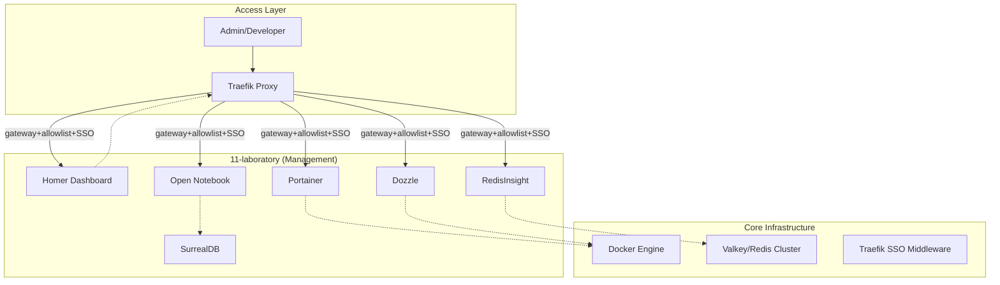

# 11-laboratory Architecture Description

## Context and Stakeholders

이 문서는 `11-laboratory` 계층의 참조 아키텍처와 품질 속성을 정의한다. 시스템의 관리 및 관측을 위한 비침습적(Non-intrusive) 관리 레이어로 설계되었다.

## Stakeholders and Concerns

요구사항 소유자, 구현자와 운영자는 이 절과 후속 뷰에 기록된 관심사를 공유한다. 여기서는 기존 문서에서 확인되는 관심사만 다룬다.

`11-laboratory` owns the unified management interface and diagnostic tools for the infrastructure. It provides a human-centric layer over the automated systems.

## System Boundaries

이 절은 현재 문서가 이미 기록한 시스템 경계, 소비 관계, non-goal과 제약을 보존한다.

- **Owns**: Dashboard (Homer), Container UI (Portainer), Data UI (RedisInsight), Log UI (Dozzle), Open Notebook and local SurrealDB laboratory datastore.
- **Consumes**: Docker Engine API, Redis/Valkey network endpoints, Traefik gateway and SSO middleware.
- **Does Not Own**: Business application UIs, hardware-level hypervisors.
- **Non-goals**: Replacing CLI-based troubleshooting for advanced operators.

## Quality Attributes

### Quality Scenarios

품질 시나리오는 아래 속성이 적용되는 기존 구성, 실패 경계와 연결된 검증 기대를 가리킨다. 구체적인 실행 증거는 관련 Spec과 Operations 문서가 소유한다.

- **Performance**: High (Lightweight container images).
- **Security**: Mandatory SSO (Keycloak) for all web interfaces.
- **Reliability**: No direct impact on core traffic if management tier fails.

## Components

### Viewpoints and Views

이 절의 컨텍스트, 구성 요소 또는 배치 표현을 해당 관심사의 뷰로 사용한다.

## Data Flow

### Data and Control Flows

데이터 및 제어 흐름은 이 절과 기존 인프라·배치 설명에 명시된 상호작용만 포함한다.

`11-laboratory` does not own primary application data. It consumes Docker Engine, Valkey/Redis, and dashboard metadata endpoints for management visibility. The exception is Open Notebook local laboratory state, which is stored under the `open-notebook` service boundary with its SurrealDB dependency and remains outside production workload data ownership.

## Deployment View

- **Runtime / Platform**: Docker Compose.
- **Deployment Model**: root-active includes render Dozzle, RedisInsight, Open Notebook, and SurrealDB through the `admin` profile; Homer Dashboard and Portainer remain optional/commented root includes that are checked by the hardening script until promoted.

## Traceability

상위 요구사항의 disposition과 관련 결정·구현 명세는 `Related Documents`의 PRD, ADR, Spec 링크가 소유한다. 이 설명은 그 문서의 역할을 대체하지 않는다.

## Related Documents

- **PRD**: [../../01.requirements/0012-laboratory.md](../../01.requirements/0012-laboratory.md)
- **Spec**: [../../03.specs/012-laboratory/spec.md](../../03.specs/0012-laboratory/spec.md)
- **ADR**: [../decisions/0011-laboratory-services.md](../decisions/0011-laboratory-services.md)
