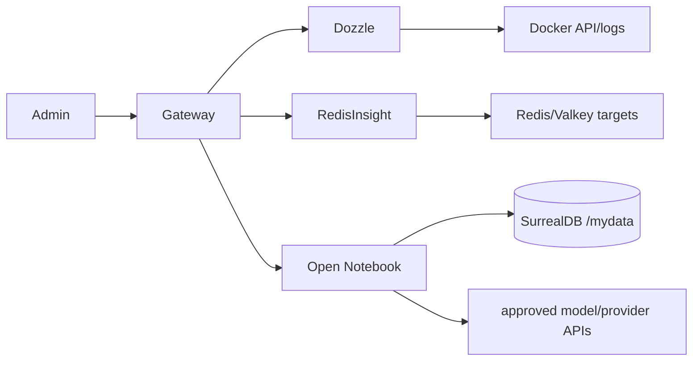

# Administration and Experimentation Architecture Description

## Context and Stakeholders

The former Laboratory capabilities now reside in their owning Data, Observability, AI and Analytics tiers under SPEC-0197. This description preserves their optional operator and knowledge-work obligations. It is
outside HOME and must not affect core traffic when absent. Its broad visibility
into Docker, Redis/Valkey, provider APIs, and notebook content makes it an admin
security boundary rather than a harmless dashboard layer.

## System Boundaries

- **Dozzle:** `admin`/`admin-logs`; reads Docker logs through a read-only socket,
  stores settings under `/data`, and uses both native OIDC configuration and the
  tracked gateway controls. A read-only socket does not restrict Docker API reads.
- **RedisInsight:** `admin`/`admin-data`; stores local connections/settings under
  `/data` and manages external Redis/Valkey targets. Target data remains owned by
  each target service. Current Compose does not declare `RI_ENCRYPTION_KEY`.
- **Open Notebook:** `notebook`; stores local app data under `/app/data`,
  connects to SurrealDB within the same `08-ai/open-notebook` package, and uses password/encryption-key Docker
  Secrets. Provider/API egress is a distinct authorization boundary.
- **SurrealDB:** the nested build in `infra/08-ai/open-notebook/surrealdb`, selected by `notebook` or `surrealdb`, persists Open Notebook records under `/mydata`; its host-port block remains commented out.
- **MLflow:** `08-ai/mlflow` retains tracking and feature-owned DB provisioning under `mlops`/`data-science`; PostgreSQL metadata and SeaweedFS artifacts recover together. The browser uses ForwardAuth, while direct SDK access on all four declared networks lacks equivalent authentication.
- **JupyterLab:** `12-analytics/jupyterlab`, selected by `data-science`, retains its token-file startup guard and UID1000 notebook workspace. Browser SSO does not replace token protection on peer networks.
- **Non-goals:** this tier does not own primary Redis/Valkey backups, copied Docker
  logs, production notebook workloads, or Metabase. No current Metabase service is
  declared in this tier.

## Components

```mermaid
flowchart LR
  Admin --> Gateway
  Gateway --> Dozzle --> DockerAPI[Docker API/logs]
  Gateway --> RedisInsight --> Targets[Redis/Valkey targets]
  Gateway --> Notebook[Open Notebook]
  Notebook --> SurrealDB[(SurrealDB /mydata)]
  Notebook --> Providers[approved model/provider APIs]
```

## Data Flow

Dozzle requests Docker log streams, RedisInsight opens operator-defined target
connections, and Open Notebook sends approved provider requests while persisting
application records in SurrealDB. These flows are independent; selecting one
narrow profile must not grant another tool's target or API access.

## Deployment View

The root project includes five package leaves across four tiers and seven service identities. `admin` selects Dozzle and RedisInsight; `admin-logs`/`admin-data` select each separately. `notebook` selects Open Notebook and nested SurrealDB, `surrealdb` only that DB. `mlops` selects MLflow and its provisioner; `data-science` also selects JupyterLab. Dozzle is a separate Observability leaf, not an entry in the aggregate Compose file. Profiles, host paths and service identities remain unchanged.

## Quality Attributes

- **Security:** preserve gateway/allowlist/authentication controls, protect local
  settings databases, and never expose provider credentials, target passwords,
  logs, notebook content, or encryption keys in evidence.
- **Recoverability:** Dozzle settings can be restored without a production Docker
  socket. RedisInsight local settings and each target database recover separately.
  Open Notebook recovery requires app data, SurrealDB data, and the matching
  encryption key at one recovery point; loss of the key can make provider secrets
  unreadable.
- **Isolation:** restore rehearsals block provider egress, production Docker API,
  and production data targets until sanitized acceptance passes.

## Traceability

- [Dozzle operations](../../05.operations/guides/0072-dozzle.md)
- [Open Notebook operations](../../05.operations/guides/0073-open-notebook.md)
- [RedisInsight operations](../../05.operations/guides/0076-redisinsight.md)

## Related Documents

- [Laboratory requirement](../../01.requirements/0012-laboratory.md)
- [Laboratory decision](../decisions/0011-laboratory-services.md)

Runtime pins are owned by Compose/Dockerfile declarations; the
[derived Compose image projection](../../../infra/tech-stack.versions.json) supplies drift verification.
