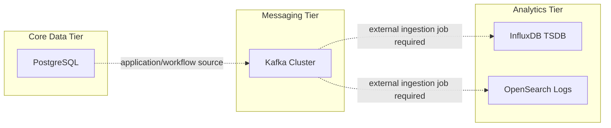

# Analytics Tier Architecture Description

> This document defines the structural boundaries, quality attributes, and infrastructure strategy for the specialized analytics data engines within the `04-data/analytics` sub-tier.

---

## Context and Stakeholders

This document defines the technical skeleton and system architecture of the `04-data/analytics` sub-tier. It details the deployment strategy, data flow, and platform integration approach of the analytics-only hyperscale engines (InfluxDB, OpenSearch) that are separated from the core data tier. Stream processing (Flink) and OLAP warehousing (Trino) are owned by `04-data/lakehouse` and fall outside the scope of this description.

### Stakeholders and Concerns

Requirement owners, implementers, and operators share the concerns recorded in this section and the following views. Only concerns confirmed in the existing document are covered here.

- **Identifier**: `Architecture Description-0012`
- **Domain**: Data Architecture (Analytics)
- **Primary Tech Stack**: InfluxDB 3 Core, OpenSearch 3.x.
- **Connectivity**: private isolated Compose networks.

## System Boundaries

This section preserves the system boundaries, consumption relationships, non-goals, and constraints the current document already records.

### Owns (Responsibilities)

- **Time-series Persistence**: High-density storage of edge device and sensor data.
- **Distributed Searching**: Distributed log/document indexing and search.

### Consumes (Dependencies)

- **Core Data**: Change data (CDC) from core storage such as PostgreSQL/Redis.
- **Infrastructure**: Docker Compose orchestration and NVMe-based persistent storage.

## Quality Attributes

### Quality Scenarios

Quality scenarios point to the existing configuration these attributes apply to and the verification expectations tied to the failure boundary. Concrete execution evidence belongs to the related Spec and Operations documents.

- **Performance**: Query latency must stay consistent even under heavy write volume (leveraging LSM-tree-based engines).
- **Scalability**: Guarantees the ability to scale OpenSearch nodes according to data volume and query load.
- **Observability**: Prioritizes the healthcheck, service logs, Traefik route, and linked operations runbook evidence that the current compose declares. A `/metrics` endpoint is treated as current implementation evidence only when declared in the per-service compose.
- **Reliability**: Guarantees complete isolation so that a failure in the analytics system does not affect the service availability of the core data tier (SQL).

## Components

### Viewpoints and Views

This section uses the context, component, or deployment representation as the view for the relevant concern.

The current tracked compose provides analytics engines and endpoints. Kafka-to-engine ingestion and dashboard datasets are application or workflow concerns and are not wired as automatic data pipelines in the analytics compose files.

### Infrastructure Strategy

- **Networking**: Every service uses its declared network, but the host exposure method follows each service's Compose declaration. OpenSearch and the OpenSearch Dashboards HTTP path use Traefik. Node1 of the OpenSearch cluster publishes the Performance Analyzer `${ES_PERFORMANCE_ANALYZER_HOST_PORT:-9600}:${ES_PERFORMANCE_ANALYZER_PORT:-9600}` port to the host. These ports are not treated as Gateway-only exposure.
- **Storage Bindings**:
  - InfluxDB, OpenSearch, and OpenSearch Dashboards use bind-backed named volumes.
  - The device paths in the current compose are the `${DEFAULT_DATA_DIR}/influxdb` and `${DEFAULT_DATA_DIR}/opensearch` series.
  - Using high-performance disks (NVMe) is a recommendation, and completion evidence for performance figures needs separate benchmark evidence.
- **Config Management**: Docker Secrets and environment variables are used where declared by each compose file.

### AI Agent Architecture

- **Metadata Access**: The AI agent has read access to analytics schema information and metadata.
- **Query Optimization**: The agent can detect inefficient analytics query patterns and suggest optimizations such as OpenSearch indexing.

#### Additional Boundaries and Constraints

- **Owns**: The architecture scope already described in this document.
- **Consumes**: Upstream requirements and downstream specs listed in Related Documents.
- **Does Not Own**: Secret values, runtime changes, or execution evidence outside this Architecture Description.
- **Non-goals**: Semantic rewriting of the historical architecture record.

## Data Flow

### Data and Control Flows

Data and control flows include only the interactions specified in this section and the existing infrastructure/deployment description.

- **Ingestion**: The current compose provides ingestion endpoints and dependencies. Kafka CDC, OpenSearch indexing, and InfluxDB writes require separate producer/workflow evidence.
- **Storage Strategy**:
  - InfluxDB: 3 Core data/plugin volumes with database and HTTP line-protocol endpoint/schema contracts on port `8181`; token provisioning and authenticated access remain runtime-unverified.
  - OpenSearch: Distributed storage of Lucene indexes.
- **Consistency**: Adopts the eventual consistency model by default to maximize throughput.

## Deployment View

The existing infrastructure strategy section defines the deployment boundary for this existing Architecture Description. Runtime procedures and recovery steps remain in the linked operations documents.

## Traceability

The disposition of the upstream requirement and the related decision/implementation specs are owned by the PRD, ADR, and Spec links in `Related Documents`. This description does not replace the role of those documents.

## Related Documents

- **PRD**: [005-data-analytics.md](../../01.requirements/0005-data-analytics.md)
- **ADR**: [0039-analytics-engines-after-lakehouse-convergence.md](../decisions/0039-analytics-engines-after-lakehouse-convergence.md) (supersedes ADR-0015)
- **Specs**: [spec.md](0012-data-analytics-architecture.md)
- **Guides**: [README.md](../../05.operations/guides/README.md)

Runtime pins are owned by Compose/Dockerfile declarations; the [derived Compose image projection](../../../infra/tech-stack.versions.json) supplies drift verification.
