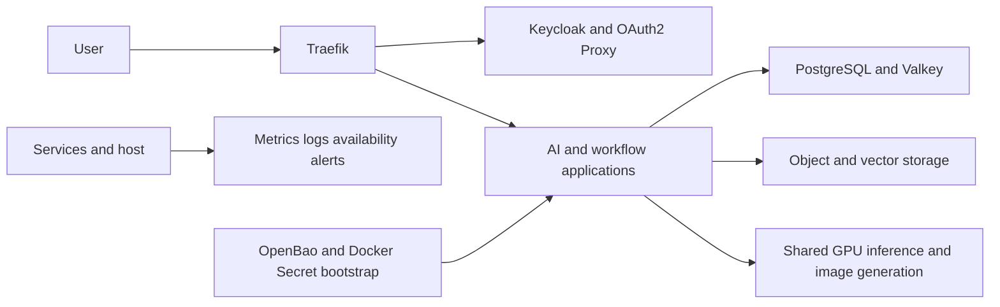

# Home and Development Host Architecture

## Context and Stakeholders

한 대의 Linux 서버를 HOME 서비스와 개발 실험이 공유한다. 사용자는 AI와
워크플로우도 HOME 상시 기능으로 지정했다. 목표는 운영자 한 명이 상태와
복구 경로를 설명할 수 있는 범위에서 서비스를 유지하는 것이다. 실제 소비자가
확인되지 않은 선택 기능은 상시 기동 비용을 HOME에 전가하지 않는다.

## System Boundaries

루트 Compose가 include를, 서비스 profile이 활성화를 소유한다. 어휘의 정규
소유자는 [POL-0078](../../05.operations/catalog/00-workspace/0078-compose-profile-vocabulary/policy.md)이다.
운영 데이터를 가진 현재 호스트와 실험용 별도 Compose project를 구분한다.
프로파일은 보안 격리 경계가 아니며 같은 Docker daemon 장애를 공유한다.
공유 Compose network와 k3d network 연결은 기존 구현의 신뢰 경계로, 이 설계가
완전한 네트워크 격리를 입증하지 않는다.

## Components

| Class | Retained capability | Activation and limitation |
| --- | --- | --- |
| HOME | Traefik, Keycloak, OAuth2 Proxy, OpenBao | `core`; OpenBao bootstrap readiness required |
| HOME | Management PostgreSQL/Valkey and exporters | `mng`; application databases and queue state |
| HOME | Ollama, Open WebUI, ComfyUI, Qdrant | `ai`; shared GPU concurrency is bounded |
| HOME | Airflow and n8n, workers and runners | `workflow`; initialization and daemon readiness differ |
| HOME | Single-node object storage | `storage`; no single-host HA claim |
| HOME | Metrics, host signals, availability, logs, alerts | narrow observability profiles from POL-0078 |
| DEV | Mail capture and explicit update/IaC jobs | jobs run only for a named operation |
| OPTIONAL | Additional application databases, analytics and tracing | enable only for a known consumer |
| LAB | Multi-node database, broker and storage variants | rehearsal topology, not physical fault isolation |
| MIGRATE | superseded tooling awaiting acceptance | preserve data and references until migration acceptance |

## Data Flow

OpenBao rendered outputs and Docker Secret consumers are distinct existing paths;
a migration must verify consumer mounts and permissions before claiming automatic
rotation or complete secret delivery. No secret values belong in diagrams or evidence.

## Deployment View

The source-controlled selection is validated before deployment. `core mng ai
workflow storage obs-core obs-host availability logs alerting` describes the
current HOME candidate; it is not a new competing profile vocabulary or approval.
Use exact services for approved incremental deployment. Exclude cluster variants,
legacy selectors and update/IaC jobs from unattended startup.

Runtime pins come from Compose and Dockerfile declarations. The version registry
is a derived Compose image projection; source inventory separately inspects
Dockerfile build sources. Documents route to the applicable source or projection
instead of repeating patch pins without context.
Renovate owns enabled infrastructure managers and Dependabot owns Storybook npm.

## Quality Attributes

- Availability: initialization completion, daemon health and application readiness
  are separate evidence. Unseal and authenticated functional checks are explicit.
- Capacity: retain HOME application availability while limiting simultaneous GPU
  jobs. Container memory caps do not prove workload fit or prevent host contention.
- Recoverability: keep protected backups and prove restoration on isolated data;
  Git configuration rollback cannot undo database migrations.
- Maintainability: README routes to implementation; Guide, Policy and Runbook
  have separate ownership, with current commands in Runbooks.
- Security: prefer authenticated gateway ingress and loopback diagnostic ports;
  document remaining host publications and shared network grants as residual risk.

## Traceability

- [REQ-0027](../../01.requirements/0027-home-development-host.md)
- [SPEC-0180](../../03.specs/0180-home-dev-convergence/spec.md)
- [Service disposition research](../../90.references/research/0002-agentic-engineering-research-pack/m0021-local-docker-service-consolidation.md)
- [Infrastructure implementation](../../../infra/README.md)

## Risks

Single-host power, storage, Docker daemon and GPU failure affect multiple HOME
capabilities. Existing shared networks and host-level capabilities limit isolation.
Current backup/restore, OpenBao bootstrap and resource acceptance are not yet
proven by this redesign. Keep these as deployment prerequisites, not PASS claims.

## Evolution

Measure actual application usage and restore evidence before removing persistent
services or changing storage engines. Promote only validated optional capabilities;
retire migrations through existing archive and identity contracts, never by
rewriting history or deleting unverified data.

Runtime pins are owned by Compose/Dockerfile declarations; the [derived Compose image projection](../../../infra/tech-stack.versions.json) supplies image drift verification.
