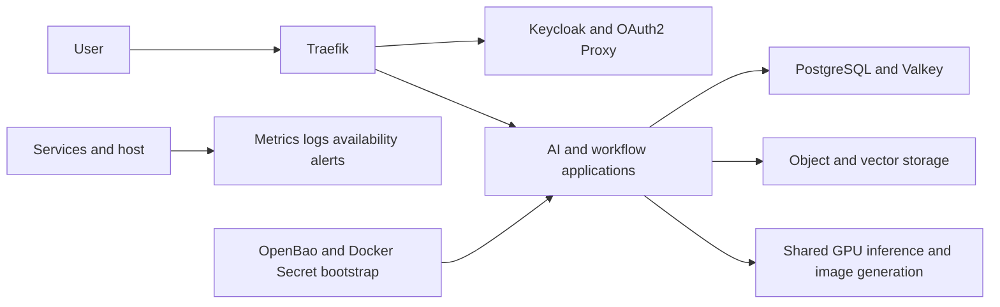

# Home and Development Host Architecture

## Context and Stakeholders

One Linux server shares HOME service and development experiments. The user
also designated AI and workflow as always-on HOME capabilities. The goal is
to keep the service within the scope where one operator can explain state
and the recovery path. An optional capability with no confirmed real
consumer does not push its always-on startup cost onto HOME.

## System Boundaries

The root Compose owns include, and the service profile owns activation. The
canonical owner of the vocabulary is
[POL-0078](../../05.operations/policies/0078-compose-profile-vocabulary.md).
Distinguish the current host, which holds operational data, from a separate
Compose project for experiments. Profiles are not a security isolation
boundary and share the same Docker daemon failure. The shared Compose network
is an existing implementation's trust boundary, and this design does not
prove complete network isolation.

Storage and Redis administration packages are flat under `04-data`; processing, data quality, BI, dbt and JupyterLab are under `12-analytics`. Software verification and development mail capture belong to `11-quality`; platform tools remain in `09-platform-ops`. Dozzle belongs to Observability; Open Notebook/SurrealDB and MLflow belong to AI. This is source organization only and does
not change HOME selection or the root Compose project (ADR-0045).

## Components

| Class | Retained capability | Activation and limitation |
| --- | --- | --- |
| HOME | Traefik, Keycloak, OAuth2 Proxy, OpenBao | `core`; OpenBao bootstrap readiness required |
| HOME | Management PostgreSQL/Valkey and exporters | `mng`; service metadata, sessions and management queues |
| HOME | Ollama, Open WebUI, ComfyUI, Qdrant | `ai`; shared GPU concurrency is bounded |
| HOME | Airflow and n8n, workers and runners | `workflow`; initialization and daemon readiness differ |
| HOME | Single-node object storage | `storage`; no single-host HA claim |
| HOME | Metrics, host/GPU signals, availability, logs, alerts, tracing and profiling | narrow observability profiles from POL-0078 |
| DEV | Single TimescaleDB Community PostgreSQL and Valkey | `dev-data`; project database/roles and ACL prefixes are separately approved |
| DEV | Mail capture and explicit update/IaC jobs | jobs run only for a named operation |
| OPTIONAL | Additional application databases and analytics | enable only for a known consumer |
| LAB | Multi-node database, broker and storage variants | rehearsal topology, not physical fault isolation |
| MIGRATE | superseded tooling awaiting acceptance | preserve data and references until migration acceptance |

Traefik remains the shared gateway. Development time-series workloads use
TimescaleDB Community on the single development PostgreSQL; its TSL terms
are distinct from PostgreSQL licensing. Management PostgreSQL does not gain
Timescale without an existing consumer requirement. Projects use explicit
database/role and Valkey ACL contracts rather than expanding legacy `app_db`.
Shared Prometheus, Grafana, SeaweedFS and Qdrant remain the common services;
k6 supplies load tests, WireMock HTTP mocks, and Locust optional isolated LABs.

External Project-Template-derived workspaces own business API/UI, migrations,
adapters, workflows, fixtures, E2E and application Compose. Infrastructure
owns engines, shared ingress/identity, observability, backup and bounded
resource registration. Root Compose never includes external application source.
The [registration contract](../../../infra/09-platform-ops/project-registration/README.md)
and [development database policy](../../05.operations/policies/0100-development-database.md)
own the current interfaces; metadata approval does not deploy or issue secrets.
The independent 07/08 product-planning tracks grant no runtime resource authority.

## Data Flow

```mermaid
flowchart LR
  User --> Gateway[Traefik]
  Gateway --> Identity[Keycloak and OAuth2 Proxy]
  Gateway --> Apps[AI and workflow applications]
  Apps --> State[PostgreSQL and Valkey]
  Apps --> Objects[Object and vector storage]
  Apps --> GPU[Shared GPU inference and image generation]
  Services[Services and host] --> Observe[Metrics logs availability alerts]
  Secrets[OpenBao and Docker Secret bootstrap] --> Apps
```

OpenBao rendered outputs and Docker Secret consumers are distinct existing paths;
a migration must verify consumer mounts and permissions before claiming automatic
rotation or complete secret delivery. No secret values belong in diagrams or evidence.

## Deployment View

The source-controlled selection is validated before deployment. `core mng ai
workflow storage obs-core obs-host availability logs alerting tracing profiling
obs-gpu registry` describes the
current HOME candidate; it is not a new competing profile vocabulary or approval.
Use exact services for approved incremental deployment. Exclude cluster variants,
legacy selectors and update/IaC jobs from unattended startup.

Runtime pins come from Compose and Dockerfile declarations. The version registry
is a derived Compose image projection; source inventory separately inspects
Dockerfile build sources. Documents route to the applicable source or projection
instead of repeating patch pins without context.
Renovate owns enabled infrastructure managers and Dependabot owns Storybook npm.

## Quality Attributes

- Availability: initialization completion, daemon health and application readiness
  are separate evidence. Unseal and authenticated functional checks are explicit.
- Capacity: retain HOME application availability while limiting simultaneous GPU
  jobs. Container memory caps do not prove workload fit or prevent host contention.
- Recoverability: keep protected backups and prove restoration on isolated data;
  Git configuration rollback cannot undo database migrations.
- Maintainability: README routes to implementation; Guide, Policy and Runbook
  have separate ownership, with current commands in Runbooks.
- Security: prefer authenticated gateway ingress and loopback diagnostic ports;
  document remaining host publications and shared network grants as residual risk.

## Traceability

- [REQ-0027](../../01.requirements/0027-home-development-host.md)
- [SPEC-0180](../../98.archive/completed/03.specs/0180-home-dev-convergence/spec.md)
- [Service disposition research](../../90.references/research/0002-agentic-engineering-research-pack/m0021-local-docker-service-consolidation.md)
- [Infrastructure implementation](../../../infra/README.md)

## Risks

Single-host power, storage, Docker daemon and GPU failure affect multiple HOME
capabilities. Existing shared networks and host-level capabilities limit isolation.
Current backup/restore, OpenBao bootstrap and resource acceptance are not yet
proven by this redesign. Keep these as deployment prerequisites, not PASS claims.

## Evolution

Measure actual application usage and restore evidence before removing persistent
services or changing storage engines. Promote only validated optional capabilities;
retire migrations through existing archive and identity contracts, never by
rewriting history or deleting unverified data.

Runtime pins are owned by Compose/Dockerfile declarations; the [derived Compose image projection](../../../infra/tech-stack.versions.json) supplies image drift verification.
