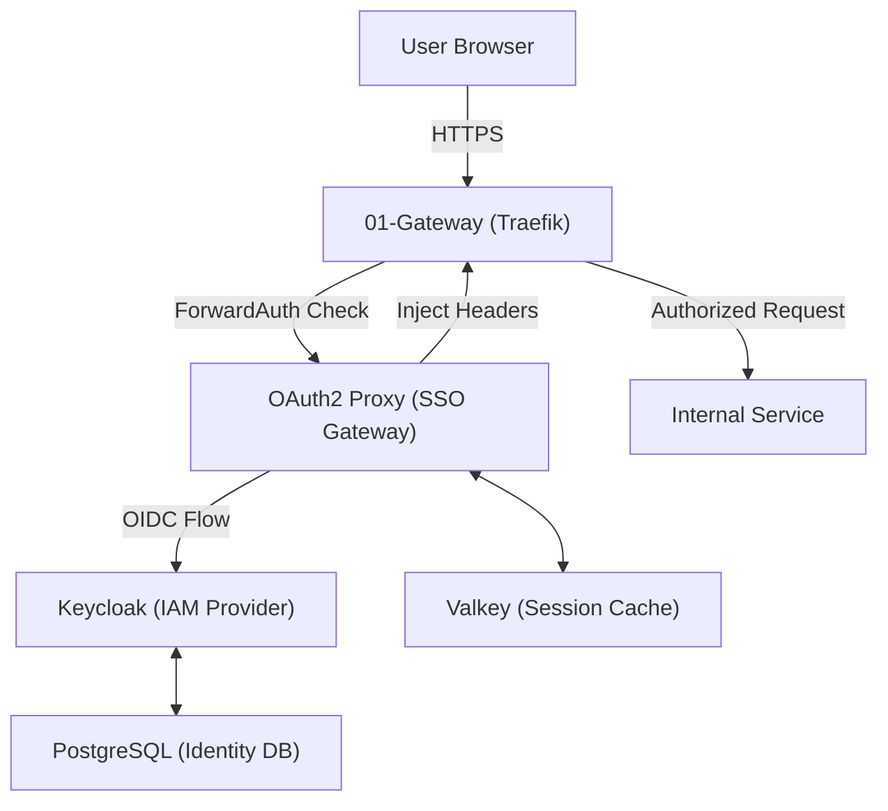

<!-- Target: docs/02.architecture/requirements/0002-auth-architecture.md -->

# 02-Auth Architecture Reference Document (ARD)

> This document defines the technical architecture for Identity and Access Management (IAM) and Authentication ForwardAuth Gateway.

---

## Overview

`02-auth` 아키텍처는 사용자 식별 및 액세스 제어를 위한 두 가지 핵심 계층으로 구성된다. 중앙 IAM 역할을 수행하는 `Keycloak`과 트래픽 가로채기를 통해 SSO를 강제하는 `OAuth2 Proxy`가 긴밀하게 연동된다. 이 구조는 `Traefik`의 ForwardAuth 메커니즘을 활용하여 모든 백엔드 서비스에 대한 통일된 인증 게이트웨이를 제공한다.

## Status

- **Proposed**: 2026-03-26
- **Status**: Active (Standardized)
- **Stakeholders**: AI Platform Team, DevOps Team, Security Team

## Principles

- **Zero-Trust Enforcement**: All requests must be explicitly authenticated.
- **Protocol Standardization**: Use OIDC (OpenID Connect) for all internal integrations.
- **Stateless Verification**: Leverage JWT (JSON Web Tokens) where applicable, backed by server-side sessions.
- **High Availability**: Identity data and sessions must be resilient to container failures.

## Context

The auth system sits between the `01-gateway` and other internal services. It validates user presence before traffic enters any protected container.

### System Architecture Diagram (Mermaid)

## Decisions

- **IAM Engine**: Keycloak (Quarkus distribution) for robust OIDC/SAML support.
- **SSO Gateway**: OAuth2 Proxy for standardized ForwardAuth implementation.
- **Session Manager**: Valkey as a high-performance Redis-compatible session store.
- **Storage**: PostgreSQL for identity persistence (Realms, Users, Clients).

## Data Models

Refer to `docs/03.specs/02-auth/spec.md` for detailed OIDC claims and realm structures.

## AI Agent Integration

Agents access services using Service Account tokens issued by Keycloak. All agent-initiated actions must include the `X-Auth-Request-User` header for auditing.

## Summary

This section was added for template alignment. Existing architecture content in this historical ARD remains the source of truth; no runtime behavior is changed.

## Boundaries & Non-goals

- **Owns**: The architecture scope already described in this document.
- **Consumes**: Upstream requirements and downstream specs listed in Related Documents.
- **Does Not Own**: Secret values, runtime changes, or execution evidence outside this ARD.
- **Non-goals**: Semantic rewriting of the historical architecture record.

## Quality Attributes

- **Performance**: Use the existing service-specific constraints in this document.
- **Security**: Preserve the security boundaries already described in this document.
- **Reliability**: Preserve the availability and failure-mode notes already described in this document.
- **Scalability**: Use existing capacity and deployment notes where present.
- **Observability**: Use downstream operations and spec documents for runtime evidence.
- **Operability**: Use downstream operations documents for procedures.

## System Overview & Context

The existing architecture diagram, component, constraint, or reliability sections in this document provide the system context. This alignment section does not introduce new architecture facts.

## Related Documents

- **PRD**: [Auth product requirements](../../01.requirements/002-auth.md)
- **Spec**: [Auth technical specification](../../03.specs/02-auth/spec.md)
- **ADR**: [Keycloak and OAuth2 Proxy choice](../decisions/0002-keycloak-oauth2-proxy-choice.md)
