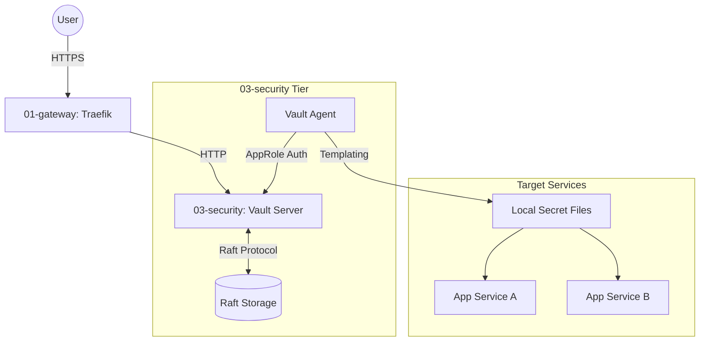

<!-- Target: docs/02.architecture/requirements/0003-security-architecture.md -->

# Security Tier Architecture Reference Document (ARD)

## Overview

`03-security` 티어는 HashiCorp Vault를 기반으로 하는 비밀 정보 관리 시스템이다. 현재 구현은 단일 노드 Raft 통합 스토리지를 사용하며, 애플리케이션 서비스에 비밀 정보를 안전하게 주입하기 위해 Vault Agent 서비스 패턴을 채택한다. 외부 접근은 Traefik Gateway를 통해 HTTPS로 보호된다.

## Constraints

- **Storage**: Raft 통합 스토리지를 사용하여 외부 데이터베이스 의존성 제거.
- **Network**: `infra_net` 내부망을 통해 상호 통신하며, 외부 노출은 Traefik을 통해서만 허용.
- **Auth**: AppRole 인증 방식을 사용하여 서비스 컨테이너의 Vault 접근 권한 자동화.

## Architecture Diagram

### Container Diagram (Mermaid)

## Component Architecture

### 1. Vault Server

- **Role**: 비밀 정보 저장, 암호화, 정책 엔진, 감사 로그 제공.
- **Storage**: Raft (`/vault/data`).
- **Ingress**: `vault.${DEFAULT_URL}`를 통해 UI 및 API 제공.

### 2. Vault Agent

- **Role**: 인증 관리, 토큰 갱신, 템플릿 기반 비밀 정보 주입.
- **Pattern**: Sidecar/Dedicated agent service.
- **Auth Method**: `approle` (RoleID/SecretID 기반).

### 3. Templating System

- **Process**: Vault Agent가 Consul Template 구문을 사용하여 Vault의 시크릿을 로컬 파일로 렌더링.
- **Targets**: PostgreSQL Password, Keycloak Credentials, Grafana Secrets 등.

## Reliability & Scalability

- **Availability**: 현재는 단일 노드 Raft 운영 상태이며, Raft cluster 확장은 별도 전환 절차로 준비.
- **Fault Tolerance**: Vault Agent의 캐싱 기능을 통해 서버 일시 장애 시 조회 가용성 확보.

## Alternative Scopes

- **Direct API Call**: SDK를 통한 직접 조회가 가능하나, 코드 수정 최소화를 위해 템플릿 방식 우선.
- **OIDC Auth**: 관리자 접속을 위해 Keycloak OIDC 연동 가능 (향후 고도화).

## Summary

This section was added for template alignment. Existing architecture content in this historical ARD remains the source of truth; no runtime behavior is changed.

## Boundaries & Non-goals

- **Owns**: The architecture scope already described in this document.
- **Consumes**: Upstream requirements and downstream specs listed in Related Documents.
- **Does Not Own**: Secret values, runtime changes, or execution evidence outside this ARD.
- **Non-goals**: Semantic rewriting of the historical architecture record.

## Quality Attributes

- **Performance**: Use the existing service-specific constraints in this document.
- **Security**: Preserve the security boundaries already described in this document.
- **Reliability**: Preserve the availability and failure-mode notes already described in this document.
- **Scalability**: Use existing capacity and deployment notes where present.
- **Observability**: Use downstream operations and spec documents for runtime evidence.
- **Operability**: Use downstream operations documents for procedures.

## System Overview & Context

The existing architecture diagram, component, constraint, or reliability sections in this document provide the system context. This alignment section does not introduce new architecture facts.

## Data Architecture

The existing storage, secret templating, and Vault Agent sections in this document describe data handling boundaries for this historical ARD. This alignment section does not introduce new data architecture facts.

## Infrastructure & Deployment

The existing constraints, component architecture, and reliability sections describe the Vault runtime and deployment boundaries for this historical ARD. Operational procedures remain in the linked operations documents.

## Related Documents

- [Security PRD](../../01.requirements/003-security.md)
- [Vault ADR](../decisions/0003-vault-as-secrets-manager.md)
- [Security spec](../../03.specs/003-security/spec.md)
- [Security standardization plan](../../04.execution/plans/2026-03-26-03-security-standardization.md)
