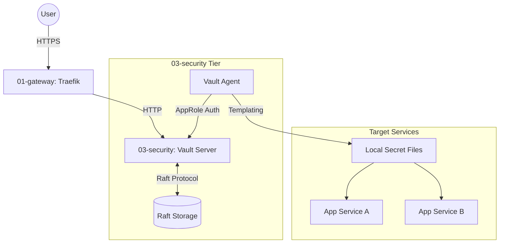

# ARD: Security Tier Architecture (03-security)

## Overview (KR)

`03-security` 티어는 HashiCorp Vault를 기반으로 하는 고가용성 비밀 정보 관리 시스템이다. Raft 합의 알고리즘을 통한 자체 스토리지 구성을 사용하며, 애플리케이션 서비스에 비밀 정보를 안전하게 주입하기 위해 Vault Agent 사이드카 패턴을 채택한다. 외부 접근은 Traefik Gateway를 통해 HTTPS로 보호된다.

## Constraints

- **Storage**: Raft 통합 스토리지를 사용하여 외부 데이터베이스 의존성 제거.
- **Network**: `infra_net` 내부망을 통해 상호 통신하며, 외부 노출은 Traefik을 통해서만 허용.
- **Auth**: AppRole 인증 방식을 사용하여 서비스 컨테이너의 Vault 접근 권한 자동화.

## Architecture Diagram

### Container Diagram (Mermaid)

## Component Architecture

### 1. Vault Server

- **Role**: 비밀 정보 저장, 암호화, 정책 엔진, 감사 로그 제공.
- **Storage**: Raft (`/vault/data`).
- **Ingress**: `vault.${DEFAULT_URL}`를 통해 UI 및 API 제공.

### 2. Vault Agent

- **Role**: 인증 관리, 토큰 갱신, 템플릿 기반 비밀 정보 주입.
- **Pattern**: Sidecar/Dedicated agent service.
- **Auth Method**: `approle` (RoleID/SecretID 기반).

### 3. Templating System

- **Process**: Vault Agent가 Consul Template 구문을 사용하여 Vault의 시크릿을 로컬 파일로 렌더링.
- **Targets**: PostgreSQL Password, Keycloak Credentials, Grafana Secrets 등.

## Reliability & Scalability

- **High Availability**: Raft Cluster 구성을 통해 단일 노드 장애 시에도 서비스 가용성 유지.
- **Fault Tolerance**: Vault Agent의 캐싱 기능을 통해 서버 일시 장애 시 조회 가용성 확보.

## Alternative Scopes

- **Direct API Call**: SDK를 통한 직접 조회가 가능하나, 코드 수정 최소화를 위해 템플릿 방식 우선.
- **OIDC Auth**: 관리자 접속을 위해 Keycloak OIDC 연동 가능 (향후 고도화).
