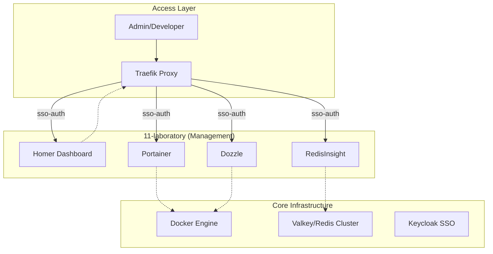

<!-- Target: docs/02.architecture/requirements/0011-laboratory-architecture.md -->

# 11-laboratory Architecture Reference Document (ARD)

## Overview (KR)

이 문서는 `11-laboratory` 계층의 참조 아키텍처와 품질 속성을 정의한다. 시스템의 관리 및 관측을 위한 비침습적(Non-intrusive) 관리 레이어로 설계되었다.

## Summary

`11-laboratory` owns the unified management interface and diagnostic tools for the infrastructure. It provides a human-centric layer over the automated systems.

## Boundaries & Non-goals

- **Owns**: Dashboard (Homer), Container UI (Portainer), Data UI (RedisInsight), Log UI (Dozzle).
- **Consumes**: Docker Engine API, Redis/Valkey network endpoints, Keycloak SSO.
- **Does Not Own**: Business application UIs, hardware-level hypervisors.
- **Non-goals**: Replacing CLI-based troubleshooting for advanced operators.

## Quality Attributes

- **Performance**: High (Lightweight container images).
- **Security**: Mandatory SSO (Keycloak) for all web interfaces.
- **Reliability**: No direct impact on core traffic if management tier fails.

## System Overview & Context

## Data Architecture

`11-laboratory` does not own primary application data. It consumes Docker Engine, Valkey/Redis, and dashboard metadata endpoints for management visibility, while persistence remains owned by the underlying service tiers.

## Infrastructure & Deployment

- **Runtime / Platform**: Docker Compose.
- **Deployment Model**: Multi-container stack in `infra/11-laboratory`.

## Related Documents

- **PRD**: [../../01.requirements/2026-03-26-11-laboratory.md](../../01.requirements/2026-03-26-11-laboratory.md)
- **Spec**: [../../03.specs/11-laboratory/spec.md](../../03.specs/11-laboratory/spec.md)
- **Plan**: [../../04.execution/plans/2026-03-26-11-laboratory-standardization.md](../../04.execution/plans/2026-03-26-11-laboratory-standardization.md)
- **ADR**: [../decisions/0011-laboratory-services.md](../decisions/0011-laboratory-services.md)
