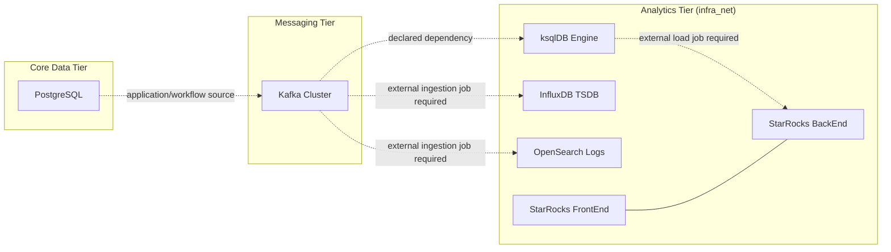

<!-- Target: docs/02.architecture/requirements/0012-data-analytics-architecture.md -->

# Analytics Tier Architecture Reference Document (ARD)

> This document defines the structural boundaries, quality attributes, and infrastructure strategy for the specialized analytics data engines within the `04-data/analytics` sub-tier.

---

## Analytics Tier Architecture Reference Document (ARD)

## Overview

본 문서는 `04-data/analytics` 서브 티어의 기술적 뼈대와 시스템 아키텍처를 정의한다. 핵심 데이터 티어로부터 분리된 분석 전용 하이퍼스케일 엔진들(InfluxDB, ksqlDB, OpenSearch, StarRocks)의 배치 전략, 데이터 흐름, 그리고 플랫폼 통합 방식을 상세히 기술한다.

## Summary

- **Identifier**: `ARD-0012`
- **Domain**: Data Architecture (Analytics)
- **Primary Tech Stack**: InfluxDB 3 Core, Confluent ksqlDB 8.x, OpenSearch 3.x, StarRocks 4.x.
- **Connectivity**: Private isolated `infra_net`.

## Boundaries

### Owns (Responsibilities)

- **Time-series Persistence**: 엣지 디바이스 및 센서 데이터의 고밀도 저장.
- **Stream Processing**: 실시간 데이터 변환 및 윈도잉 연산.
- **Distributed Searching**: 분산 환경에서의 로그/도큐먼트 인덱싱 및 검색.
- **OLAP Warehousing**: 대규모 정형 데이터의 분석용 실시간 집계.

### Consumes (Dependencies)

- **Core Data**: PostgreSQL/Redis 등 핵심 스토리지의 변경 데이터(CDC).
- **Messaging Layer**: ksqlDB/StarRocks로 인입되는 Kafka 토픽 데이터.
- **Infrastructure**: Docker Compose 오케스트레이션 및 NVMe 기반 영구 스토리지.

## Quality Attributes

- **Performance**: 대량 기록 시에도 조회 지연이 일정하게 유지되어야 함 (LSM 트리 기반 엔진 활용).
- **Scalability**: 데이터량 및 쿼리 부하에 따라 별도의 FE/BE 노드 확장 가능성 보장 (StarRocks 등).
- **Observability**: 현재 compose가 선언한 healthcheck, service logs, Traefik route, and linked operations runbook evidence를 우선 사용한다. `/metrics` endpoint는 서비스별 compose에 선언된 경우에만 current implementation evidence로 취급한다.
- **Reliability**: 분석 시스템의 장애가 핵심 데이터 티어(SQL)의 서비스 가용성에 영향을 주지 않는 완전 격리 보장.

## System Overview & Context

현재 tracked compose는 analytics engines and endpoints를 제공한다. Kafka-to-engine ingestion, CDC fan-out, dashboard datasets, and StarRocks load workflows are application or workflow concerns and are not wired as automatic data pipelines in the analytics compose files.

## Data Architecture

- **Ingestion**: 현재 compose는 ingestion endpoints and dependencies를 제공한다. Kafka CDC, OpenSearch indexing, InfluxDB writes, and StarRocks load jobs require separate producer/workflow evidence.
- **Storage Strategy**:
  - InfluxDB: 3 Core data/plugin volumes with database and HTTP line-protocol endpoint/schema contracts on port `8181`; token provisioning and authenticated access remain runtime-unverified.
  - OpenSearch: 루씬(Lucene) 인덱스 분산 저장.
  - StarRocks: MPP(Massively Parallel Processing) 아키텍처의 컬럼형 스토리지.
- **Consistency**: 최종 일관성(Eventual Consistency) 모델을 기본으로 채택하여 처리량 극대화.

## Infrastructure Strategy

- **Networking**: `infra_net` 내부 통신만 허용하며, 외부 접근은 Gateway Tier의 Reverse Proxy를 통해서만 가능.
- **Storage Bindings**:
  - InfluxDB, ksqlDB, OpenSearch, OpenSearch Dashboards, StarRocks FE/BE는 bind-backed named volume을 사용한다.
  - 현재 compose의 device paths는 `${DEFAULT_DATA_DIR}/influxdb`, `${DEFAULT_DATA_DIR}/ksql`, `${DEFAULT_DATA_DIR}/opensearch`, `${DEFAULT_DATA_DIR}/starrocks` 계열이다.
  - 고성능 디스크(NVMe) 활용은 권장 사항이며, 성능 수치의 완료 증거는 별도 benchmark evidence가 필요하다.
- **Config Management**: Docker Secrets and environment variables are used where declared by each compose file. ksqlDB and StarRocks do not currently declare Docker Secrets.

## Infrastructure & Deployment

The existing infrastructure strategy section defines the deployment boundary for this historical ARD. Runtime procedures and recovery steps remain in the linked operations documents.

## AI Requirements

- **Metadata Access**: AI 에이전트는 분석용 스키마 정보와 메타데이터에 대한 읽기 권한을 가짐.
- **Query Optimization**: 에이전트는 비효율적인 분석 쿼리 패턴을 감지하고 StarRocks 인덱싱 등의 최적화 제안 가능.

## Boundaries & Non-goals

- **Owns**: The architecture scope already described in this document.
- **Consumes**: Upstream requirements and downstream specs listed in Related Documents.
- **Does Not Own**: Secret values, runtime changes, or execution evidence outside this ARD.
- **Non-goals**: Semantic rewriting of the historical architecture record.

## Related Documents

- **PRD**: [005-data-analytics.md](../../01.requirements/005-data-analytics.md)
- **ADR**: [0015-analytics-engine-selection.md](../decisions/0015-analytics-engine-selection.md)
- **Specs**: [spec.md](../../03.specs/005-data-analytics/spec.md)
- **Guides**: [README.md](../../05.operations/guides/04-data/analytics/README.md)
