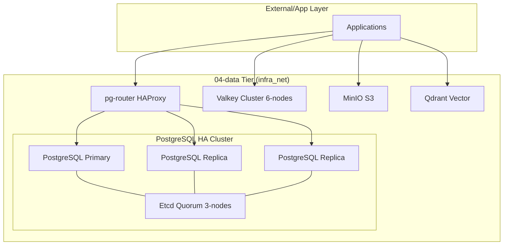

<!-- Target: docs/02.ard/0004-data-architecture.md -->

# Data Tier (04-data) Architecture Reference Document (ARD)

## Overview (KR)

이 문서는 `04-data` 티어의 참조 아키텍처와 품질 속성을 정의한다. 시스템 경계, 책임, 데이터 흐름, 운영 관점을 정리하는 기준 문서다. 본 아키텍처는 다중 모델 영속성 계층을 지향하며, 고가용성(HA)과 보안 격리를 핵심 설계 원칙으로 한다.

## Summary

`04-data` 티어는 플랫폼의 모든 영속성 데이터를 소유하며, 관계형, NoSQL, 캐시, 오브젝트, 벡터 등 다양한 데이터 요구사항을 충족하는 인프라를 제공한다.

## Boundaries & Non-goals

- **Owns**: 데이터베이스 인스턴스, 스토리지 볼륨, 백업 데이터, 데이터 전용 네트워크(`infra_net`).
- **Consumes**: Docker Secrets, Vault 시크릿, 시스템 리소스(CPU/RAM/Storage).
- **Does Not Own**: 애플리케이션 비즈니스 코드, 사용자 UI, 네트워크 외부 노출(Gateway 담당).
- **Non-goals**: 실시간 대시보드 시각화 (Observability 티어에서 담당).

## Quality Attributes

- **Performance**: Valkey 클러스터를 통한 밀리초 단위 응답 보장.
- **Security**: `infra_net` 격리 및 Docker Secrets 기반 인증.
- **Reliability**: Patroni/Etcd 기반의 자동 장애 조치(Failover).
- **Scalability**: 데이터 샤딩 및 노드 확장이 용이한 마이크로서비스 친화적 구성.
- **Observability**: Prometheus Exporter를 통한 실시간 상태 모니터링.
- **Operability**: 표준화된 백업/복구 런북 제공.

## System Overview & Context

`04-data` 티어는 `hy-home.docker`의 기초 계층으로, 모든 상위 티어(Auth, AI, App 등)에 데이터 저장소를 공급한다.

## Data Architecture

- **Key Entities / Flows**: 트랜잭션 데이터(SQL), 비정형 자산(S3), 검색 인덱스(Vector).
- **Storage Strategy**: 호스트 볼륨 바인드 마운트(`${DEFAULT_DATA_DIR}`).
- **Data Boundaries**: 각 서비스는 독립된 볼륨과 물리적 격리를 유지함.

## Infrastructure & Deployment

- **Runtime / Platform**: Docker Compose / Linux.
- **Deployment Model**: Multi-node Cluster (HA).
- **Operational Evidence**: `docker ps`, `patronictl list`, `valkey-cli cluster nodes`.

## Related Documents

- **PRD**: `[../01.prd/2026-03-26-04-data.md]`
- **Spec**: `[../04.specs/04-data/spec.md]`
- **Plan**: `[../05.plans/2026-03-26-04-data-standardization.md]`
- **ADR**: `[../03.adr/0004-postgresql-ha-patroni.md]`
