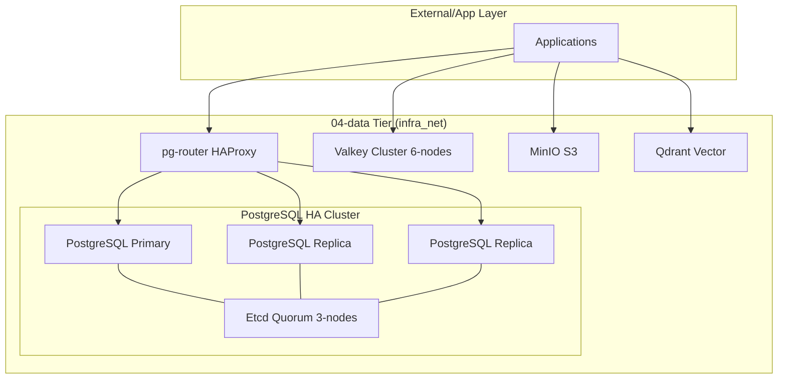

# ARD: Data Tier Architecture (04-data)

## Overview (KR)

본 문서는 `04-data` 티어의 다중 모델 영속성 계층 아키텍처를 정의한다. PostgreSQL 클러스터링(Patroni), Valkey 분산 캐시, MinIO S3 스토리지를 핵심 컴포넌트로 하며, `infra_net`을 통한 보안 격리 및 통합 라우팅(pg-router) 전략을 상세히 다룬다.

## Architecture Diagram

## Core Components

### 1. Relational Database (PostgreSQL 17)
- **Engine**: Spilo (Zalando's PostgreSQL + Patroni).
- **Consensus**: Etcd (3-node)를 사용한 리더 선출 및 구성 관리.
- **Routing**: HAProxy(pg-router)를 통해 RW(15432) / RO(15433) 트래픽 분산.

### 2. Cache & Key-Value (Valkey 8.0)
- **Mode**: Distributed Cluster (3 Master + 3 Replica).
- **Auth**: 비밀번호 기반 인증 (Valkey 9.x+ 가이드 준수).

### 3. Object Storage (MinIO)
- **Port**: 9000 (API) / 9001 (Console).
- **Provisioning**: `minio-create-buckets` 잡을 통한 초기 버킷 생성 자동화.

### 4. Specialized Engines
- **Qdrant**: RAG 아키텍처를 위한 고성능 벡터 데이타베이스.
- **MongoDB/CouchDB**: 문서 지향 데이터 수용.

## Infrastructure Strategy

- **Storage Isolation**: 호스트의 `${DEFAULT_DATA_DIR}`와 컨테이너 `/data` 경로를 1:1 바인드 마운트.
- **Network Isolation**: 모든 데이타 서비스를 `infra_net` 전용 네트워크에 배치하여 외부 노출 차단.
- **Secrets Management**: 패스워드 정보를 환경 변수가 아닌 `/run/secrets/` 경로를 통해 주입.
