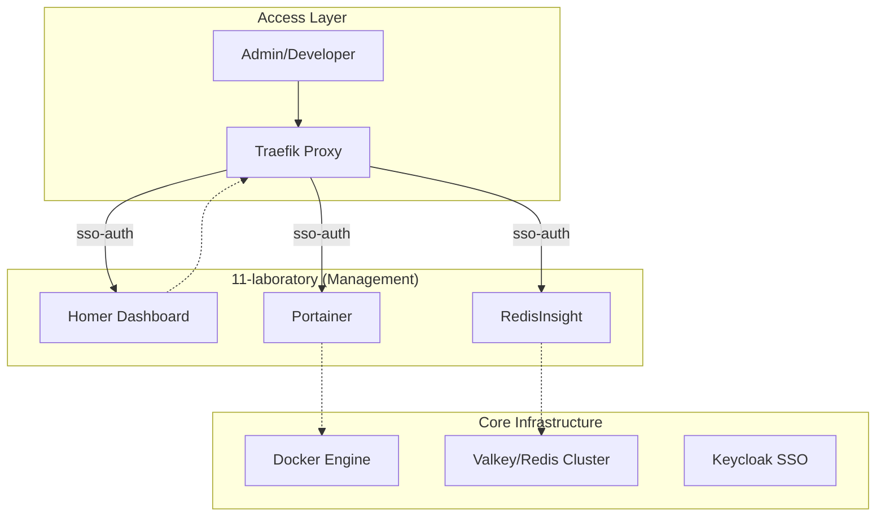

<!-- Target: docs/02.ard/0011-laboratory-architecture.md -->

# ARD - 0011: 11-laboratory Architecture Overview

## Architecture

`11-laboratory` 계층은 시스템의 관리 및 관측을 위한 비침습적(Non-intrusive) 관리 레이어로 설계되었다. 모든 도구는 독립적인 컨테이너로 동작하며, Traefik 리버스 프록시를 통해 중앙 집중식 접근 제어를 받는다.

### Logical Architecture

## Management Strategy

### 1. Dashboard (Homer)
- 목적: 모든 서비스의 통합 진입점 제공.
- 연결: Traefik 라우팅 규칙을 기반으로 정적 설정 파일(`config.yml`)을 통해 서비스 링크 관리.

### 2. Container Orchestration (Portainer)
- 목적: GUI 기반 컨테이너 생명주기 관리.
- 보안: Docker Socket 접근 시 보안 권한 최소화 및 SSO 연동.

### 3. Data Inspection (RedisInsight)
- 목적: 데이터 저장소 모니터링 및 쿼리 테스트.
- 연결: `04-data` 계층의 내부 네트워크 망을 통해 데이터베이스에 접근.

## Constraints
- **Security**: 모든 도구는 외부 노출 시 반드시 HTTPS 및 SSO 인증이 필수이다.
- **Performance**: 관리 도구 자체가 시스템 리소스를 과도하게 점유하지 않도록 경량 이미지를 사용한다.

## Status: Accepted (2026-03-26)
