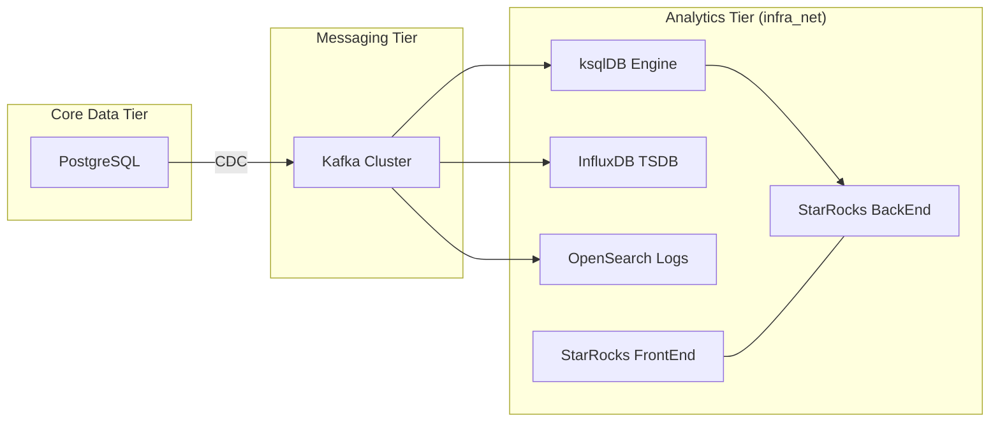

# ARD: Analytics Tier Architecture (04-data/analytics)

> This document defines the structural boundaries, quality attributes, and infrastructure strategy for the specialized analytics data engines within the `04-data/analytics` sub-tier.

---

## Analytics Tier Architecture Reference Document (ARD)

## Overview (KR)

본 문서는 `04-data/analytics` 서브 티어의 기술적 뼈대와 시스템 아키텍처를 정의한다. 핵심 데이터 티어로부터 분리된 분석 전용 하이퍼스케일 엔진들(InfluxDB, ksqlDB, OpenSearch, StarRocks)의 배치 전략, 데이터 흐름, 그리고 플랫폼 통합 방식을 상세히 기술한다.

## Summary

- **Identifier**: `ARD-0012`
- **Domain**: Data Architecture (Analytics)
- **Primary Tech Stack**: InfluxDB 2.x, ksqlDB 0.29+, OpenSearch 2.x, StarRocks 3.x.
- **Connectivity**: Private isolated `infra_net`.

## Boundaries

### Owns (Responsibilities)

- **Time-series Persistence**: 엣지 디바이스 및 센서 데이터의 고밀도 저장.
- **Stream Processing**: 실시간 데이터 변환 및 윈도잉 연산.
- **Distributed Searching**: 분산 환경에서의 로그/도큐먼트 인덱싱 및 검색.
- **OLAP Warehousing**: 대규모 정형 데이터의 분석용 실시간 집계.

### Consumes (Dependencies)
- **Core Data**: PostgreSQL/Redis 등 핵심 스토리지의 변경 데이터(CDC).
- **Messaging Layer**: ksqlDB/StarRocks로 인입되는 Kafka 토픽 데이터.
- **Infrastructure**: Docker Compose 오케스트레이션 및 NVMe 기반 영구 스토리지.

## Quality Attributes

- **Performance**: 대량 기록 시에도 조회 지연이 일정하게 유지되어야 함 (LSM 트리 기반 엔진 활용).
- **Scalability**: 데이터량 및 쿼리 부하에 따라 별도의 FE/BE 노드 확장 가능성 보장 (StarRocks 등).
- **Observability**: 모든 서비스는 `/metrics` 엔드포인트를 통해 상태 추적 가능.
- **Reliability**: 분석 시스템의 장애가 핵심 데이터 티어(SQL)의 서비스 가용성에 영향을 주지 않는 완전 격리 보장.

## System Overview & Context

## Data Architecture

- **Ingestion**: 메시징 티어(Kafka)를 허브로 하는 Event-driven 수집 아키텍처.
- **Storage Strategy**:
  - InfluxDB: TSM (Time-Structured Merge) 파일 기반.
  - OpenSearch: 루씬(Lucene) 인덱스 분산 저장.
  - StarRocks: MPP(Massively Parallel Processing) 아키텍처의 컬럼형 스토리지.
- **Consistency**: 최종 일관성(Eventual Consistency) 모델을 기본으로 채택하여 처리량 극대화.

## Infrastructure Strategy

- **Networking**: `infra_net` 내부 통신만 허용하며, 외부 접근은 Gateway Tier의 Reverse Proxy를 통해서만 가능.
- **Storage Bindings**:
  - `${DEFAULT_DATA_DIR}/analytics/<target>/data` 경로에 데이터 물리 저장.
  - 고성능 디스크(NVMe) 활용 권장.
- **Config Management**: Docker Secrets 및 환경 변수를 통한 설정 주입.

## AI Requirements

- **Metadata Access**: AI 에이전트는 분석용 스키마 정보와 메타데이터에 대한 읽기 권한을 가짐.
- **Query Optimization**: 에이전트는 비효율적인 분석 쿼리 패턴을 감지하고 StarRocks 인덱싱 등의 최적화 제안 가능.

## Related Documents

- **PRD**: [2026-03-26-04-data-analytics.md](../01.prd/2026-03-26-04-data-analytics.md)
- **ADR**: [0015-analytics-engine-selection.md](../03.adr/0015-analytics-engine-selection.md)
- **Specs**: [spec.md](../04.specs/04-data-analytics/spec.md)
- **Guides**: [README.md](../07.guides/04-data/analytics/README.md)
