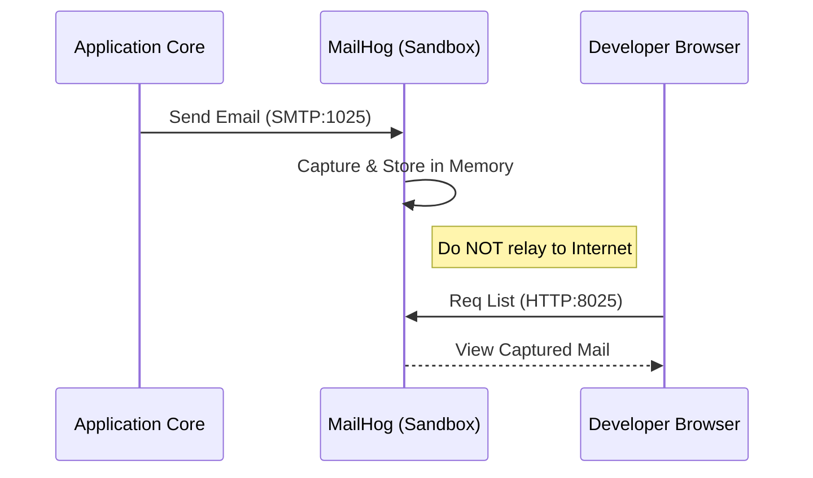

<!-- Target: docs/03.specs/10-communication/spec.md -->

# Communication Tier Technical Specification

## Overview

This document defines the technical specification for the `10-communication` tier. It covers the SMTP trapping architecture, mail server components, data persistence protocols, and security controls. Because `infra/10-communication/mail/docker-compose.yml` is currently a commented optional include in the root `docker-compose.yml`, this specification describes the owned implementation and root-optional execution contract.

## Strategic Boundaries & Non-goals

- **Owns**:
  - MailHog development mail trap contract.
  - Stalwart production mail service interface contract.
  - SMTP/IMAP/JMAP port, TLS, DNS, persistence, and secret boundary.
- **Does Not Own**:
  - External DNS provider operations beyond required record expectations.
  - ISP or hosting-provider port unblock procedures.
  - Application-level email template content.

## Related Inputs

- **PRD**: [../../01.requirements/2026-03-26-10-communication.md](../../01.requirements/2026-03-26-10-communication.md)
- **ARD**: [../../02.architecture/requirements/0010-communication-architecture.md](../../02.architecture/requirements/0010-communication-architecture.md)
- **Related ADRs**: [../../02.architecture/decisions/0010-communication-services.md](../../02.architecture/decisions/0010-communication-services.md)

## Contracts

- **Config Contract**:
  - Communication mail compose exists under `infra/10-communication/mail/`, but it is not root-active in the current root compose.
  - The service-local compose file depends on root-level `infra_net`, secrets, and common template context; direct standalone service-local config rendering is not a valid readiness proof.
  - MailHog receives development SMTP traffic on internal port `1025` and exposes its web UI on internal port `8025`.
  - Stalwart exposes SMTP/Submit on `25`, `465`, `587`, IMAPS on `993`, and JMAP/Admin UI on `8080`.
- **Data / Interface Contract**:
  - MailHog stores captured development messages in memory and does not relay mail to the internet.
  - Stalwart persists production mail data to `${DEFAULT_COMMUNICATION_DIR}/stalwart/data` through the `stalwart-data` bind-backed volume.
  - Production clients use TLS-protected SMTP/IMAP endpoints.
- **Governance Contract**:
  - Admin passwords and mail service secrets must use Docker Secrets.
  - SPF, DKIM, and DMARC records must remain documented in operations policy.
  - Open relay configuration is disallowed.

## Core Design

### Component Boundary

### 1. MailHog (Development Sandbox)

- **SMTP Server**: Receives mail on port `1025` and does not relay it externally.
- **Web UI**: Runs as a stateless disposable service and displays captured mail on port `8025`.
- **Storage**: In-memory by default.

### 2. Stalwart (Production Backend)

- **SMTP/Submit**: Service for mail sending and receiving on ports `25`, `465`, and `587`.
- **IMAP/JMAP**: Mail client access protocols on ports `993` and `8080`.
- **Admin UI**: Web-based server administration and domain configuration tool.
- **Dependency**: Local persistent volume backed by `${DEFAULT_COMMUNICATION_DIR}/stalwart/data`; no PostgreSQL sidecar is declared by the current compose.

### Key Dependencies

- **DNS Provider**: MX, SPF, DKIM, DMARC records for production delivery.
- **Docker Secrets**: `stalwart_password` and TLS certificate material references.
- **Traefik / SSO**: Web UI access boundary for management surfaces.

### Tech Stack

- MailHog
- Stalwart Mail Server
- Docker Compose
- SMTP, SMTPS, IMAPS, JMAP

## Data Modeling & Storage Strategy

- **Schema / Entity Strategy**:
  - MailHog keeps captured development mail in memory and resets state on container restart.
  - Stalwart stores mailbox data and service metadata in persistent storage under the communication tier data boundary.
- **Migration / Transition Plan**:
  - Keep development applications pointed at MailHog for safe local testing.
  - Promote production mail delivery through Stalwart only after TLS, DNS records, and secret references are present.

## Interfaces & Data Structures

### Network Ports

| Service | Internal Port | External Port | Protocol | Auth Required |
| :--- | :--- | :--- | :--- | :--- |
| MailHog SMTP | 1025 | Internal only | SMTP | No (development trap) |
| MailHog HTTP | 8025 | Traefik route `mailhog.${DEFAULT_URL}` | HTTP | SSO (Traefik) |
| Stalwart SMTP | 25 | 25 | SMTP | Opportunistic TLS |
| Stalwart Secure | 465 / 587 | 465 / 587 | SMTPS | Mandatory Auth |
| Stalwart IMAP | 993 | 993 | IMAPS | Mandatory Auth |
| Stalwart Admin/JMAP | 8080 | Traefik route `mail.${DEFAULT_URL}` | HTTP | SSO (Traefik) |

### Common Variables

- `DEFAULT_URL`: Traefik virtual-host base domain.
- `DEFAULT_COMMUNICATION_DIR`: host data root for Stalwart persistent storage.
- `SMTP_HOST_PORT`, `SUBMISSION_HOST_PORT`, `SMTPS_HOST_PORT`, `IMAPS_HOST_PORT`, `MANAGESIEVE_HOST_PORT`: host port overrides for Stalwart mail protocols.
- `STALWART_PORT`, `MAILHOG_UI_PORT`: internal web service port overrides for Traefik service targets.

## API Contract (If Applicable)

No application API is defined by this spec. Communication interfaces are protocol-level SMTP, SMTPS, IMAPS, HTTP UI, and JMAP/Admin UI endpoints.

## Sequence Diagrams

### Development Mail Trapping Flow



## Guardrails

- **Authentication**: Stalwart Admin/JMAP UI and MailHog UI are protected by the Traefik `gateway-standard-chain@file,sso-errors@file,sso-auth@file` middleware chain.
- **Encryption**: `secrets/certs` is mounted read-only for Stalwart certificate material; TLS protocol readiness must be verified during service promotion.
- **Deliverability**: SPF, DKIM, and DMARC remain production readiness requirements, but DNS records and signing evidence are external to the tracked compose.
- **Blocked Conditions**:
  - Open relay behavior.
  - Plaintext secret values in documentation.
  - Production delivery without TLS and DNS record verification.

## Edge Cases & Error Handling

- **Connectivity**: The production server (Stalwart) requires port `25` to be unblocked by the ISP and requires a static IP assignment.
- **Resources**: Stalwart must support easy disk expansion as retained mail volume grows.
- **Development Queue Reset**: MailHog restart clears captured mail because storage is in-memory.
- **Certificate Expiry**: Expired certificate material causes SMTP/IMAP client failures.

## Failure Modes & Fallback / Human Escalation

- **Failure Mode**: production mail delivery fails because port `25` is blocked.
  - **Fallback**: verify ISP/hosting policy and use an approved relay path if direct SMTP remains unavailable.
  - **Human Escalation**: Communication service owner and infrastructure operator.
- **Failure Mode**: MailHog captures no development messages.
  - **Fallback**: check application SMTP host/port values and MailHog container health.
  - **Human Escalation**: application owner when SMTP settings diverge from this spec.

## Verification

```bash
bash scripts/hardening/check-all-hardening.sh 10-communication
bash scripts/validation/check-repo-contracts.sh
```

Root-context render checks may be run after the optional root include is enabled
or through an explicit validation overlay that preserves the root network,
secret, and template context.

Production readiness checks:

```bash
openssl s_client -connect mail.${DEFAULT_URL}:465
openssl s_client -starttls smtp -connect mail.${DEFAULT_URL}:587
```

## Success Criteria & Verification Plan

- **VAL-SPC-COMM-001**: MailHog receives development SMTP traffic and does not relay externally.
- **VAL-SPC-COMM-002**: Stalwart TLS-protected SMTP/IMAP endpoints are validated only after the optional mail compose is promoted and DNS, TLS, and secret evidence are present.
- **VAL-SPC-COMM-003**: SPF, DKIM, and DMARC requirements are reflected in operations policy.
- **VAL-SPC-COMM-004**: Guide, policy, and runbook links point to canonical `docs/05.operations` buckets.

## Agent Role & IO Contract (If Applicable)

- **Agent Role**: N/A
- **Inputs**: N/A
- **Outputs**: N/A
- **Success Definition**: N/A

## Related Documents

- **PRD**: [2026-03-26-10-communication.md](../../01.requirements/2026-03-26-10-communication.md)
- **ARD**: [0010-communication-architecture.md](../../02.architecture/requirements/0010-communication-architecture.md)
- **ADR**: [0010-communication-services.md](../../02.architecture/decisions/0010-communication-services.md)
- **Plan**: [../../04.execution/plans/2026-03-26-10-communication-standardization.md](../../04.execution/plans/2026-03-26-10-communication-standardization.md)
- **Tasks**: [../../04.execution/tasks/2026-03-26-10-communication-tasks.md](../../04.execution/tasks/2026-03-26-10-communication-tasks.md)
- **Guide**: [../../05.operations/guides/10-communication/mail.md](../../05.operations/guides/10-communication/mail.md)
- **Policy**: [../../05.operations/policies/10-communication/mail.md](../../05.operations/policies/10-communication/mail.md)
- **Runbook**: [../../05.operations/runbooks/10-communication/mail.md](../../05.operations/runbooks/10-communication/mail.md)
