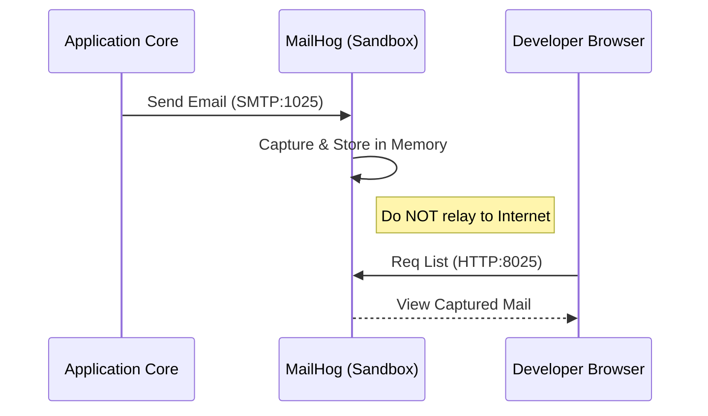

<!-- Target: docs/03.specs/10-communication/spec.md -->

# Communication Tier Technical Specification

## Overview (KR)

이 문서는 `10-communication` 계층의 기술 사양을 정의한다. SMTP 트래핑 아키텍처, 메일 서버 구성 요소, 데이터 지속성 프로토콜 및 보안 통제 사항을 포함한다.

## Strategic Boundaries & Non-goals

- **Owns**:
  - MailHog development mail trap contract.
  - Stalwart production mail service interface contract.
  - SMTP/IMAP/JMAP port, TLS, DNS, persistence, and secret boundary.
- **Does Not Own**:
  - External DNS provider operations beyond required record expectations.
  - ISP or hosting-provider port unblock procedures.
  - Application-level email template content.

## Related Inputs

- **PRD**: [../../01.requirements/2026-03-26-10-communication.md](../../01.requirements/2026-03-26-10-communication.md)
- **ARD**: [../../02.architecture/requirements/0010-communication-architecture.md](../../02.architecture/requirements/0010-communication-architecture.md)
- **Related ADRs**: [../../02.architecture/decisions/0010-communication-services.md](../../02.architecture/decisions/0010-communication-services.md)

## Contracts

- **Config Contract**:
  - MailHog receives development SMTP traffic on internal port `1025` and exposes its web UI on internal port `8025`.
  - Stalwart exposes SMTP/Submit on `25`, `465`, `587`, IMAPS on `993`, and JMAP/Admin UI on `8080`.
  - `DEFAULT_MAIL_DOMAIN` defines the default system mail domain.
  - `MAIL_SENDER_NAME` defines the default sender display name.
- **Data / Interface Contract**:
  - MailHog stores captured development messages in memory and does not relay mail to the internet.
  - Stalwart persists production mail data to encrypted local persistent volumes.
  - Production clients use TLS-protected SMTP/IMAP endpoints.
- **Governance Contract**:
  - Admin passwords and mail service secrets must use Docker Secrets.
  - SPF, DKIM, and DMARC records must remain documented in operations policy.
  - Open relay configuration is disallowed.

## Core Design

### Component Boundary

### 1. MailHog (Development Sandbox)

- **SMTP Server**: 1025 포트에서 메일을 수신하며 외부로 전달하지 않음.
- **Web UI**: 소모성 서버(Stateless)로 작동하며 8025 포트에서 캡처된 메일 전시.
- **Storage**: In-memory (기본 설정).

### 2. Stalwart (Production Backend)

- **SMTP/Submit**: 메일 발송 및 수신용 서비스 (25, 465, 587 포트).
- **IMAP/JMAP**: 메일 클라이언트 접근 프로토콜 (993, 8080 포트).
- **Admin UI**: 웹 기반 서버 관리 및 도메인 설정 도구.
- **Dependency**: PostgreSQL (Optional metadata), Local Persistent Volumes (Encrypted).

### Key Dependencies

- **DNS Provider**: MX, SPF, DKIM, DMARC records for production delivery.
- **Docker Secrets**: `stalwart_password` and TLS certificate material references.
- **Traefik / SSO**: Web UI access boundary for management surfaces.

### Tech Stack

- MailHog
- Stalwart Mail Server
- Docker Compose
- SMTP, SMTPS, IMAPS, JMAP

## Data Modeling & Storage Strategy

- **Schema / Entity Strategy**:
  - MailHog keeps captured development mail in memory and resets state on container restart.
  - Stalwart stores mailbox data and service metadata in persistent storage under the communication tier data boundary.
- **Migration / Transition Plan**:
  - Keep development applications pointed at MailHog for safe local testing.
  - Promote production mail delivery through Stalwart only after TLS, DNS records, and secret references are present.

## Interfaces & Data Structures

### Network Ports

| Service | Internal Port | External Port | Protocol | Auth Required |
| :--- | :--- | :--- | :--- | :--- |
| MailHog SMTP | 1025 | 1025 | SMTP | No (Whitelist) |
| MailHog HTTP | 8025 | 18025 | HTTP | SSO (Traefik) |
| Stalwart SMTP | 25 | 25 | SMTP | Opportunistic TLS |
| Stalwart Secure | 465 / 587 | 465 / 587 | SMTPS | Mandatory Auth |
| Stalwart IMAP | 993 | 993 | IMAPS | Mandatory Auth |

### Common Variables

- `DEFAULT_MAIL_DOMAIN`: 시스템 대표 메일 도메인.
- `MAIL_SENDER_NAME`: 기본 발신자 명칭.

## API Contract (If Applicable)

No application API is defined by this spec. Communication interfaces are protocol-level SMTP, SMTPS, IMAPS, HTTP UI, and JMAP/Admin UI endpoints.

## Sequence Diagrams

### Development Mail Trapping Flow



## Guardrails

- **Authentication**: Stalwart는 Keycloak LDAP/OIDC를 통해 시스템 사용자 계정과 통합 가능.
- **Encryption**: `secrets/certs` 내의 인증서를 사용하여 STARTTLS 및 SSL/TLS 암호화 강제.
- **Deliverability**: Stalwart 내에서 SPF, DKIM, DMARC 서명을 자동 처리하여 스팸 필터링 방지.
- **Blocked Conditions**:
  - Open relay behavior.
  - Plaintext secret values in documentation.
  - Production delivery without TLS and DNS record verification.

## Edge Cases & Error Handling

- **Connectivity**: 운영 서버(Stalwart)는 ISP로부터 25번 포트 차단 해제 및 정적 IP 할당이 필요함.
- **Resources**: Stalwart는 메일 보관량에 따라 디스크 공간 확장이 용이해야 함.
- **Development Queue Reset**: MailHog restart clears captured mail because storage is in-memory.
- **Certificate Expiry**: Expired certificate material causes SMTP/IMAP client failures.

## Failure Modes & Fallback / Human Escalation

- **Failure Mode**: production mail delivery fails because port `25` is blocked.
  - **Fallback**: verify ISP/hosting policy and use an approved relay path if direct SMTP remains unavailable.
  - **Human Escalation**: Communication service owner and infrastructure operator.
- **Failure Mode**: MailHog captures no development messages.
  - **Fallback**: check application SMTP host/port values and MailHog container health.
  - **Human Escalation**: application owner when SMTP settings diverge from this spec.

## Verification

```bash
docker compose -f infra/10-communication/mail/docker-compose.yml config
docker compose ps mailhog stalwart
docker logs --tail 100 mailhog
docker logs --tail 100 stalwart
```

Production readiness checks:

```bash
openssl s_client -connect mail.${DEFAULT_URL}:465
openssl s_client -starttls smtp -connect mail.${DEFAULT_URL}:587
```

## Success Criteria & Verification Plan

- **VAL-SPC-COMM-001**: MailHog receives development SMTP traffic and does not relay externally.
- **VAL-SPC-COMM-002**: Stalwart exposes TLS-protected SMTP/IMAP endpoints with secret-backed administration.
- **VAL-SPC-COMM-003**: SPF, DKIM, and DMARC requirements are reflected in operations policy.
- **VAL-SPC-COMM-004**: Guide, policy, and runbook links point to canonical `docs/05.operations` buckets.

## Related Documents

- **PRD**: [2026-03-26-10-communication.md](../../01.requirements/2026-03-26-10-communication.md)
- **ARD**: [0010-communication-architecture.md](../../02.architecture/requirements/0010-communication-architecture.md)
- **ADR**: [0010-communication-services.md](../../02.architecture/decisions/0010-communication-services.md)
- **Plan**: [../../04.execution/plans/2026-03-26-10-communication-standardization.md](../../04.execution/plans/2026-03-26-10-communication-standardization.md)
- **Tasks**: [../../04.execution/tasks/2026-03-26-10-communication-tasks.md](../../04.execution/tasks/2026-03-26-10-communication-tasks.md)
- **Guide**: [../../05.operations/guides/10-communication/mail.md](../../05.operations/guides/10-communication/mail.md)
- **Policy**: [../../05.operations/policies/10-communication/mail.md](../../05.operations/policies/10-communication/mail.md)
- **Runbook**: [../../05.operations/runbooks/10-communication/mail.md](../../05.operations/runbooks/10-communication/mail.md)
