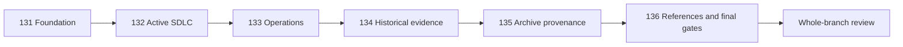

# Document Corpus Lifecycle Migration Foundation Technical Specification

## Overview

This specification defines the control plane for migrating the workspace
documentation corpus onto the canonical Stage 00 and Stage 99 contracts. It
continues the deliberately deferred Waves A through E from Spec 130 rather than
reopening the completed template-system canonicalization.

The program is contract-first and preservation-oriented. It establishes a
machine-readable migration manifest, typed lifecycle and relation validation,
semantic-duplicate disposition rules, directory accumulation budgets, hybrid
archive provenance, generated ledgers, and CI/QA gates before broad document
movement or normalization begins. Each later wave receives its own Spec, Plan,
Task evidence, implementation agent, specification review, quality review, and
logical commits.

Current tracked evidence at baseline `e00e1483` shows why a single mechanical
rewrite is unsafe:

- Stage 01 contains 24 PRD leaves and Stage 02 contains 24 ARD plus 24 ADR
  leaves; none is fully migrated to the typed metadata contract.
- Stage 03 contains 55 Spec-role leaves, Stage 04 contains 95 Plans and 117
  Tasks, and Stage 05 contains 66 Guides, 64 Policies, and 61 Runbooks.
- The advisory metadata inventory contains 901 records and 2,025 findings:
  1,893 missing-required-key findings, 125 stale-active signals, and seven
  replacement-free supersession findings.
- The active-only advisory check selects 362 records and reports 1,290
  findings. These are migration inputs, not permission to auto-rewrite.
- Stage 98 contains 20 tombstones. Five older tombstones retain provenance only
  in body tables and do not satisfy the typed archive profile.
- Stage 04's flat directories already contain 95 Plans and 117 Tasks, while no
  enforced partition, retention review, or directory budget exists.

The canonical 2026-07-05 implementation audit remains the current audit route.
Its dated counts are historical evidence and are not rewritten to resemble this
baseline; current manifests and generated inventories own program execution
counts.

## Boundaries and Inputs

### In Scope

- `_workspace` and `.github` contracts directly required by the migration
  harness.
- Stage 01 through Stage 05 document metadata, body-role conformance,
  traceability, links, indexes, lifecycle, review evidence, and bounded
  restructuring.
- Stage 90 research, audit, data, learning, and generated-reference role
  reconciliation.
- Stage 98 archive provenance, generated ledger, and explicitly approved
  immutable evidence snapshots.
- Stage 99 human contracts, registry profiles, templates, selection rules, and
  lifecycle governance needed to express this design.
- Validators, tests, local QA routing, pre-commit integration, and tracked
  GitHub Actions workflow definitions.
- Topic-specific official-source verification for active documents whose
  current content changes.

### Out of Scope

- Docker Compose service or profile mutation.
- Infrastructure runtime, deployment runtime, or environment changes.
- Secret, credential, token, key, shell-history, or raw-log capture.
- Remote GitHub ruleset, branch-protection, environment, check, release, or
  deployment mutation.
- User-global Claude, Codex, Gemini, MCP, or provider configuration changes.
- Creating Incident, Postmortem, or Release records without a qualifying event.
- Rewriting historical commands, dates, counts, decisions, verdicts, hashes,
  approvals, or execution results for style or present-day consistency.
- Treating Graphify output as authoritative when its report is stale or
  advisory.

### Canonical Inputs

The requested `docs/03.specs/requirements/` and
`docs/03.specs/decisions/` paths do not exist at the approved baseline and must
not be created as parallel owners. Product requirements remain in Stage 01;
architecture requirements and decisions remain in Stage 02. Requirement,
decision, API, data, test, service, or agent details that are genuine focused
Spec contracts stay inside their owning Stage 03 feature directory and use the
registered Spec-child role. A later move requires an explicit canonical-owner
change, not directory-name symmetry.

- [Spec 130: Template Contract System Canonicalization](../130-template-contract-system-canonicalization/spec.md)
- [Spec 129: Document Contract Canonicalization](../129-document-contract-canonicalization/spec.md)
- [Agent Governance PRD](../../01.requirements/024-agent-governance-standardization.md)
- [Agent Governance ARD](../../02.architecture/requirements/0027-agent-governance-canonical-adapter.md)
- [Stage 00 adapter ADR](../../02.architecture/decisions/0027-stage-00-canonical-adapter-model.md)
- [Canonical implementation audit](../../90.references/audits/2026-07-05-agentic-engineering-implementation-audit-pack/README.md)
- [Stage 99 metadata registry](../../99.templates/support/document-metadata-profiles.yaml)
- [SDLC document contract](../../99.templates/support/sdlc-document-contract.md)
- [Common document contract](../../99.templates/support/common-document-contract.md)
- [Template governance](../../99.templates/support/template-governance.md)
- [`_workspace` contract](../../../_workspace/README.md)

### External Source Basis

External sources inform local decisions; they do not define repository path
numbers, artifact IDs, lifecycle vocabulary, or approval authority.

| Primary or official source | Local design consequence |
| --- | --- |
| [YAML 1.2.2](https://yaml.org/spec/1.2.2/) | Parse frontmatter as typed mappings, reject duplicate keys, and keep serialization order deterministic without assigning semantic priority. |
| [GitHub Docs frontmatter](https://docs.github.com/en/contributing/writing-for-github-docs/using-yaml-frontmatter) | Validate metadata against consumer-specific profiles instead of one universal key set. |
| [CommonMark](https://spec.commonmark.org/0.31.2/) and [GFM](https://github.github.com/gfm/) | Validate Markdown body structure separately from YAML frontmatter. |
| [Diataxis](https://diataxis.fr/) | Keep learning, explanation, reference, and procedural roles distinct; do not mix Guide, Policy, Runbook, Reference, or Audit ownership. |
| [ISO/IEC/IEEE 29148:2018](https://www.iso.org/standard/72089.html), [ISO/IEC/IEEE 42010:2022](https://www.iso.org/standard/74393.html), and [NASA SWE-052](https://swehb.nasa.gov/spaces/7150/pages/16450285/SWE-052%2B-%2BBidirectional%2BTraceability%2BBetween%2BHigher%2BLevel%2BRequirements%2Band%2BSoftware%2BRequirements) | Preserve typed requirements, architecture concerns, stable identities, bidirectional traceability, orphan detection, and change-impact evidence. |
| [MADR](https://adr.github.io/madr/) and [GitHub Spec Kit](https://github.com/github/spec-kit) | Keep one decision per ADR and separate intent, design, planning, tasks, implementation, and analysis. |
| [Google SRE Postmortem Culture](https://sre.google/workbook/postmortem-culture/) and [Emergency Response](https://sre.google/sre-book/emergency-response/) | Keep Incident, Postmortem, Policy, and Runbook roles distinct and require executable, reviewed operational evidence. |
| [W3C PROV-O](https://www.w3.org/TR/prov-o/) | Model original entities, derivations, activities, and responsible agents without presenting an archive copy as current truth. |
| [Git log](https://git-scm.com/docs/git-log) | Use immutable commit and blob identities as the default original-body preservation route across moves and deletions. |
| [GitHub Actions workflow syntax](https://docs.github.com/en/actions/reference/workflows-and-actions/workflow-syntax) | Keep tracked CI definitions event-driven and avoid relying on incomplete path filtering for mandatory repository contracts. |
| [pre-commit](https://pre-commit.com/) | Treat all-files hooks as repository-wide, potentially mutating checks and run them through the approved clean-worktree wrapper. |

## Contracts

### Canonical Ownership and Precedence

The migration uses the following precedence:

1. Stage 00 owns governance, authorization, provider-neutral agent rules, and
   protected-surface boundaries.
2. Stage 99 owns exact metadata profiles, lifecycle semantics, human document
   roles, template forms, selection, retention, archive, and migration rules.
3. Stage 01 through Stage 05 own current requirements, architecture, technical
   contracts, execution evidence, and operations knowledge.
4. Stage 04 Task artifacts own actual commands, results, reviews, commits,
   exceptions, and deviations for each wave.
5. Stage 90 owns source-backed advisory research, audits, data, and generated
   inventories; it cannot approve policy or runtime state.
6. Stage 98 owns provenance tombstones and approved immutable snapshots; it is
   not a current-truth documentation stage.

README files remain indexes and routers. Shared rules must live in their named
Stage 00 or Stage 99 owner. Templates remain copyable forms and must not carry
migration algorithms, lifecycle policy, or copied governance.

### Typed Metadata Contract

Every selected lifecycle leaf uses the exact profile in
`document-metadata-profiles.yaml`.

- `artifact_id` is stable across path, heading, and numbering changes.
- `artifact_type` is path/profile-derived and must match the registry.
- `parent_ids` contains verified direct upstream artifacts only.
- Multiple parents have set-like meaning; deterministic order is presentation,
  not priority, chronology, approval rank, or dependency strength.
- `supersedes` is present only for a verified replacement relationship and must
  agree with target lifecycle and direction.
- `reviewed_at` and `review_cycle` are written only from actual review evidence.
- README, generated, governance, repo-support, template-source, and native
  platform exceptions retain their real consumer contracts.
- No path number, matching suffix, title similarity, or body link may by itself
  manufacture an artifact identity or parent relation.

### Duplicate and Disposition Contract

Every wave manifest assigns each selected path exactly one disposition:

`migrate`, `preserve`, `move`, `merge`, `archive`, `delete`, `regenerate`, or
`exempt`.

An exact hash, similar title, matching role, or shared topic can create a
candidate but cannot authorize a merge, deletion, or archive. A destructive
disposition requires all of the following:

1. the documents have the same type, purpose, topic, and scope;
2. one canonical owner is selected;
3. no unique decision, result, command, audit fact, or historical evidence is
   lost;
4. every active consumer and cross-link is enumerated;
5. replacement and archive disposition are explicit; and
6. rollback and preservation evidence exist.

Template drift alone never makes a historical artifact a duplicate. The
manifest records evidence, reviewer verdict, and the exact commit boundary for
every destructive action.

### Hybrid Archive Contract

The default archive artifact is a concise provenance tombstone. It includes the
existing archive identity and relation fields plus:

- `archive_disposition`;
- `archived_commit`;
- `archived_blob`; and
- `preservation_class: git-history`.

`current_replacement` is conditionally required for superseded, duplicate, and
conflict dispositions. It is absent, not the string `N/A`, when a verified
withdrawal has no replacement. The registry and human contract must agree on
this condition.

Only audit, legal, or explicitly approved `evidence-preserve` cases may use
`preservation_class: immutable-snapshot`. Those tombstones also require:

- `snapshot_path`;
- `content_sha256`; and
- `snapshot_reason`.

The byte-preserving payload lives at
`docs/98.archive/evidence/<sha256>.md.snapshot`. It is not Markdown current
truth and is never included in lifecycle inference. Snapshot admission requires
a confidentiality scan; secret-bearing, credential-bearing, token-bearing,
private-key, shell-history, or raw-log payloads must not be committed.

Tombstone frontmatter is the archive provenance source of truth. A generated
archive ledger and snapshot manifest are derived outputs and must pass check
mode without hand edits.

### Retention and Directory Budget Contract

Retention is lifecycle- and consumer-driven rather than age-only.

- Draft age of 30 days, active age of 90 days, and completed execution age of
  180 days are review signals, never automatic status transitions.
- A superseded document becomes an archive candidate only after replacement,
  consumer, provenance, and preservation checks pass.
- Completed Specs, Plans, and Tasks remain in their evidence role when they are
  active inputs, durable execution evidence, or audit evidence.
- An immediate directory emits a partition warning at 100 leaf documents.
- Adding a new leaf is blocked at 150 until an approved partition plan exists.
- Stage 01 through Stage 03 partition by stable domain or bounded context.
- Stage 04 Plans and Tasks partition by year as `plans/YYYY/` and
  `tasks/YYYY/`; lifecycle identity and artifact IDs do not change on move.

The 100/150 values are repository-local navigation budgets, not external
standards. The validator reports the configured threshold and selected path so
future changes require an explicit contract diff rather than hidden script
literals.

### Evidence Preservation Contract

- Active topic content that changes requires tracked implementation evidence
  and primary or official external sources recorded in the owning Task.
- Historical commands, results, dates, decisions, counts, verdicts, approvals,
  hashes, and commit evidence remain semantically unchanged.
- Historical code spans that describe an old path remain evidence; active
  Markdown navigation links are updated after moves.
- Review dates are not inferred from Git timestamps, filesystem mtimes,
  template dates, or the current execution date.
- Generated content changes only through its canonical generator.

## Core Design

### Program Structure

The approved program runs in one isolated branch with six independently gated
work packages:

| Spec | Work package | Responsibility |
| --- | --- | --- |
| 131 | Foundation | Manifest schema, duplicate and retention contracts, hybrid archive model, validators, tests, and tracked CI definitions. |
| 132 | Wave A | Active PRD, ARD, ADR, Spec, Plan, and directly related active Task graph. |
| 133 | Wave B | Guide, Policy, and Runbook migration by operations domain. |
| 134 | Wave C | Preservation-oriented completed and superseded corpus migration plus Stage 04 year partition. |
| 135 | Wave D | Tombstone provenance, generated archive ledger, and approved immutable snapshots. |
| 136 | Wave E | Stage 90, generated outputs, README profiles, `_workspace`, `.github`, indexes, and final cross-corpus enforcement. |

Each work package receives an independent Spec, exactly one Plan, a Task
evidence artifact, a fresh implementation agent, a separate specification
review, a separate quality review, remediation re-review, and logical commits.
No wave may consume an unapproved future Spec or bypass its entry gate.

### Wave A: Active SDLC Graph

The parent graph is established before body normalization.

- PRD can be a justified root.
- ARD and ADR link only to verified requirements, architecture concerns, and
  decisions.
- Spec and focused Spec children link to the direct PRD, ARD, ADR, or umbrella
  Spec they actually consume.
- Plan links to approved Spec work; Task links to the Plan actually executed.
- Missing document types remain justified N/A when no semantic trigger exists.
- Section consolidation occurs only when existing content has equivalent
  meaning. Active topic content is verified against tracked implementation and
  official sources before correction.

### Wave B: Operations by Domain

Guide, Policy, and Runbook are reviewed together for each `00-workspace` and
`01-*` through `12-*` domain while retaining separate roles.

- Guide owns understanding, routine use, onboarding, and Runbook handoff.
- Policy owns required/prohibited controls, exceptions, verification, and
  review cadence.
- Runbook owns trigger, prerequisites, ordered procedure, expected result,
  evidence, recovery, rollback, and escalation.
- Incident, Postmortem, and Release stay event-triggered.
- SDLC, Spec, test, and Runbook conflicts route to the earliest canonical owner.
  Unverified runtime state becomes a recorded gap, not invented guidance.

### Wave C: Historical Evidence

Completed and superseded documents receive minimum typed metadata and current
link repair. Stage 04 leaves move with `git mv` into year partitions. Historical
body facts remain unchanged. A missing same-stem Plan or Task is not repaired by
creating a document; relationships use verified artifact identities.

### Wave D: Archive Provenance

All existing tombstones and new archive candidates are classified. The five
known provenance-deficient tombstones are explicit entry candidates, not the
entire scope. The wave verifies Git objects, conditional replacements,
snapshot eligibility, SHA-256 values, generated ledger freshness, and the rule
that active documents do not consume tombstones as current guidance.

### Wave E: References and Final Enforcement

The 2026-07-05 implementation audit remains current; the 2026-07-03 and
2026-07-04 packs remain dated evidence; the 2026-07-07 pack remains a
superseded mapping ledger. Research, Audit, Data, Learning, and LLM Wiki roles
are reconciled without turning Stage 90 into policy. README files keep exactly
one profile. Generated outputs refresh only through canonical generators.
`_workspace` remains outside document lifecycle inference and retains its two
tracked README allowlist.

The final wave promotes full-corpus validation to blocking only after every
selected finding is resolved or represented by an approved, owned, expiring
exception.

## Interfaces and Data

### Migration Manifest

Each wave uses a deterministic manifest with at least these fields:

| Field | Meaning |
| --- | --- |
| `wave` | Approved work package identity. |
| `source_path` | Baseline tracked path. |
| `target_path` | Result path or null when legitimately deleted. |
| `artifact_id` | Stable identity or declared profile exception. |
| `artifact_type` | Registry type. |
| `status_before` / `status_after` | Verified lifecycle transition. |
| `parent_ids` | Direct parents after migration. |
| `disposition` | Exactly one allowed migration action. |
| `canonical_replacement` | Verified replacement identity/path when required. |
| `active_consumers` | Enumerated current consumers before destructive action. |
| `preservation_class` | `git-history`, `immutable-snapshot`, or not applicable. |
| `evidence` | Commands, sources, and repository paths supporting the row. |
| `review_verdict` | Specification and quality disposition. |

Dry-run output lives under `_workspace/repo-support/`. Approved deterministic
manifests and summary reports are promoted to a generator-owned Stage 90 data
surface and linked from Stage 04 Task evidence. No raw log or secret-bearing
output is promoted.

### Validator Interfaces

The implementation plan may extend `check-document-metadata.py` or add a
single-purpose companion when separation materially improves maintainability.
The final interface must provide:

- contract/profile validation;
- manifest validation for an explicit wave;
- changed/new plus impacted-dependent validation;
- full-corpus blocking validation after migration;
- advisory lifecycle-review signals;
- archive Git-object and snapshot-integrity validation;
- duplicate-candidate reporting without automatic destructive disposition;
- directory budget validation; and
- deterministic write/check modes for manifests and archive ledgers.

Machine output uses stable finding codes, bounded paths, counts, and safe
metadata only. It must not print body content, secret values, raw logs, tokens,
or credential material.

### CI and QA Interface

- Pull requests and pushes retain changed/new fail-closed metadata validation.
- A manual and scheduled tracked workflow runs full-corpus and archive
  provenance checks.
- Mandatory repository-contract jobs do not depend solely on path filters.
- Each completed wave promotes its approved manifest scope to blocking.
- The final wave enables full-corpus blocking with explicit exception input.
- Remote required-check and ruleset state is observed read-only and recorded as
  drift; no remote mutation is authorized.
- No CD, environment promotion, deployment, release, or rollback runtime is
  introduced by this program.

## Failure Modes and Guardrails

| Failure mode | Required response |
| --- | --- |
| Manifest omits or classifies a path more than once | Fail before target mutation. |
| Similarity candidate is treated as deletion permission | Reject; require canonical-owner, consumer, evidence, replacement, preservation, and review proof. |
| Parent inferred from number, title, or path resemblance | Reject and require direct semantic evidence or justified root/N/A. |
| Review date is inferred or fabricated | Reject; retain missing evidence and route to the owning wave. |
| Historical body changes beyond approved minimum | Fail preservation comparison and revert the wave change. |
| Archive commit/blob is missing or mismatched | Fail; do not create or overwrite the tombstone/snapshot. |
| Snapshot checksum changes | Fail closed; immutable snapshots are append-only and content-addressed. |
| Snapshot contains confidential or raw operational material | Do not commit; record a safe blocked disposition without the payload. |
| Generated ledger differs from check mode | Regenerate canonically or fail. |
| Directory exceeds configured hard budget | Block new leaf creation until the approved partition is applied. |
| Hook changes an unexpected path | Stop, preserve safe evidence, and inspect before any cleanup. |
| Required remote state cannot be observed | Record the local definition separately; do not claim remote enforcement. |
| Graphify output is stale, noisy, or unavailable | Use tracked source and stage contracts; record advisory/skip evidence. |
| A wave fails after earlier waves pass | Revert only that wave's logical commits in reverse order and regenerate derived data. |

No agent may use `--no-verify`, rewrite Git history, weaken protected-surface
contracts to make validation pass, or introduce an exception without an owner,
reason, scope, and exit condition.

## Verification

### Per-Work-Package Gates

Every work package records:

1. focused validator tests showing RED before implementation and GREEN after;
2. metadata registry and contract checks;
3. explicit wave-manifest validation;
4. repository contract validation;
5. full documentation traceability and implementation-alignment checks;
6. applicable Markdown, YAML, workflow, shell, and machine-template checks;
7. generator write/check freshness;
8. reference, stale-path, and broken-link checks after moves/deletions;
9. `graphify update .` after code changes when available, otherwise explicit
   skip evidence; and
10. specification review, quality review, remediation, and re-review evidence.

The final all-files gate runs only through
`scripts/validation/run-agent-precommit-all-files.sh` from a clean isolated
worktree. The Task records its command, allowed prefixes, exit status, before
and after path sets, hook-managed changes, and disposition. Agents must not run
`pre-commit run --all-files` directly.

### Program Acceptance Criteria

- Every target path has exactly one manifest disposition and no unclassified
  row remains.
- Each current role, purpose, topic, and scope has one canonical document.
- Every migrated leaf has profile-valid, correctly ordered metadata.
- The direct parent graph has no missing identity, wrong type, cycle, or orphan.
- Every supersession has verified direction and replacement semantics.
- Every tombstone has valid Git commit/blob provenance.
- Every immutable snapshot has matching SHA-256 and approved eligibility.
- Guide, Policy, Runbook, Incident, Postmortem, and Release roles remain
  distinct.
- Every README matches exactly one profile and declared consumer boundary.
- Stage 04 is year-partitioned and all immediate directories satisfy the
  configured budget.
- Canonical current inventories are regenerated while dated historical
  snapshots remain semantically preserved.
- Full-corpus blocking findings are zero, or each bounded exception has an
  approved owner, reason, scope, and exit condition.
- The controlled all-files wrapper passes from a clean worktree.
- Per-package and whole-branch reviews have no unresolved blocking finding.
- The final worktree is clean and the Task commit ledger matches Git history.

## Agent Role and IO Contract

### Roles

| Role | Input | Output | Prohibited behavior |
| --- | --- | --- | --- |
| Controller | Approved Spec, Plan, manifest, current Task evidence | Sequenced assignments, gate decisions, and commit boundaries | Implementing before approval or allowing concurrent edits to the same path. |
| Explorer/researcher | Canonical audits, tracked source, official external sources | Safe evidence summary and candidate manifest rows | Editing targets or promoting an inference to current truth. |
| Implementer | One approved work package and exact file responsibility | Bounded diff, focused validation, and evidence for review | Expanding into another wave or inventing metadata/review evidence. |
| Specification reviewer | Approved Spec and implementation diff | Requirement-by-requirement verdict and actionable findings | Performing implementation or quality approval in the same role. |
| Quality reviewer | Reviewed diff, tests, and repository conventions | Correctness, maintainability, security, and preservation verdict | Treating a specification pass as a quality pass. |
| Whole-branch reviewer | Complete branch range and all Task evidence | Cross-wave scope, preservation, traceability, and rollback verdict | Reusing a per-task review as final approval. |

Fresh agents are used for each implementation and review assignment. Parallel
work is limited to read-only evidence or disjoint review surfaces. All agents
share the same isolated worktree, so overlapping writes are serialized.

### Execution Location

The program branch is `codex/document-corpus-lifecycle-migration` in
`.worktrees/document-corpus-lifecycle-migration`. Root `main` remains untouched
until the branch is explicitly finished and the user authorizes local merge.

## Related Documents

- [Foundation implementation plan](../../04.execution/plans/2026-07-14-document-corpus-lifecycle-migration-foundation.md)
- [Foundation task evidence](../../04.execution/tasks/2026-07-14-document-corpus-lifecycle-migration-foundation.md)
- [Stage 03 specifications](../README.md)
- [Spec 130](../130-template-contract-system-canonicalization/spec.md)
- [Spec 129](../129-document-contract-canonicalization/spec.md)
- [Stage authoring matrix](../../00.agent-governance/rules/stage-authoring-matrix.md)
- [Documentation protocol](../../00.agent-governance/rules/documentation-protocol.md)
- [Canonical implementation audit](../../90.references/audits/2026-07-05-agentic-engineering-implementation-audit-pack/README.md)
- [Frontmatter contract](../../99.templates/support/frontmatter-contract.md)
- [Lifecycle status contract](../../99.templates/support/lifecycle-status.md)
- [Template governance](../../99.templates/support/template-governance.md)
- [Spec template](../../99.templates/templates/sdlc/spec.template.md)
