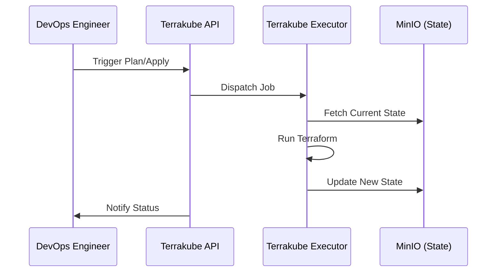

<!-- Target: docs/04.specs/09-tooling/spec.md -->

# Tooling Tier Technical Specification

## Technical Specification

## Overview (KR)

이 문서는 `09-tooling` 계층의 기술 사양을 정의한다. 각 서비스의 구성 요소, 데이터 흐름, 네트워크 설정 및 통합 인터페이스에 대한 상세 내용을 포함한다.

## Components

### 1. Terrakube (IaC Platform)
- **API**: 애플리케이션 프레임워크 및 워크플로우 엔진.
- **Executor**: 실제 Terraform 바이너리를 실행하는 워커.
- **Registry**: 테라폼 모듈 및 프로바이더 관리.
- **Dependency**: PostgreSQL (metadata), MinIO (state files).

### 2. SonarQube (Static Analysis)
- **Server**: 분석 결과 전시 및 설정 관리용 웹 UI.
- **Database**: 분석 이력 및 품질 게이트 규정 저장 (PostgreSQL).
- **Scanner**: CI/CD 파이프라인 또는 로컬에서 실행되는 분석 에이전트.

### 3. Locust (Load Testing)
- **Master**: 부하 테스트 제어 및 실시간 통계 수집.
- **Worker**: 실제 시나리오를 실행하여 대상 서비스에 트래픽 생성.
- **Scripting**: Python 기반 `locustfile.py`.

### 4. Registry (OCI Container Storage)
- **Backend**: 이미지 데이터 저장을 위한 S3-compatible 스토리지 (MinIO).
- **Auth**: `htpasswd` 또는 OIDC 프록시를 통한 접근 제어.

### 5. Syncthing (File Sync)
- **Discovery**: 로컬/글로벌 노드 탐색.
- **Protocol**: Block-level 동기화 프로토콜 (BEP).

## Interface Definition

### Network Ports
| Service | Internal Port | External Port | Auth Required |
| :--- | :--- | :--- | :--- |
| Terrakube API | 8080 | 10080 | OIDC |
| SonarQube | 9000 | 19000 | OIDC |
| Locust Master | 8089 | 18089 | OIDC |
| Registry | 5000 | 15000 | Basic / Token |
| Syncthing UI | 8384 | 18384 | Local Auth |

### Common Variables
- `DEFAULT_TOOLING_DB`: Tooling 전용 DB 인스턴스 정보.
- `DEFAULT_TOOLING_STORAGE`: MinIO 내 전용 버킷 정보.

## Sequence Diagrams

### IaC automation Flow

## Data Models

### Database Schema (Abstract)
- **Terrakube**: workspaces, jobs, states, organizations.
- **SonarQube**: projects, issues, measures, snapshots, users.

## Security

- **Authentication**: Keycloak 연동을 통한 모든 도구의 단일 로그인 환경 구축.
- **Isolation**: 각 서비스는 전용 브릿지 네트워크(`infra_net`)를 사용하여 불필요한 외부 노출 차단.

## Constraints

- **Resource Limits**: SonarQube 및 Terrakube는 최소 2GB 이상의 메모리 권장.
- **Network**: 모든 도구는 내부 Gateway(Nginx/Traefik)를 통해 프록시됨.

## Related Documents

- **PRD**: [2026-03-26-09-tooling.md](../../01.prd/2026-03-26-09-tooling.md)
- **ARD**: [0009-tooling-architecture.md](../../02.ard/0009-tooling-architecture.md)
- **ADR**: [0009-tooling-services.md](../../03.adr/0009-tooling-services.md)
